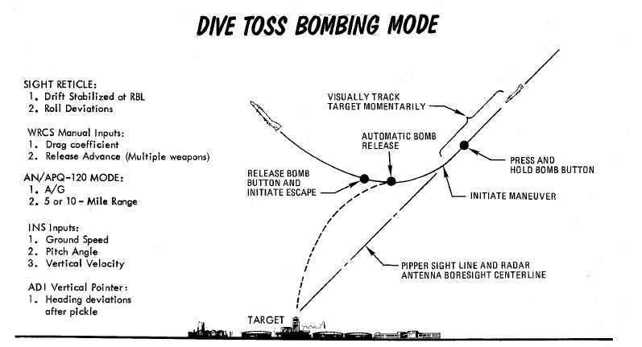
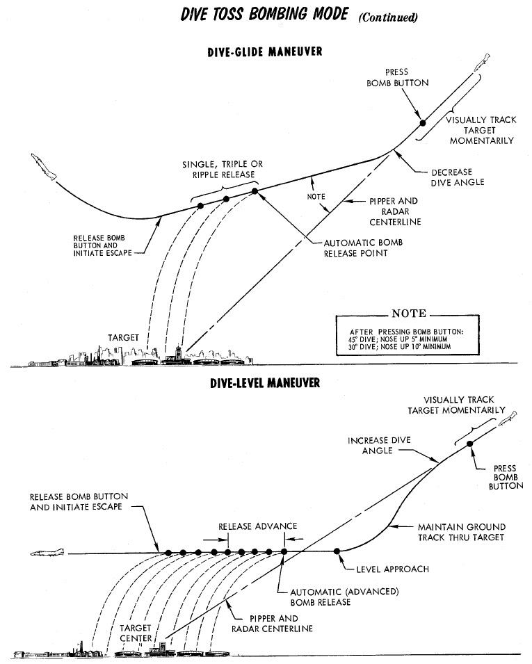

# Accurate Modes

## Dive Toss - DT

One of the most accurate and easiest bombing modes to use is Dive Toss.

It requires a direct line of sight and computing the right drag coefficient
value for the WRCS.

The pilot flies a dive attack on the target while the WSO obtains accurate
target range information using the radar. Once the target is designated, the
pilot simple holds down the Bomb Button and begins to gently pull out of the
dive. Weapons automatically release at the right moment during the maneuver.

Dive Toss uses the [WRCS](../../../../systems/weapon_systems/wrcs.md) and
[radar](../../../../systems/radar/overview.md) tracking, in conjunction with
other aircraft sensors, to calculate the release solution in real time. The
target can be approached from any direction, airspeed, and dive angle, and the
WRCS computes the proper release point relative to the acquired track, munition
drag coefficient setting, and any release advance control input (in conjunction
with [AWRU](../../../../systems/weapon_systems/awru.md) settings).

> 💡 Since for a lot of dive attack profiles the drag coefficient value barely
> changes (e.g. dropping conventional bombs from medium altitude, high speed and
> steep angles), Dive Toss can be a very forgiving mode that is suitable to be
> used against targets of opportunity with little setup or planning.
>
> The [Bombing Calculator Tool](../../../../dcs/bombing_computer.md) can be used
> to compute the appropriate Drag Coefficient value.

### Procedure

To perform a Dive Toss attack, the
[radar](../../../../systems/radar/overview.md) must be set in AIR-GRD mode, with
a 5 or 10-mile range setting. Once set, the pilot initiates the attack with the
Optical Sight in Air-to-Ground mode, and the reticle automatically cages in
elevation along the RBL. The pilot then selects DT on the Delivery Mode Knob,
places Weapon Selector Knob in BOMBS, and selects the desired Interval and
Quantity on the respective [AWRU](../../../../systems/weapon_systems/awru.md)
knobs. At this point, the pilot can initiate the attack.

The attack is initiated in a dive. The required dive is roughly 20% higher than
that required for a Direct mode attack, as to achieve effective
[radar](../../../../systems/radar/overview.md) ground lock; that is, the radar
must get a solid ground return, rather than see the actual target being bombed.
Once lock-on is achieved, the pilot then maneuvers to place the pipper over the
intended target, wings level, then presses and holds the bomb button to insert
radar range to the [WRCS](../../../../systems/weapon_systems/wrcs.md), and then
begins the desired pullout maneuver, maintaining wings level. After the pilot
pushes the bomb release button, radar ground lock is no longer required. The
pullout maneuver must maintain as constant a rate of turn as possible for
maximum precision.

At the point where the bomb computed trajectory will intersect the target, the
[WRCS](../../../../systems/weapon_systems/wrcs.md) provides the release signal,
dropping rounds based on the settings chosen for number and interval.

<iframe width="560" height="315" src="https://www.youtube.com/embed/-eHZRXwmELY?si=3GDLzXoZRFRXoiR1"
title="How to (Actually) Drop Bombs In The F-4E" frameborder="0"
allow="accelerometer; autoplay; clipboard-write; encrypted-media; gyroscope; picture-in-picture; web-share"
referrerpolicy="strict-origin-when-cross-origin" allowfullscreen></iframe>

<iframe width="560" height="315" src="https://www.youtube.com/embed/Ff-874bghek"
title="DCS: F4E WSO Dive Toss/Dive Laydown Tutorial" frameborder="0"
allow="accelerometer; autoplay; clipboard-write; encrypted-media; gyroscope; picture-in-picture; web-share"
referrerpolicy="strict-origin-when-cross-origin" allowfullscreen></iframe>

## Target Find - TGT FIND

Target Find was originally just a utility mode derived from OFFSET mode; where
it does not provide a standard release signal to the fire control and
[AWRU](../../../../systems/weapon_systems/awru.md) to initiate bomb drop, but
was instead used to confirm target location without release, for training
purposes, or, if necessary, perform an [INS](../../../../systems/nav_com/ins.md)
system update.

However, with the
[Pave Spike](../../../../systems/weapon_systems/pave_spike/overview.md)
targeting pod installed, Target Find will instead signal the WRCS to use the
target defined by the pods line of sight for a Dive Toss delivery, instead of
defining the target by radar lock.

In this case, the Pave Spike is placed on the target (activate the laser for a
more accurate slant range) and the bomb button is pressed and hold down. Similar
to a regular Dive Toss delivery, steering cues appear on the HUD. The system
will automatically release the bombs when the parameters for the ballistic
solution are met.

> 💡It is not necessary to perform a dive maneuver as the target is simply
> designated by the pods line of sight together with the measured slant range
> instead of the radar.

> 💡 TGT FIND with the Pave Spike is comparable to CCRP modes in newer aircraft.
> Designate the target with the pod, hold down the bomb button and weapons
> automatically release at the right moment.

<iframe width="560" height="315" src="https://www.youtube.com/embed/FZNtAqOZGgA?si=sbQ7nQk2CZcFV6iA"
title="DCS: F-4E Phantom: Pave Spike + Laser guided bombs Tutorial" frameborder="0"
allow="accelerometer; autoplay; clipboard-write; encrypted-media; gyroscope; picture-in-picture; web-share"
referrerpolicy="strict-origin-when-cross-origin" allowfullscreen></iframe>
