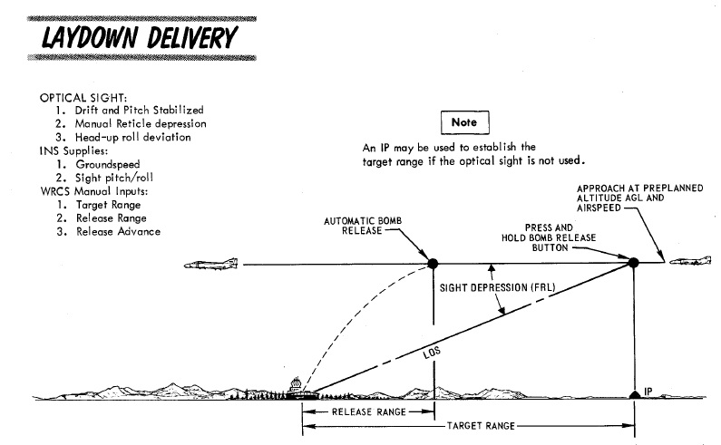
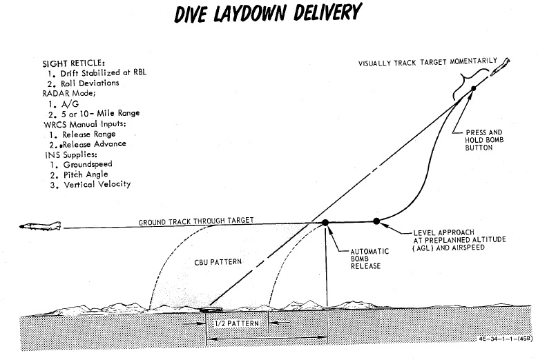

# Laydown Modes

Laydown delivery allows for releasing weapons from a wings level attitude by
designating the target visually either by using the pipper set to a certain
sight depression or the radar.

They are most effective if used for low altitude attacks, as well as deploying
CBUs or high drag bombs.

## Laydown - L

In this mode, the target is designated by means of a distance to a point prior
to the target (IP). Once over that point, the Bomb Button is held down and
weapons automatically release after passing the setup release range.

As a visual aid, the sight should be depressed in a way that it will be exactly
over the target when at the IP. That way, as soon as the pipper is over the
target, the Bomb Button can be held down and weapons will impact.

> 💡 The correct sight depression can be computed using the
> [Bombing Calculator Tool](../../../dcs/bombing_computer.md).

### Procedure - L

Setup for the Laydown attack requires the bombing table target range and
altitude above target to be entered on the
[WRCS](../../../../systems/weapon_systems/wrcs.md) panel.

The Optical Sight should be set to the depression noted from the tables in
Air-to-Ground mode, and the approach to the target should be flown at the true
airspeed (or ground speed) listed in the bombing tables for the parameters,
wings level

The [AWRU](../../../../systems/weapon_systems/awru.md) and WRCS Release Advance
settings should be entered as desired, and the Weapon Select Knob placed in
BOMBS or RKTS & DISP (for dispensers like CBU-1 and CBU-2 only).

As the pipper crosses the target, the bomb button should be held until the set
spread of munitions has released.

## Dive Laydown - DL

This mode is a variation of the regular Laydown mode, where the target is
designated by using the radar instead.

Therefore, the pilot flies a dive attack similar to the
[Dive Toss](accurate_modes.md#dive-toss---dt) mode, while the WSO obtains
accurate range information to the target by obtaining a radar lock.

After target designation, the pilot levels out at the planned altitude and
weapons release automatically at the set range to the target.

### Procedure - DL

The bombing table release range must be set directly in the
[WRCS](../../../../systems/weapon_systems/wrcs.md) panel, and the pilot flies
the ballistic schedule speed (true airspeed or ground speed) at the given
altitude above the target to produce the given release range.

Dive Laydown is selected by placing the Delivery Mode Knob in DL, and choosing
either RKTS & DISP (for dispensers like CBU-1 or CBU-2 only) or BOMBS. Desired
release range is entered on the
[WRCS](../../../../systems/weapon_systems/wrcs.md) panel, and, if necessary, the
release advance control.

The start of the attack is the same as Dive Toss; a higher than normal dive
angle is flown, with the [radar](../../../../systems/radar/overview.md) in
AIR-GRD mode at 5 or 10-mile range, a solid return is generated, and the pilot
then positions the pipper on the intended target and holds the bomb release
button.

Once this is completed, the pilot pulls out of the dive at the bombing table
plan altitude, maintains the target speed and heading with wings level, and the
bombs release automatically at the desired range.

The key factors for accuracy in this mode are correct altitude and pitch angle
at the point of release.
