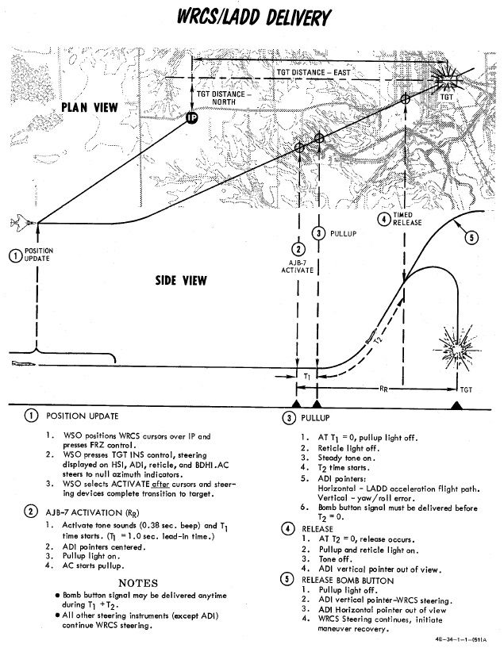

# Lofting and Tossing

The Phantom supports a variety of ways to loft and toss bombs on targets with
minimum expose to ground fire while sacrificing accuracy.

These modes are mostly designed to be used with nuclear weapons, but can also be
used effectively with conventional bombs when employing a high amount of
ammunition while attacking a larger area target.

They are categorized into either lofting or tossing modes.

| Category | Modes         | Release Angle |
| -------- | ------------- | ------------- |
| Lofting  | LOFT, T LAD   | below 90°     |
| Tossing  | O/S, INST O/S | above 90°     |

The benefit of lofting is that target flyover can be avoided, greatly minimizing
the risk of getting attacked. Weapons can be dispensed from great distances,
allowing the aircraft to turn around before entering the dangerous zone.

If target flyover is possible, tossing modes allow for more accuracy by
designating the target visually by initiating the maneuver over the target area.
The advantage compared to other visual release modes is that the time until
weapon impact is greatly increased, allowing the aircraft to gain some distance
before impact. This is crucial when employing nuclear weapons.

## LOFT

As the name entails, the aircraft transitions from a low altitude to a higher
one in a pull-up, thus lofting the released munitions at a pre-calculated point
that reaches the target.

The mode revolves around computing and setting a pull-up timer based on the
desired release parameters, such as altitude, speed and loft angle.

The pilot flies to the reference point, holds the bomb button and starts
initiating the pull-up maneuver the moment the aircraft gives the pull-up cue.
Weapons automatically release when reaching the setup loft angle.

### Procedure - LOFT

Planning for a loft attack requires a known target location, so that distances
for the IP and respective bomb ranges can be calculated. The ballistics tables
are references to determine delivery pattern and pull-up-to-target range.

With this information, the number of bombs can be decided, which determines the
spread, and knowing the pull-up to target range - the pull-up point distance to
the IP can be chosen.

As the path from IP to pull-up is flown at a constant speed, this can then be
used to determined time from said distance for pull-up Timer entry. And with the
ballistic table reference for the LOW angle, the profile is set.

> 💡 The [Bombing Calculator Tool](../../../../dcs/bombing_computer.md) can be
> used to compute the proper value for the Pull-Up Timer.

Upon entry to the target area, the pilot flies the intended course to the IP,
and once over, presses and holds the bomb release button to initiate the run.
Flying direct or crabbed to the pull-up point, the pilot maintains the bomb
release button in the down position, and holds it until the desired munitions
have released.

In LOFT mode, the [ARBCS](../../../../systems/weapon_systems/arbcs.md) programs
for a **4 G pull-up schedule**, and will automatically release the selected
munitions once the bombing run is initiated, timer runout has occurred, and
pre-set LOW pitch (gyro) angle is achieved.

At the initiation of the bomb run, upon pressing the bomb button, the ARBCS
overrides any other navigational guidance provided on the
[ADI](../../../../cockpit/pilot/flight_director_group.md#attitude-director-indicator)
and assumes command of the pointers to show deviation relative to the programmed
attack profile. The vertical pointer offsets in the direction requiring yaw
input to maintain target alignment. On approach to the loft point, the
horizontal needle shows deviation from a 1.0 G flight path.

When the pull-up timer completes signaling the **4 G pull-up**, deviation of the
horizontal needle is relative to the desired constant 4 G pull, with the initial
drift representing achieving 4 G of load in two seconds. Maintaining the
horizontal needle centered means the pilot has increased and held G at the
proper rate for maximum accuracy. Control of the ADI by the
[AN/AJB-7](../../../../systems/weapon_systems/arbcs.md) is maintained until the
pilot releases the bomb button after the last desired munition is released.

## Timed Low Angle Drogue Delivery - T LAD(D)

Conceived as a delivery method for tactical nuclear bombs, Timed Low Angle
Drogue Delivery is a variation of LOFT to maximize the time to impact by lofting
a bomb with drogue at maximum distance to the target.

The mode performs a low altitude ingress, transitioning through a 3.5 G pull-up
into a 45 degree climb profile that allows for a lofted release of a weapon at
the top of the climb, allowing an escape attempt as the munition's deployed
drogue slows the decent to the target. While originally designed with nuclear
intent, the method provides yet another option for accurate bomb delivery with a
high, or high to low, escape option for appropriate targets.

### Procedure - T LAD(D)

Planning of the T LADD engagement begins in the bombing tables, determining the
correct entry altitude and airspeed for the selected weapon, as well as the
resulting altitude gain and time from pull up initiation to release - which will
be used as the Release control timer value, as well as the distance downrange
this climb maneuver will take the aircraft.

Using this range as a baseline, an appropriate approach angle is determined, and
a suitable IP waypoint is chosen. The distance between the IP and the pull-up
point is evaluated against the planned profile speed, which provides another
time entry - this will be the pull-up timer value.

> 💡 Timer values can be obtained using the
> [Bombing Calculator Tool](../../../../dcs/bombing_computer.md).

The attack is performed by flying over the IP along the desired intercept
heading to the target at the correct speed and altitude, and actuating the bomb
release button upon flyover of said IP, holding it down throughout the maneuver.

This begins the pull-up timer. The
[ADI](../../../../cockpit/pilot/flight_director_group.md#attitude-director-indicator)
needles will center, then show deviation against the initial heading course -
vertical being roll, horizontal being level to maintain current altitude.

At timeout of the pull-up timer, a pull-up warning tone will be provided, and
the pull-up Lamp will illuminate; subsequently, the Release timer will begin its
count, the horizontal ADI needle will transition into show deviation from the
intended 3.5 G pitch angle, and then stabilize once **45 degrees** nose up pitch
is attained. Proper timing and loading of the **3.5 G pull-up** will maintain
the needle centered.

At timeout of the Release timer, the programmed munitions will release, the
pull-up light will turn off, and the ADI needles will be stowed. Once the last
round is ejected, the bomb release button can be released, and the desired
escape maneuver performed.

## Timed Over the Shoulder - O/S

Similar to LOFT, this mode allows deploying weapons based on a pull-up timer
that represents the distance from IP to target.

Weapons are released during a pull-up maneuver when reaching the setup release
angle. In this mode, release angles are beyond 90°; effectively tossing the
weapon over the shoulder, in contrast to lofting it ahead.

The mode revolves around computing and setting a pull-up timer based on the
desired release parameters, such as altitude, speed and toss angle.

The pilot then flies to the reference point, holds the bomb button and starts
initiating the pull-up maneuver the moment the aircraft gives the pull-up cue.
Weapons automatically release when reaching the setup toss angle.

### Procedure - O/S

Setup of the LABS system requires time (calculated using the known distance from
the set IP to the target flyover point and the intended airspeed) and calculated
release angle for the resulting airspeed and munition, which is entered into the
High Angle setting; this value must be in excess of 90 degrees, and the Low
Angle and secondary timer settings can be left at any value.

> 💡 The Pull-Up Timer value can be computed using the
> [Bombing Calculator Tool](../../../../dcs/bombing_computer.md).

Flying the appropriate heading at the correct speed guarantees target flyover,
and upon timer runout an audible tone will be heard to initiate pull-up, along
with the Pull-Up Lamp illuminating. This timing action is initiated by pressing
the bomb button over the IP, and holding it throughout the attack run.

Like LOFT mode, the pull-up signal indications will also trigger the horizontal
and vertical pointers on the
[ADI](../../../../cockpit/pilot/flight_director_group.md#attitude-director-indicator)
to display appropriate pitch and angle indications to maintain proper aircraft
orientation for accurate release point entry, and the **target pull rate is 4
G**. The guidance drives the attacking aircraft through an Immelmann, and the
bombs will release at the entered High Angle value.

Maximum accuracy is achieved through maintaining a centered horizontal needle
during the entire bombing run, and like LOFT, the ADI reverts back to the
previous function once the bomb button is released after the last intended
munition for the run has been dropped.

## Instantaneous Over the Shoulder - INST O/S

Further, derived from the Timed O/S mode, Instantaneous Over the Shoulder
bombing provides the same combined attack/escape profile as the former against
targets of opportunity.

In this mode, setting up an IP and a timer are not needed. Instead, the target
is designated by pressing the Bomb Button once over the target and executing the
pull-up maneuver shortly after.

### Procedure - INST O/S

Similar to Timed O/S, a desired release angle over 90° has to be configured.

Once the aircraft is directly over the target, the pilot presses and holds the
bomb release button and initiates the **4 G wings level pull up** into the
Immelmann maneuver.

The LABS computer performs the same
[ADI](../../../../cockpit/pilot/flight_director_group.md#attitude-director-indicator)
display overrides as Loft and Timed O/S, placing the horizontal director needle
at the pitch appropriate for a 4 G pull, and the vertical director displays
deviation to maintain proper angle of bank through the maneuver.

Upon reaching the necessary angle of pitch, the munitions separation begins, and
the bomb release button can be released once all desired rounds have been
ejected from the aircraft, thus resetting the display of the ADI.
