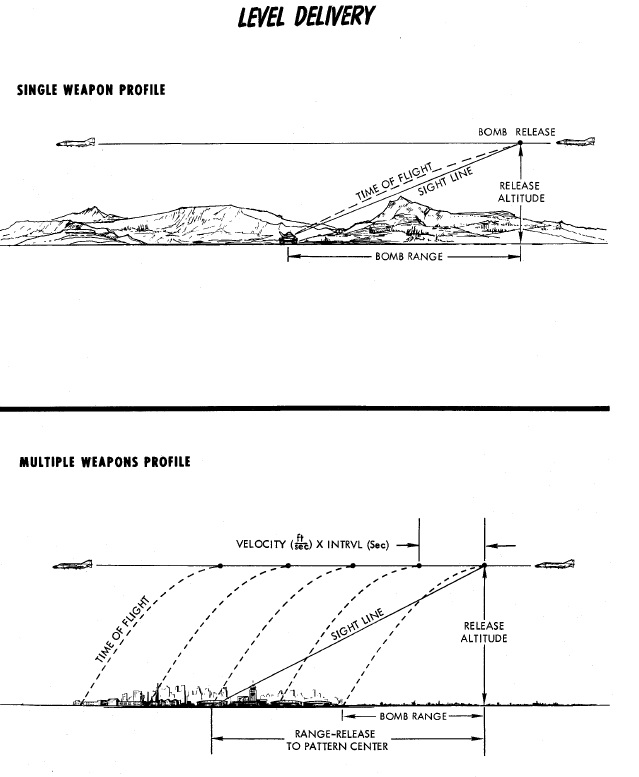

# Manual Release - DIRECT

Direct bombing is exactly as it sounds: classic, direct visual bombing, with
both dive and level bombing release passes possible. Both the
[ARBCS](../../../../systems/weapon_systems/arbcs.md) and
[WRCS.](../../../../systems/weapon_systems/wrcs.md) are excluded from this
release mode, and the pilot flies the profile as found for the intended munition
in the bombing tables, setting the sight depression to match, and hand flying
the aircraft to place the pipper directly onto the target in accordance with the
desired type of attack.

Once pipper on is achieved, the bomb release button is pressed, and the selected
number of munitions with the given program settings will be released.

While the most basic mode available to the Phantom, Direct remains a reliable
method when conditions permit, and can be used against any target the crew can
see - namely, targets of opportunity, or in the CAS environment.

It can also be very useful as wingmen when dropping bombs in a formation,
pressing the Bomb Button the moment the flight lead initiates the attack.

Or also when employing [rockets](../../rockets.md) or special ordnance such as
[Target Marker Flares](../other.md#suu-25-target-marker-flares).

> 💡 The kneeboard provides bombing and lookup tables for manual bombing, as
> well as various mil-settings for sight depression in various situations.

> 💡 Similar to Laydown (L) mode, the
> [Bombing Calculator Tool](../../../dcs/bombing_computer.md) can compute sight
> depression values for attacks at given distances to a target.
