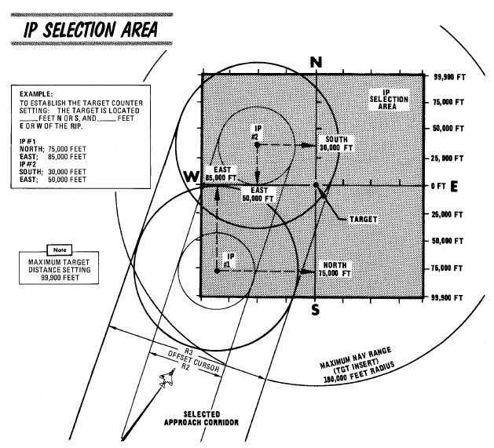
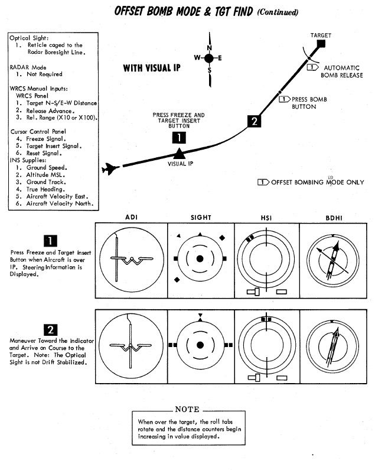
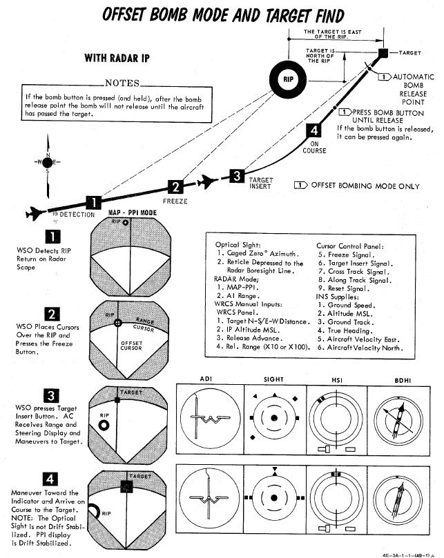

# Offset Delivery - OFFSET

Offset bombing provides a blind bombing capability, with high and low level
bombing profiles, using the full integration of the
[WRCS](../../../../systems/weapon_systems/wrcs.md),
[INS](../../../../systems/nav_com/ins.md), and
[radar](../../../../systems/radar/overview.md) in combination. Offset bombing
can be used in both visual and instrument conditions, to release either bombs or
dispensed munitions (with the RKTS & DISP mode).

The crew chooses a known reference point (IP) and obtains target position by a
means of an offset to that reference point. After setting up the aircraft with
the corresponding values, the attack is then flown by designating the reference
point instead of the actual target. The aircraft can then automatically release
weapons based on the offset values.

## Identification Point

The setup for an Offset bomb attack is based around the selection of an IP
relative to a known target location. For a visual attack, it is called VIP - the
Visual Identification Point, and initiation of the navigation assistance is
performed with a direct flyover of the VIP.

In an instrument conditions attack, the IP is called the RIP - the Radar
Identification Point, and acquisition of this point using a radar lock in
MAP-PPI mode generates a navigation solution to the target.

When chosen during planning, the VIP or RIP's position relative to the target
determines a pair of offset values (hence the name of the mode); one in the
North/South axis, the other East/West. Both offsets are noted in feet, and the
maximum amount of offset in each axis is 99,900', or 16.44 nautical miles.

Also found during mission planning is the altitude of the IP, and selection is
made using the lookup tables for the respective weapon, altitude above target,
and speed, taking note of the bomb range. When preparing the WRCS entries, the
offsets are always referenced from the IP to the target. Selection of an IP
should be as close as possible to the target to minimize system drift by way of
smaller navigation time and distance, and approach to the IP should be flown
with a focus on minimizing maneuvering required to put the target nose on after
IP acquisition (RIP) or flyover (VIP).

> 💡 The [Bombing Calculator Tool](../../../../dcs/bombing_computer.md) can be
> used to convert offset values from direct range and direction to the required
> N/S and E/W distances.

### RIP Low Altitude Considerations

Of special note in the RIP mode is the need to compensate for altitude
difference in the event the ingress to target will be flown below the altitude
of the RIP itself. Because the computations performed by the
[WRCS](../../../../systems/weapon_systems/wrcs.md) and navigation system are
mechanical, selecting a RIP target altitude above the course can cause
interference damage. To alleviate this, perform the following:

1. Note the approach altitude above MSL.
2. Subtract the approach altitude MSL from the RIP altitude above MSL.
3. Subtract the resulting value found in 2. from the approach altitude.

The resulting value is used for the target altitude value, and the pilot flies
the planned approach attitude during the target freeze and insert operations as
per normal.

## Procedure

### Visual IP

Prior to IP overflight, the N/S and E/W offsets, release range (x10 per the
window, or using the x100 switch modifier on the
[WRCS](../../../../systems/weapon_systems/wrcs.md) initiate panel), and any
desired release advance setting should be entered. Additionally, the desired
release timing and count should be selected on the
[AWRU](../../../../systems/weapon_systems/awru.md).

The Offset Visual IP attack commences on overflight of the VIP, with the
aircraft at the desired release altitude and speed; as the aircraft overflies
the VIP, the WSO presses the Freeze Signal button, followed by the Target Insert
Signal button on the Cursor Control Panel; doing so initiates
[INS](../../../../systems/nav_com/ins.md) target tracking. _Freeze_ memorizes
the position under the radar cursor, which by default is the current aircraft
position. _Insert_ then applies the entered offset data onto the memorized
position to designate the target coordinates. At this time, the vertical
[ADI](../../../../cockpit/pilot/flight_director_group.md#attitude-director-indicator),
Sight,
[BDHI](../../../../cockpit/wso/upfront_indicators.md#bearing-distance-heading-indicator-bdhi),
and
[HSI](../../../../cockpit/pilot/flight_director_group.md#horizontal-situation-indicator)
navigation aids will all show offset from the calculated release point, as well
as target range on the HSI and BDHI.

Completion of the attack is performed by the pilot through maneuvering the
aircraft to align course to the release point, maintaining the planned release
airspeed and altitude, and, prior to reaching the release point, pressing and
holding the bomb release button. If the bomb release button is released prior to
munitions release, but at a range greater than the programmed release range, the
attack can be recovered by pressing and holding the bomb release button until
release occurs. When this takes place, the pull-up light will illuminate to
confirm drop initiation. Should the bomb release button not be pressed until
after the release point is passed, the bombs will not release until the target
is passed; ergo, the bomb button should be released to cancel the run prior to
errant bomb drop.

Once an attack is completed, the navigation program against the set target is
maintained. The aircraft can attempt a re-attack, although natural INS drift may
reduce the accuracy of this second attack.

## Radar IP

Prior to RIP Freeze and Target Insert, the N/S and E/W offsets, RIP altitude,
release range (x10 per the window, or using the x100 switch modifier on the
[WRCS](../../../../systems/weapon_systems/wrcs.md) initiate panel), and any
desired release advance setting should be entered. Additionally, the desired
release timing and count should be selected on the
[AWRU](../../../../systems/weapon_systems/awru.md). Prior to initiation, the
pilot should enter the target area at the desired profile altitude and airspeed.
The WSO should have the APQ-120 prepared for the attack with a good
[radar](../../../../systems/radar/overview.md) picture in MAP-PPI mode, NOR stab
mode, WIDE scan, and a range of 10 or 25 miles, with an observed return from the
RIP.

Initiation of the attack begins with placing the Along Track cursor (presented
as a growing hemisphere on the radar display defining range to the RIP) in
proximity to, but below, the intended RIP return. When this is set, the Cross
Track cursor (a vertical line) is slewed over the RIP. Once the intersection is
defined, the WSO waits momentarily until the RIP range decreases and falls onto
the intersection. At this time, the WSO pushes the Freeze button. This initiates
radar tracking of the RIP, and provides the opportunity for the WSO to better
the intersection point between the Along Track and Cross Track cursors. Once the
precise point is attained, the WSO pushes the Insert Target button, which hands
target guidance off to the [INS](../../../../systems/nav_com/ins.md) and
performs an immediate slew of the Along Track and Cross Track cursors from the
RIP to the offset target.

At this time, the INS presents guidance and range information on the
[ADI](../../../../cockpit/pilot/flight_director_group.md#attitude-director-indicator),
the sight, the
[BDHI](../../../../cockpit/wso/upfront_indicators.md#bearing-distance-heading-indicator-bdhi),
and the
[HSI](../../../../cockpit/pilot/flight_director_group.md#horizontal-situation-indicator).
The WSO should continue to monitor the radar display - should the actual target
appear on the display as range decreases, the actual known altitude of the
target can be entered on the [WRCS](../../../../systems/weapon_systems/wrcs.md)
panel and the Along Track and Cross Track cursors can be touched up using their
controls to further increase release precision.

Prior to release range, the pilot must press and hold the bomb release button.
Once the bombs have released, the pull-up light will illuminate to confirm
release.

In the event that a RIP profile, due to breaking weather conditions, transition
to a VIP-possible profile, the offsets can be kept in the
[WRCS](../../../../systems/weapon_systems/wrcs.md), and the pilot simply fly
over the RIP, with the WSO pressing the Freeze and Target Insert buttons
simultaneously, just like a VIP attack.

## Practice

If no [Pave Spike](../../../../systems/weapon_systems/pave_spike/overview.md)
targeting pod is installed, the TGT FIND mode can be used as a practice mode for
OFFSET.

It then functions identical to the OFFSET mode with the difference of not
sending an actual release signal to the weapons.
