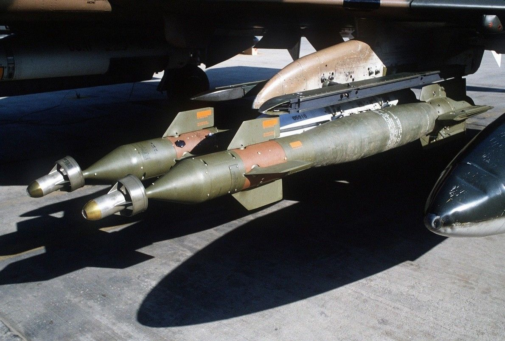

# Laser Guided Bombs

## GBU-10, 12, and 24

Built around the Mk 80 series of conventional bombs, the Paveway series
precision bomb kits install a guidance section and directional maneuvering fin
section to the Mk 82 (GBU-12) and Mk 84 (GBU-10 and 24) general purpose rounds,
respectively. Utilizing the Pave Spike laser targeting pod or buddy lasing, the
Paveway's resulting performance delivered a substantial increase to the
Phantom's bombing accuracy, with the later GBU-24's larger fin arrangement
providing greater glide range for the 2000 lb round over the original GBU-10.

## Variants

Available variants of the GBU family include:

| Variant | Warhead |
| ------- | ------: |
| 10      | 2000 lb |
| 12      |  500 lb |
| 24 A/B  | 2000 lb |

The laser guided BDU-45 LG can be used for training purposes.

## Employment

GBUs are deployed using the BOMBS setting on the
[Weapon Selector Knob](../../../cockpit/pilot/weapon_management.md#weapon-selector-knob).

Technically, all bombing modes on the
[Delivery Mode Knob](../../../cockpit/pilot/weapon_management.md#delivery-mode-knob)
are supported, see the [4.3.3.6. Employment](employment/overview.md) section for
details.

However, unless guided by another aircraft,
[TGT FIND](employment/accurate_modes.md#target-find---tgt-find) in combination
with a [Pave Spike](../../../systems/weapon_systems/pave_spike/overview.md)
targeting pod is the main mode to employ GBUs with.
