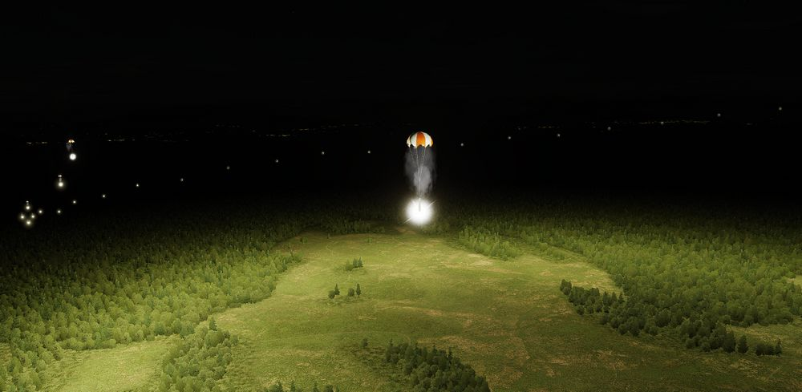

# Other

## SUU-25 Target Marker Flares

Container loaded with 8 parachute illumination flares for marking target areas or providing
battlefield illumination at night.

To employ, select DIRECT Delivery Mode and RKTS & DISP on the Weapon Selector Knob. Release them
directly over the target area. The flares last for around 4 minutes and should be dropped below
5000ft (1500m) AGL if battlefield illumination is desired.

## BLU-107 Durandal

The BLU-107 Durandal is an air-dropped, specialized anti-runway bomb originally developed by the
French company Matra, utilizing its dual charge warhead, is designed to penetrate and disable
airport runways to hinder enemy aircraft operations and subsequent repair. Designed to be dropped
from low altitudes, the bomb deploys a parachute to slow its descent before a rocket booster propels
it into the runway where it then detonates its primary charge once penetrating the runway and its
secondary charge is detonated soon after (the delay in between each charge was programmable on later
models).

To employ, select DIRECT Delivery Mode, BOMBS on the Weapon Selector Knob, and have the desired
interval and quantity for the runway length. Release them directly over the target area at around
500ft (150m) AGL to allow for adequate parachute release timing.

<iframe width="560" height="315" src="https://www.youtube.com/embed/yxxAtVcIBeg?si=ANwU3wgpsFA1xdnx"
title="DCS F-4E Phantom II Durandal Anti Runway Bomb" frameborder="0"
allow="accelerometer; autoplay; clipboard-write; encrypted-media; gyroscope; picture-in-picture; web-share"
referrerpolicy="strict-origin-when-cross-origin" allowfullscreen></iframe>
