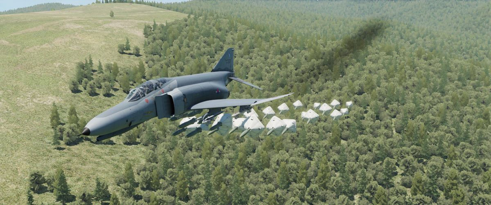

# 航弹

作为多用途战机，“鬼怪”II 配备了多样化的航弹，以适应多种作战任务场景。

F-4E 的航弹武器核心是 [马克 80 系列，](./conventional_bombs.md#mk-80-series)，马克 80 为一系列通用
航弹，用于航空领域已有数十载，其在杀手力和简易性之间有着不错的平衡，包括
[MK-82、MK-83 和 MK-84](./conventional_bombs.md#mk-80-series)，这些非制导航弹一直是军事主力

对于需要大面积覆盖目标的任务，F-4E “鬼怪”II 可以配置携带
[集束炸弹](./conventional_bombs.md#cbu-variants)。这些弹药在指定区域内抛撒小型炸弹，有效饱和攻击目
标区域。

F-4E 还可以装备激光制导炸弹，如 GBU 系列。这些武器使用激光制导系统，以卓越的精度锁定指定的目标。

F-4E 还装备了如 GBU-8 HOBOS（寻的炸弹系统）和
[AGM-62 "白星眼" I 和 II](./tv_guided_bombs.md#variants) 等电视制导炸弹。这些制导武器使用光学传感器
来跟踪和击中目标。

