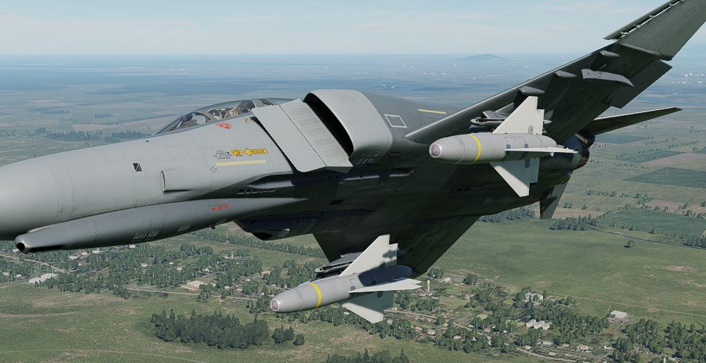
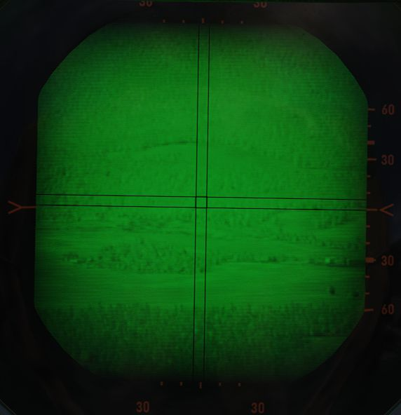
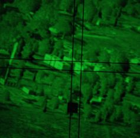
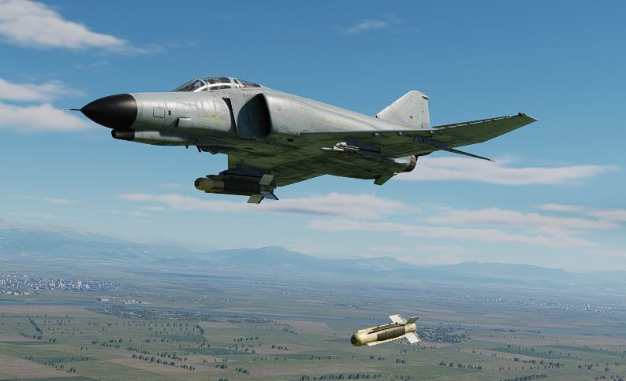

# TV Guided Bombs

The F-4E Phantom II was equipped with TV-guided bombs, notably the GBU-8 and
AGM-62 Walleye, enhancing its precision strike capabilities.

The GBU-8, also known as the "HOBOS" (Homing Bomb System), its successor the
GBU-15, and the AGM-62 I and II Walleye are electro-optical, TV-guided glide
bombs. They are precision-guided munition equipped with a television camera in
their nose.

The GBU-15 can be steered after being launched via a data-link interface,
leading to pinpoint precision and increasing the F-4E's effectiveness in
attacking well-defended and high-value targets, providing a "man-in-the-loop"
guidance solution.

> 💡 The earlier DSCG variant does not support the data-link interface. Thus, it
> can launch the weapons only in a backup mode _"Lock-On Before Launch"_ similar
> to Mavericks, without any manual steering after launch.

Historically, also both Walleye variants received data-link upgrades (ER/DL).
However, the F-4E has never been adjusted to support the Walleyes specific
data-link interface for man-in-the-loop guidance.

Both the GBU-8/15 and AGM-62 Walleye were crucial additions to the F-4E's
arsenal, enhancing its ability to conduct precise strikes with reduced
collateral damage. These TV-guided bombs showcased the adaptability of the F-4E
Phantom II in integrating advanced munitions to meet evolving mission
requirements.

<iframe width="560" height="315" src="https://www.youtube.com/embed/Ko1OaDN4Y5g?si=SgfKXHcAs_l_XzmP"
title="F-4E Bombing Tutorial - AGM62 Walleye" frameborder="0"
allow="accelerometer; autoplay; clipboard-write; encrypted-media; gyroscope; picture-in-picture; web-share"
referrerpolicy="strict-origin-when-cross-origin" allowfullscreen></iframe>

## Variants

Available TV guided bombs include:

| Variant              | Warhead | Description    |
| -------------------- | ------: | -------------- |
| AGM-62 Walleye I     | 1000 lb |                |
| AGM-62 Walleye II ER | 2000 lb | extended range |
| GBU-8 HOBOS          | 2000 lb |                |

## Employment

TV weapons require a three-minute period to warm up the equipment. This starts
as soon as electric power is connected to the aircraft. By the time the aircraft
is airborne, they are typically ready to use.

It is helpful to set the optical sight to A/G mode, and enter a depression of
**22 mils**, so that the sight alignment be that of the missile seeker. This
way, the pilot can put the target on the pipper and it will be within the
weapons view.

Either bomb is released by selecting the corresponding stations, putting the
Weapon Selector to TV and the Delivery Mode Knob to DIRECT.

> 💡 The ARM lights on the
> [Station Select Buttons](../../../cockpit/pilot/weapon_management.md#station-select-buttons)
> are hardwired to always start a 3-minute timer whenever the
> [Weapon Selector Knob](../../../cockpit/pilot/weapon_management.md#weapon-selector-knob)
> is moved into the TV position. Hence, if the knob is only moved out of the
> position shortly, the ARM lights will not illuminate before the timer has
> passed again. The bombs however, can be used regardless, ignoring the ARM
> light.

Enable the TV mode for the DSCG screen and press the trigger. This activates the
sensor and video feed will be displayed on the screen.

> 💡 WSO controls are on the actual flight stick, not the Antenna Hand Control.

The camera sensor **can not be slewed**. Place the crosshair in the general
direction of the target area, or in case of launching in _"Lock-On Before
Launch"_-mode, directly over the target. Press and hold down the trigger to
command a lock.

The seeker attempts to lock via contrast. If it fails to lock, the target likely
does not stand out enough to its background.

> 💡 Due to TV based contrast-locking, the weapons effectiveness may decrease
> during dusk, dawn or in heavy overcast situations.

Once locked, a black square is added to the symbology, indicating the seeker
head position.

Then, press and hold the bomb button for a few seconds to release the weapon.

> 💡 Effective range varies a lot with release altitude and speed. The release
> mechanism does not check if the ordnance is within parameters. To reduce the
> risk of the weapon missing its target, prefer launching it from increased
> altitude and speed.

