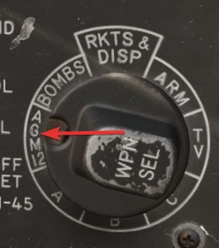
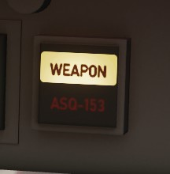

# AGM-12 Bullpup

The AGM-12, nicknamed Bullpup, is a guided short-range air-to-ground missile
that can be steered manually by the crew.

It was the first of its kind that reached series production and was used in
service during the early 1960s until it was later supplanted by the
[AGM-62 Walleye](../bombs/tv_guided_bombs.md).

## Variants

Available variants include:

| Variant | Warhead | Description              |
| ------- | ------: | ------------------------ |
| A       |  250 lb |                          |
| B       | 1000 lb | improved motor and range |

## Employment

To setup the aircraft for launching a Bullpup, ensure the relevant station is
armed, the Weapon Selector is in the AGM-12 position and the Video Selector set
to WEAPON.

Also make sure the screen is turned on and set to TV.

After launch, the weapon can be steered either by the pilot using the mini-stick
next to the throttle, or by the WSO using the Antenna Hand Control Stick.

> 🚧 This section is under construction.
>
> - Rough max engagement range
> - Double check the procedure and how to actually launch (which buttons etc)
