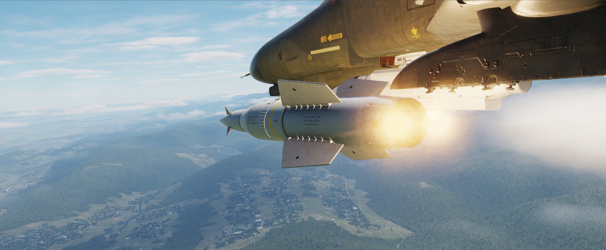

# AGM-12 "小斗犬"

AGM-12，绰号小斗犬，是一种可由机组人员手动遥控的制导型近程空对地导弹。

转向指令通过“鬼怪”的下部 UHF 天线来发射。

AGM-12 是同种类首次批量生产的武器，于 1960 年代初期开始服役，直到后来被 AGM-62 “白星眼”所取代。

## 型号

可用型号包括：

| 型号 |  战斗部 | 介绍                 |
| ---- | ------: | -------------------- |
| A    |  250 磅 | 固体燃料             |
| B    |  250 磅 | 液体燃料，增程       |
| C    | 1000 磅 | 液体燃料，进一步增程 |

## 武器投放

### 基础驾驶舱设置

在发射 AGM-12 "小斗犬" 前，飞行员需要在驾驶舱设置几项开关：

1. 通过[挂点选择按钮](../../../cockpit/pilot/weapon_management.md#挂点选择按钮)选择 AGM-12 "小斗犬"
   挂点
2. 在[武器选择旋钮](../../../cockpit/pilot/weapon_management.md#武器选择旋钮) 选择 AGM-12
3. 在[投放模式旋钮](../../../cockpit/pilot/weapon_management.md#投放模式旋钮)选择直接
4. (可选) 将 LCOSS 设置到 A/G
5. 将 [主军械](../../../cockpit/pilot/weapon_management.md#主军械开关) 拨至 ON

来发射 AGM-12 "小斗犬"的最后一步为将准星对准目标，并按住航弹投放按钮直到导弹离架。导弹发射后，飞行
员可以通过使用油门握把旁的迷你控制杆来遥控，或者由 WSO 使用天线手控杆来遥控导弹。
