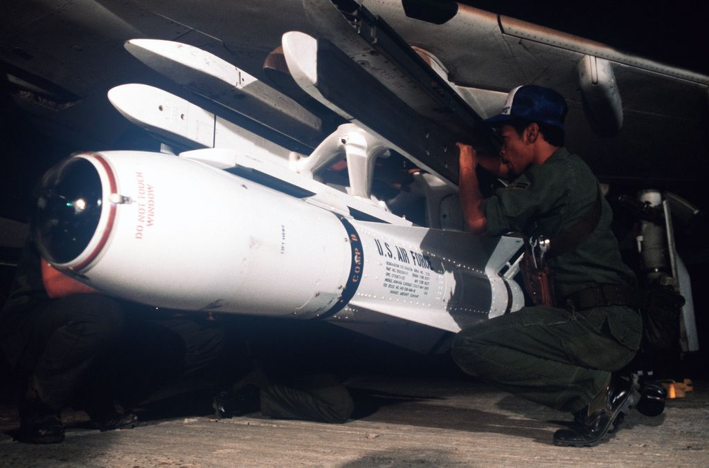
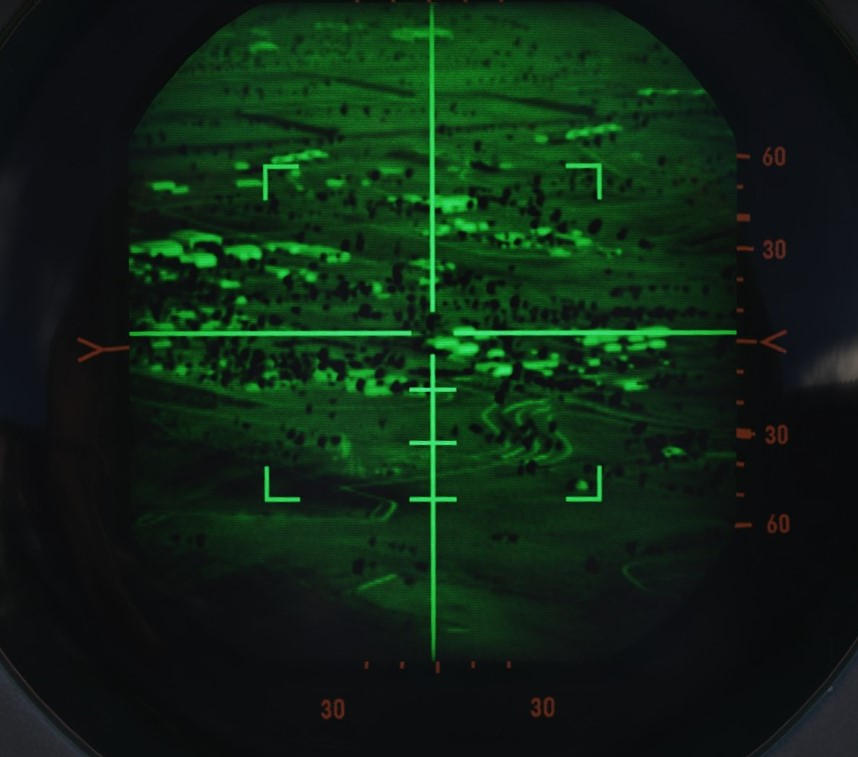
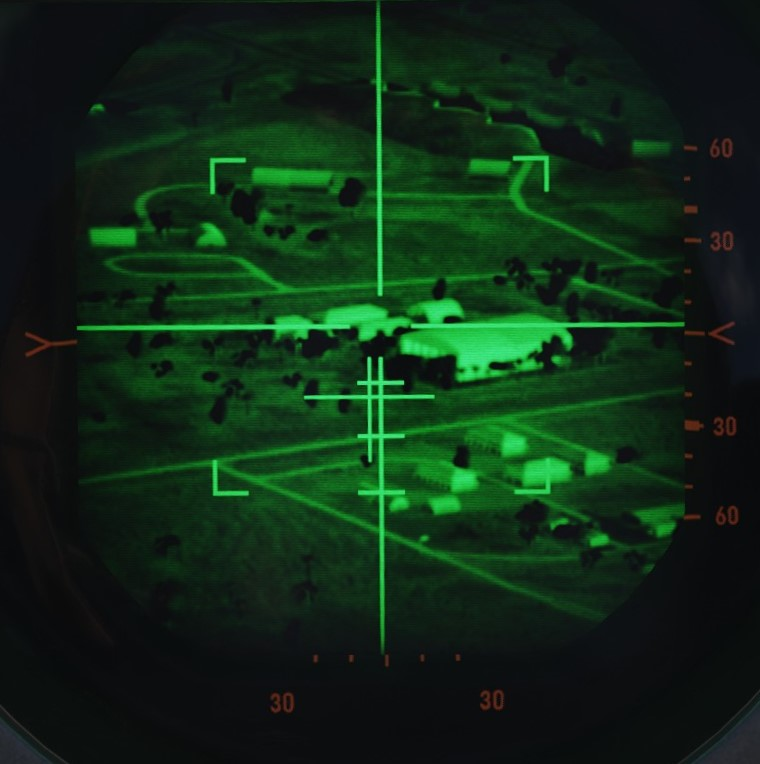
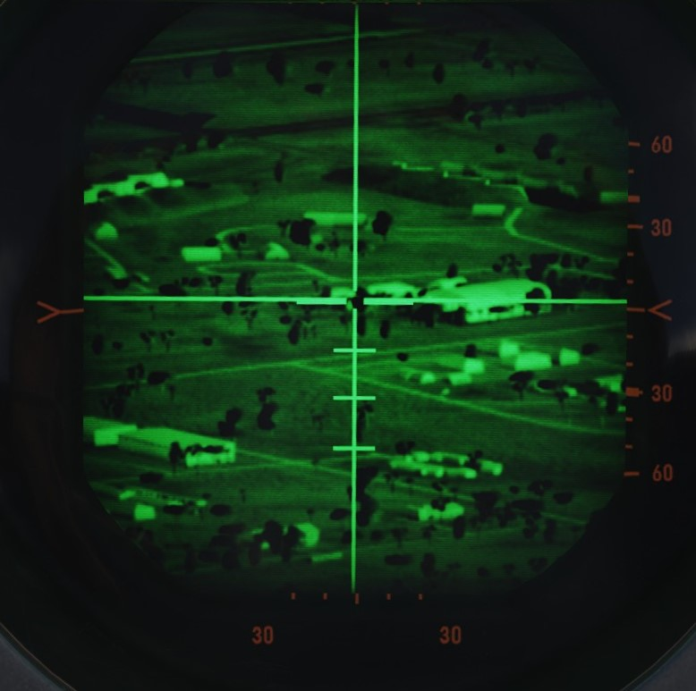
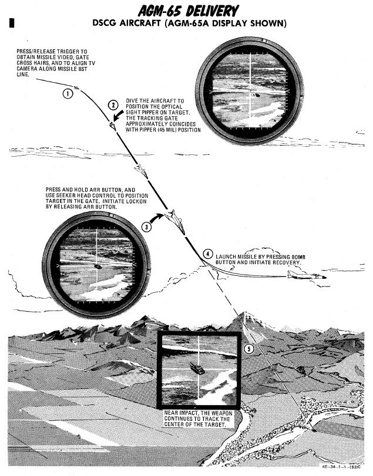

# AGM-65 Maverick

Entering service in 1972, the AGM-65 air to surface missile provided the Phantom
II with a direct-fire long range weapon, capable of destroying armor, mechanized
infantry, and other targets with electro-optical, and later - infrared imaged,
accuracy.

The F-4E was capable of carrying up to six between the two inboard wing pylons.
The AGM-65 Maverick has an approximate maximum range of 12 nautical miles.

Employment of the Maverick is shared between both cockpits, with the pilot
responsible for stores and mode selection, and initial seeker placement. From
the point the seeker head is stabilized on the intended target area, either crew
member can direct the final intended contrast target.

## Variants

Available variants include:

| Variant | Description                          |
| ------- | ------------------------------------ |
| A       | TV-Guided                            |
| B       | TV-Guided with a narrower FOV than A |
| D       | IR-Guided                            |

## Employment

To utilize a Maverick of any variant, the pilot begins by pressing the
applicable Station Select buttons, and setting Master Arm to On. The pilot then
must select Direct on the Delivery Mode Knob, and the TV position on the Weapon
Select Knob.

When selected to TV, the 3-minute missile gyro warmup sequence initiates; it is
suggested to start the stopwatch to the left of the Multiple Weapon Panel as a
means to avoid disturbing this sequence. Once the warmup has completed, the
lower amber ARM indicators on the Station Select buttons will illuminate.
Failure to permit this gyro cycle can potentially damage the guidance unit of
the missiles aboard. During this warmup period, it is helpful to set the optical
sight to A/G mode, and enter a depression of **45 mils**, so that the sight
alignment be that of the missile seeker. This way, the pilot can put the target
on the pipper and it will be within the weapons view.

| No Lock                                                  | Locked on Target                                   | Narrow View and Locked                                     |
| -------------------------------------------------------- | -------------------------------------------------- | ---------------------------------------------------------- |
|  |  |  |

Once the warmup has completed, the crew may activate their displays for viewing
seeker video; the pilot selects the TV position on the Scope Display Select
switch on the Pedestal panel, and the WSO places the DSCG display mode knob to
TV and the Video Select Switch to WEAPON instead of ASQ.

> 💡 To start the TV feed, the flight stick trigger has to be pressed, otherwise
> the screen stays blank.

With the displays activated, the pilot maneuvers the aircraft to position the
sight reticle over the target area, and either crew member can then press their
respective flight stick trigger to initiate video. With video active, command of
the missile seeker is controlled by the crew member who activated the video
signal, as follows:

### Pilot

With the pipper over the target area, pressing and holding the ARR button
enables track slewing with the Forward Hand Control stick inboard from the
throttle. Once the seeker crosshair is over the intended target, releasing the
ARR button performs a lock-on of the missile to the contrast area under the
crosshair. If the missile seeker fails to achieve lock on the correct target,
the lock can be broken by squeezing the trigger again, bringing the missile
seeker back to its boresight position, and then reattempting the lock with the
ARR button. Should the target not appear to have enough contrast versus the
surrounding background, the contrast can be swapped from black hot to white-hot,
or vice versa, using the Target Contrast Switch on the inboard Engine Control
Panel. Leaving the switch in the Auto position allows the seeker to attempt to
determine the best option for contrast.

Should a missile appear to not be functioning correctly, it can be rejected to
the next round in the release sequence using the TGT/MSL REJ switch.

Once lock on the correct target is attained, the missile is launched using the
bomb button. To initiate lock on of the next target, the process is started over
with the squeezing of the trigger.

With the above in mind for the electro-optical AGM-65A and B, the AGM-65D has a
few minor alterations to the procedure. The seeker of the 65D has two FOV
settings, wide and narrow, and initial video signal is provided in the wide
setting. In this setting, a quartet of L shaped brackets define the region of
the display that will be zoomed in upon selecting the narrow field of view.
Pressing the trigger a second time changes the video to the narrow setting,
allowing for a more precise selection of the target.

### WSO

The WSO performs the same sequence of actions for the seeker guidance, and can
initiate video upon pilot confirmation of pipper location using the trigger of
his own flight stick in the rear cockpit. From this point, the WSO uses the
antenna hand control stick to manage the seeker head placement, lock, and in the
case of AGM-65D employment FoV controls. Rather than pressing and holding the
ARR button to activate slew, the WSO selects the half-action trigger position,
and then slews the seeker using the cursor control.

Once the applicable target is under the crosshair, lock is achieved using the
full action command. Should the WSO need to change 65D FoV to narrow, a
subsequent press of half action will do so. The WSO can change the contrast mode
with the Contrast Switch on RWR Panel on the right side. And, once lock is
achieved, the WSO can fire the missile using the Missile Launch button found on
his flight stick - in the same position as the Bomb Release button on the front
stick.

