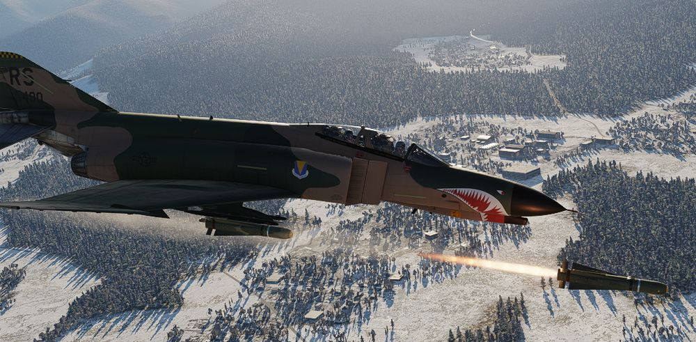

# Missiles

Among the Phantom II's lethal armament are the AGM-65 Maverick and AGM-45 Shrike missiles, each
playing a distinct role in the aircraft's capacity to engage ground targets and neutralize enemy
threats.

The [AGM-65 Maverick](maverick.md), a precision-guided air-to-ground missile, uses its versatile
guidance systems, including electro-optical and infrared seekers, to allow pilots to engage a
variety of ground-based threats.

The [AGM-45 Shrike](shrike.md) missile takes on a specialized role in Suppression of Enemy Air
Defenses (SEAD). Designed to seek out and neutralize enemy radar installations, the Shrike is an
anti-radiation missile that targets radar-emitting threats.

