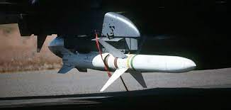
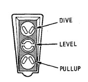
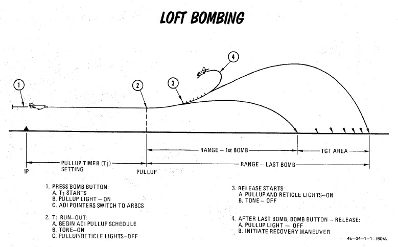

# AGM-45 Shrike Anti-Radiation Missile

The Sparrow-derived AGM-45 Shrike is an early attempt at an anti-radiation missile for the
suppression of enemy air defense (SEAD) role. Mating a frequency-tuned seeker with the rocket body
of an AIM-7, the Shrike provided the United States Navy, and later the United States Air Force, with
a standoff option for the engagement of enemy SAM radars. While nominally effective, in practice the
Shrike was a difficult weapon to employ properly, given its limited range, low speed, and primary
engagement mode that left the launching aircraft within lethal envelopes of most opposing air
defense systems. Further reducing its potency was a small warhead, meaning that in most instances
only the emitting antenna itself was damaged, rather than the vehicle it was mounted to.

While limited in most respects, the Shrike received a number of upgrades over its lifetime, lasting
in service from the mid-60s in Vietnam, until just after the Gulf War, through better engines and
additional seeker updates for later SAM systems. The Shrike was put into use by two foreign users -
the Israeli Air Force, who also modified it for a ground-launched version, and through clandestine
means with the RAF during the Falklands War.

## Variants

Only the A version can be equipped on this version of the Phantom.

## Employment

The AGM-45 has three separate launch modes available: (WRCS) AGM-45, (LABS) LOFT, and (WRCS) DIRECT.

### Basic cockpit setup

Before any AGM-45 Shrike can be employed a few things have to be set in the cockpit by the pilot:

1. Select the station for the Shrike you want to employ via the
   [station select buttons](../../../cockpit/pilot/weapon_management.md#station-select-buttons)
2. Select ARM on the
   [weapon select knob](../../../cockpit/pilot/weapon_management.md#weapon-selector-knob)
3. Select one of the three available modes of the Shrike via the
   [delivery mode knob](../../../cockpit/pilot/weapon_management.md#delivery-mode-knob)
4. (optional) Turn the
   [flight director](../../../cockpit/pilot/flight_director_group.md#navigation-function-selector-panel)
   on for ADI needle guidance
5. (optional) Turn the LCOSS to A/G
6. Turn [MASTER ARM](../../../cockpit/pilot/weapon_management.md#master-arm-switch) on

### AGM-45 (WRCS Mode)

Used only with the AGM-45 in conjunction with the WRCS, this mode is the primary means of employment
of the Shrike. The mode is based around a high altitude attack profile, and depends on the
pre-programmed weapon engagement envelope of the AGM-45 stored within the WRCS. This profile, in
conjunction with current aircraft state information from the INS and a signal provided by the
receiver in the missile - having detecting an emitter of the type its attuned to, define a flight
path and release envelope for optimum probability of the missile reaching the target.

With the WRCS mode selected to AGM-45, the run is initiated by arming a station select button for a
hardpoint carrying an AGM-45 missile. Doing so activates the missile's receiver, and upon emitter
acquisition will provide the aforementioned information signal to the WRCS. The WSO should enter a
target altitude value into the computer control panel, if necessary, using a mean value for the
current target area, and if multiple missiles are to be launched, a release advance time setting.
The WRCS receives both data from the missile regarding look angle from the missile, along with
corrected look angle from the INS; the selection for which data to use is performed with the TGT/MSL
Rej switch, that should, in most cases, be left in the DF REJ position.

Look angle and estimated range available, the WRCS will provide guidance instruction using the
needles on the ADI. Once oriented in the dive angle, the horizontal range to target will be provided
on the HSI and BDHI, so long as the INS position is selected for navigation mode.

When the aircraft's orientation is correct and the ADI needles are centered, once the aircraft is
within missile range, one of the indexer lights will illuminate based on the detected range to
target to instruct the pilot as to the required release maneuver - dive, level, or pull-up. At this
time, the pilot can press and hold the bomb release button to initiate the attack. Once the release
range is attained in the instructed profile, the missile will be launched.

> 💡 Special note must be made of the importance of maintaining the ADI needles centered, especially
> the vertical azimuth relationship. Because the orientation of the missile itself when installed on
> the wing can cause offset of its receiver to occur when the aircraft is banked, preparation of the
> attack may require repeated adjustments with wings brought to level every few seconds to make
> certain the aircraft is pointing at the emitter.

 _Commands of the AGM-45 Shrike in WRCS mode_

#### Pull-up

The Pull-up command light indicates that the aircraft is at some range where the Pull-up maneuver
must be flown to get a release signal. After pickle and with the indexer light indicating Pull-up,
the Pull-up instruction is guidance for the pilot to initiate a steady rotation back to the horizon,
and, if desired, continue into a steady climb state until range requirements are met and the missile
is launched. The pilot can choose to either bring the aircraft to near level and stop, or pull
further into a low climb profile. When the aircraft is approximately 5 seconds away from release,
the level indicator will illuminate, directing the pilot to maintain the current orientation until
the Shrike is away.

#### Dive

The dive command in the WRCS mode occurs only when the attack is initiated very close to the target.
The situation and proximity to the SAM installation must be considered prior to attack commitment
with the pickle button, as any response by the battery has a high probability of arriving before the
missile can potentially kill the emitter. The dive command, once followed, will then be followed
with the level indicator once missile launch imminent.

#### Level

The level instruction is less of a directive than a confirmation of impending launch. Depending on
the initial attack setup, the level signal may immediately occur, or occur quite soon after one of
the other two instructions. From that point, it is simply required that the pilot maintain the
current state for best chance of missile success.

#### WRCS AGM-45 Employment

> 💡The WRCS mode is currently WIP and will the employment will be described once it is ready

### Loft

The Loft attack profile of the Shrike is like a loft bombing attack, utilizing the weapon lookup
tables to define a suitable IP to release distance, the necessary release angle, and the time from
IP to pull-up is determined by the lookup table speed versus the IP to release distance.

One key difference in the Loft mode versus the WRCS employment modes for the Shrike is the primary
usage of the NORM mode rather than DF REJ; this places the missile's receiver in the role of the
azimuth guidance directive on the ADI rather than the INS. The ADI's vertical needle will appear
when the AGM-45 position is selected on the pedestal switch which is the NORM position.

The attack is performed like a loft bombing profile; the Phantom is flown over the IP at the
intended altitude and airspeed, with the bomb release button being held from the point of flyover.
The countdown timer initiates, the horizontal ADI bar appears to maintain level flight, and the
pull-up lamp illuminates. When the pull-up timer runs out, the pull-up lamp will turn off, the sight
reticle will turn off, and the horizontal ADI bar will move to display G load as normal for the
pull-up maneuver; a correct profile will keep both ADI bars centered. When the aircraft achieves the
programmed release angle, the missile will launch. Once launch has occurred, the pull-up lamp and
sight reticle will illuminate again, and the horizontal ADI bar will stow.

 _Example of the Loft bombing, the procedure stays the
same for the AGM-45 Shrike_

#### LABS Loft Employment

This mode works exactly the same as it would for bombs so pre-planning is necessary. Select an IP
calculate the timers and fly the same attack profile as for Loft bombing. Note that in this mode the
Loft seeker of the AGM-45 Shrike needs to sense a differential pressure of 1 Bar and needs to sense
a barometric height of over 18,000ft to arm itself and start searching.

### Direct Mode

Direct mode employment of the AGM-45 is dependent on the crew knowing the precise location of the
target SAM emitter; while it can be utilized as a fallback method in event of a WRCS system failure,
the need for at least 10 degrees of dive angle against the target for successful delivery places a
premium on being able to plan the attack against a specific point on the ground.

To employ the weapon in Direct mode, the crew confirms receipt of emitter audio, and initiates a
dive to center the ADI needles at the target. The crew should then check the dive chart for angle
and AGL, and the pilot should maneuver into that orientation, maintaining a centered vertical ADI
needle. From that point, the bomb release button is pressed and held until the Shrike is fired.

#### WRCS Direct Employment

For a direct employment all the pilot has to do is center the needles on the ADI and press the bomb
release button. The Shrike will fire within one second after pressing the bomb release button. Be
aware that the Shrike will have the least amount of range in direct mode and should be fired very
near to the target. A dive angle of 20 degree or more is recommended.

### Seekerheads

The following seeker heads can be used to track the corresponding Warsaw Pact land based SAM and EWR
system radars:

> 💡 Note: This seeker head data is accurate as of the 18th of August, 2024.

| Seeker      | SA-2 | SA-3 | SA-5 | SA-6 | SA-8 | SA-10 | SA-11 | SA-15 | SA-19 | EWR |
| ----------- | :--: | :--: | :--: | :--: | :--: | :---: | :---: | :---: | :---: | :-: |
| Mk 22       |  TR  |      |      |  TR  |      |       |       |  STR  |  STR  | DE  |
| Mk 23       |  TR  |      |  SR  |      |      | TS/BB |  STR  |       |  STR  |     |
| Mk 24.5     |  TR  |      |  SR  |      |      |  TS   |       |       |       |     |
| Mk 24.34    |  TR  |      |  SR  |      |      |  TS   |       |       |       |     |
| Mk 25       |  TR  |      |      |  TR  |      |       |       |  STR  |       | DE  |
| Mk 36       |  TR  |  TR  |      |  TR  |      |  CS   |  STR  |       |       |     |
| Mk 37       |  SR  |  SR  |      |      |      |       |       |       |       |     |
| Mk 49 Mod 0 |  TR  |  TR  |      |  TR  |  TR  |  CS   |  STR  |       |       |     |
| Mk 49 Mod 1 |  TR  |  TR  |      |  TR  |  TR  |  CS   |  STR  |       |       |     |
| Mk 50       |  TR  |      |  SR  |      |      |  TS   |       |       |  STR  | DE  |

- BB: Big Bird
- CS: Clam Shell
- TS: Tin Shield
- DE: Dog Ear
- TAR: Tall Rack
- BS: Box Spring
- BL: Bar Lock
- SN: Side Net
- 2S: Two Spot

Combined NATO and Warsaw Pact Anti-Aircraft Artillery (AAA) radars:

| Seeker      | Shilka | Gepard | M163 VADS | C-RAM |
| ----------- | :----: | :----: | :-------: | ----- |
| Mk 22       |        |        |           |       |
| Mk 23       |        |        |           |       |
| Mk 24.5     |        |        |           |       |
| Mk 24.34    |        |        |           |       |
| Mk 25       |        |        |           |       |
| Mk 36       |        |        |           |       |
| Mk 37       |        |        |           |       |
| Mk 49 Mod 0 |        |        |           |       |
| Mk 49 Mod 1 |        |        |           |       |
| Mk 50       |        |        |           |       |

NATO land based SAM system radars and EWRs:

| Seeker      | Hawk | Patriot | Rapier | Roland | NASAMS |
| ----------- | :--: | :-----: | :----: | :----: | :----: |
| Mk 22       |      |         |        |        |        |
| Mk 23       |      |         |        |        |        |
| Mk 24.5     |      |         |        |        |        |
| Mk 24.34    |      |         |        |        |        |
| Mk 25       |      |         |        |        |        |
| Mk 36       |      |         |        |        |        |
| Mk 37       |      |         |        |        |        |
| Mk 49 Mod 0 |      |         |        |        |        |
| Mk 49 Mod 1 |      |         |        |        |        |
| Mk 50       |      |         |        |        |        |

Warsaw Pact and Chinese Naval Threats:

| Seeker      | Kirov | Slava | Kuznetsov | Krivak | Grisha | Type 052B | Type 052C | Type 054A |
| ----------- | :---: | :---: | :-------: | :----: | :----: | :-------: | :-------: | :-------: |
| Mk 22       |       |       |           |        |        |           |           |           |
| Mk 23       |       |       |           |        |        |           |           |           |
| Mk 24.5     |       |       |           |        |        |           |           |           |
| Mk 24.34    |       |       |           |        |        |           |           |           |
| Mk 25       |       |       |           |        |        |           |           |           |
| Mk 36       |       |       |           |        |        |           |           |           |
| Mk 37       |       |       |           |        |        |           |           |           |
| Mk 49 Mod 0 |       |       |           |        |        |           |           |           |
| Mk 49 Mod 1 |       |       |           |        |        |           |           |           |
| Mk 50       |       |       |           |        |        |           |           |           |

US Naval Threats:

| Seeker      | Ticonderoga | Arleigh Burke | Oliver Hazard Perry | Nimitz |
| ----------- | :---------: | :-----------: | :-----------------: | :----: |
| Mk 22       |             |               |                     |        |
| Mk 23       |             |               |                     |        |
| Mk 24.5     |             |               |                     |        |
| Mk 24.34    |             |               |                     |        |
| Mk 25       |             |               |                     |        |
| Mk 36       |             |               |                     |        |
| Mk 37       |             |               |                     |        |
| Mk 49 Mod 0 |             |               |                     |        |
| Mk 49 Mod 1 |             |               |                     |        |
| Mk 50       |             |               |                     |        |

Other NATO Naval Threats:

| Seeker      | Ticonderoga | Arleigh Burke | Oliver Hazard Perry | Nimitz |
| ----------- | :---------: | :-----------: | :-----------------: | :----: |
| Mk 22       |             |               |                     |        |
| Mk 23       |             |               |                     |        |
| Mk 24.5     |             |               |                     |        |
| Mk 24.34    |             |               |                     |        |
| Mk 25       |             |               |                     |        |
| Mk 36       |             |               |                     |        |
| Mk 37       |             |               |                     |        |
| Mk 49 Mod 0 |             |               |                     |        |
| Mk 49 Mod 1 |             |               |                     |        |
| Mk 50       |             |               |                     |        |

- SR: Search Radar
- TR: Tracking Radar
- STR: Search and Tracking Radar
