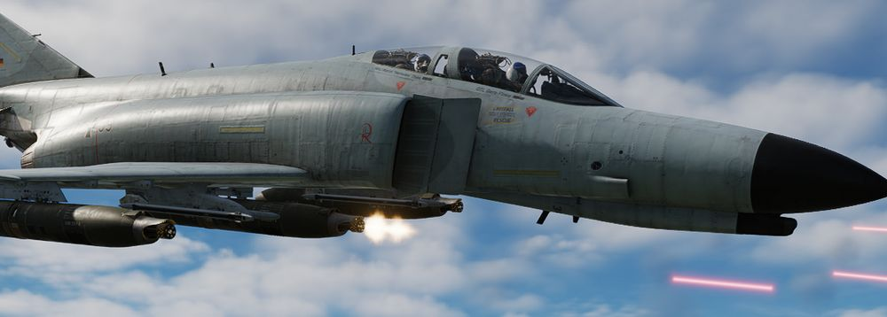

# Air to Ground

The F-4E Phantom II's air-to-ground capabilities are marked by a commitment to precision and
versatility. Armed with a diverse array of munitions, ranging from
traditional [unguided bombs](bombs/conventional_bombs.md) to
sophisticated [precision-guided missiles](missiles/overview.md), the Phantom II is equipped to
undertake a variety of ground attack missions.

Integral to the F-4E's air-to-ground arsenal are guided munitions used for precision strike.
[Laser-guided bombs (LGBs)](bombs/laser_guided_bombs.md) and other precision-guided munitions enable
the Phantom II to engage high-value and strategically important targets with unparalleled accuracy.

