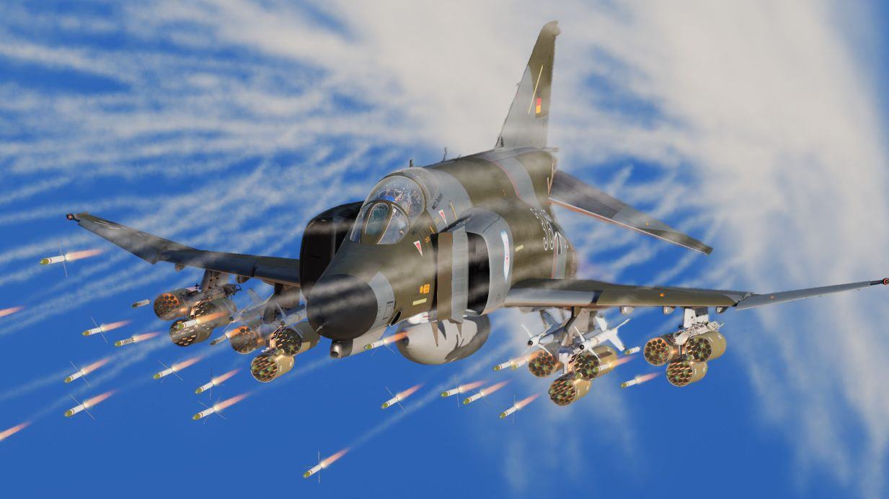

# 空对地

F-4E 鬼怪 II 战机可执行精确打击和各种打击任务，有着不俗的空对地能力。F-4E 有着从传统的
[非制导炸弹](bombs/conventional_bombs.md) 到先进的 [精确制导导弹](missiles/overview.md) 等多样化的
武器，这使得“鬼怪” II 能够执行多种地面攻击任务。

F-4E 的空对地武器库中不可或缺的一部分是用于精确打击的制导弹药
。[激光制导炸弹(LGB)](bombs/laser_guided_bombs.md) 和其它精确制导武器使得“鬼怪”II 能够以无与伦比的
准确性打击高价值和重要战略目标。

