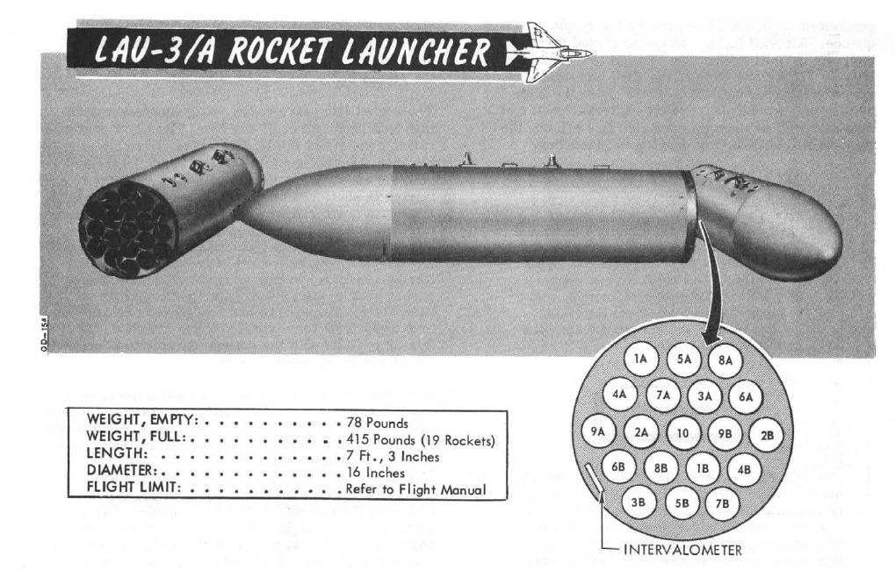

# Rockets

## Mk 4 Series 2.75 Folding Fin Aerial Rockets - FFAR

Also known as the Mighty Mouse, the Mk 4 series of unguided aerial rockets
originated as an air to air weapon. Given the rocket's undirected nature,
tendency for wide dispersion in salvo usage, and overall poor performance in its
intended role- most notably an incident in which over 200 rounds were fired by a
pair of F-89 Scorpions in a failed attempt to down an un-commanded target drone,
the Mighty Mouse was wholly unfit for purpose. However, the rocket's peculiar
traits were ingeniously capitalized upon by transitioning it to the role of an
air to ground area effect weapon.

Having become a useful tool, the original Mk 4's capability was expanded upon
with a wide array of warheads, including smoke, anti-personnel flechette, and
those used by the USAF on the Phantom- the m156 White Phosphorous, Mk 1 High
Explosive, and the Mk 5 High Explosive Anti Tank. Depending on the hardpoint
location and configuration, up to 3 LAU-3 pod launchers can be installed per
hardpoint, each carrying 19 FFARs per.

## Variants

Available variants include:

| Variant        | Description                                |
| -------------- | ------------------------------------------ |
| White Phosphor | For marking target areas                   |
| HE             | Against infantry and light armored targets |
| HEAT           | Against armored targets, such as vehicles  |
