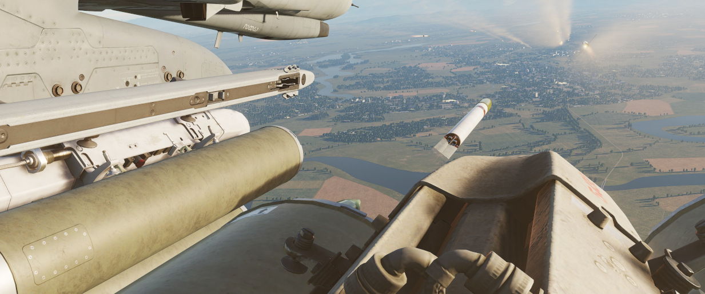

# 航箭

## Mk 4 系列 2.75 折叠翼航空火箭弹 - FFAR

绰号“太空飞鼠”，Mk 4 系列非制导航空火箭弹起初被设计作为空对空武器。但鉴于火箭的无法制导特性，齐射时
的宽散布倾向，以及在其设定角色中的总体表现不佳——尤其是在一次著名的事件后——其中两架 F-89 蝎式战斗机
发射了 200 多枚航箭，试图击落一个不受控的靶机，但未能成功，说明“太空飞鼠”完全不适合其原设计用途。不
过工程师利用航箭的这一特性，巧妙地将其转变为十分有效的空对地区域压制武器。

在证明了其作为武器的价值后，原先的 Mk 4 进一步扩展了包括烟雾弹、反人员钢箭和美国空军在“鬼怪”上使用
的——M156 白磷弹、Mk 1 高爆弹和 Mk 5 高爆反坦克战斗部。根据硬点的位置和配置，每个硬点最多可以安装 3
个 LAU-3 火箭发射器，每个发射器携带 19 枚 FFAR。

## 型号

可用型号包括：

| 型号 | 描述                   |
| ---- | ---------------------- |
| 白磷 | 标记目标区域           |
| HE   | 打击步兵和轻型装甲目标 |
| HEAT | 攻击装甲目标，如车辆   |
