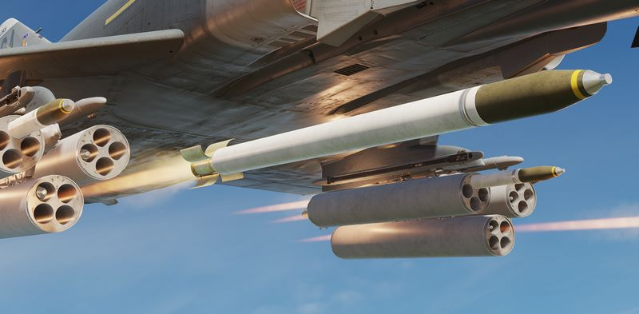

# Rockets

## Mk 4 Series 2.75 Folding Fin Aerial Rockets - FFAR

Also known as the Mighty Mouse, the Mk 4 series of unguided aerial rockets
originated as an air-to-air weapon. Given the rocket's undirected nature,
tendency for wide dispersion in salvo usage, and overall poor performance in its
intended role - most notably an incident in which over 200 rounds were fired by
a pair of F-89 Scorpions in a failed attempt to down an un-commanded target
drone, the Mighty Mouse was wholly unfit for purpose. However, the rocket's
peculiar traits were ingeniously capitalized upon by transitioning it to the
role of an air to ground area effect weapon.

Having become a useful tool, the original Mk 4's capability was expanded upon
with a wide array of warheads, including smoke, anti-personnel flechette, and
those used by the USAF on the Phantom - the M156 White Phosphorous, Mk 1 High
Explosive, and the Mk 5 High Explosive Anti Tank. Depending on the hardpoint
location and configuration, up to 3 LAU-3 pod launchers can be installed per
hardpoint, each carrying 19 FFARs.

### Variants

Available variants include:

| Variant        | Description                                |
| -------------- | ------------------------------------------ |
| White Phosphor | For marking target areas                   |
| HE             | Against infantry and light armored targets |
| HEAT           | Against armored targets, such as vehicles  |

## Mk 71 Series 5'' Zunis

The Mk 71 Zuni is a 5 inch Folding Fin Aerial Rocket (FFAR) that can be equipped
with a variety of motors and warheads. It is typically launched from a LAU-10
pod, holding 4 rockets.

The rocket is currently equipped with the Mk 63 **HE/FRAG** warhead.

The weapon was not employed by the F-4E historically, but served as crucial
ordnance for Navy variants and the german F-4F versions.

## Employment

With the Delivery Mode Selector Knob in **DIRECT** and the Weapon Selector Knob
in **RKTS & DISP**, as well as the Master Arm Switch on **ARM**, rockets can be
fired by holding down the **Bomb Button**.

Prior to that, select the corresponding stations using the **Station Select**
Buttons and configure the desired release quantity and mode on the **AWRU
panel**.

For aiming, put the sight into **A/G** mode and set the proper sight depression.

| Altitude |          Speed | Dive Angle | Sight Depression |
| -------: | -------------: | ---------: | ---------------: |
|  2500 ft | 450 - 500 KCAS |        10° |           30 mil |
|  2500 ft | 425 - 475 KCAS |        20° |           25 mil |
|  3000 ft | 400 - 425 KCAS |        30° |           15 mil |
|  3000 ft | 400 - 425 KCAS |        45° |       0 - 10 mil |

Generally, aim for about 450 KCAS. Slower speed and higher altitude lead to
hitting at the bottom edge of the pipper, while faster speed or lower altitude
lead to hitting the top of the pipper.
