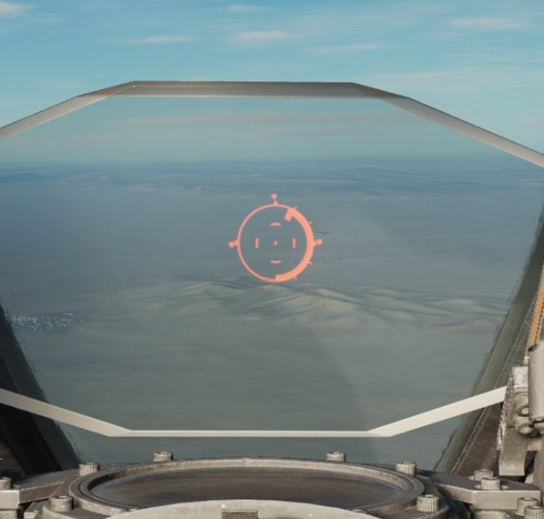
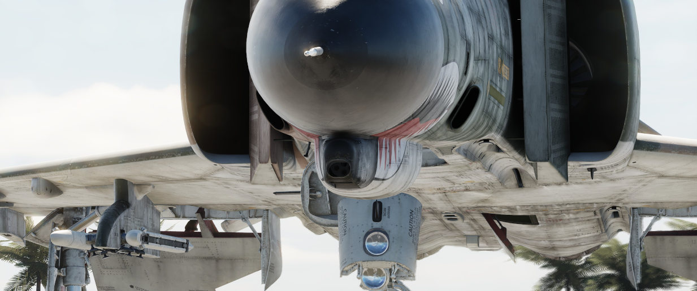

# 航炮

## 内置 M61A1 “火神”航炮

随着 F-4E 的出现，通用电气公司的 M61 “火神” 航炮终于作为“鬼怪”战斗的一部分投入了战场，F-4E 机头外形
和 APQ-120 经过了修改来适配航炮的安装。这种六管加特林式旋转航炮的内部弹鼓可携带 639 发炮弹，用户可
选择每分钟 4000 至 6000 发的射速，炮口初速超过 3450 英尺/秒，并且配有穿甲燃烧弹和高爆燃烧弹弹种选择
。“火神”航炮进行空对空，也可用于空对地攻击，F-4E 曾在越南上空有着四架火神航炮击落的确认战绩。

如需使用 M61，必须选择
[GUN 挂点选择按钮](../cockpit/pilot/weapon_management.md#station-select-buttons)、[主军械](../cockpit/pilot/weapon_management.md#master-arm-switch)
必须处于打开状态，并且必须拨到小指开关（向后）上的
[航炮选择](../cockpit/pilot/weapon_management.md#head-up-display-indicators)。完成后平视显示器上的
GUN 灯将亮起。

空对空使用航炮时，[光学瞄准具](../cockpit/pilot/dscg_controls.md#sight-mode-knob) 应设置为 A/A 模式
。在空对空模式下，光学瞄准具使用计算提前角的光学瞄准（LCOS）功能，因此可相对于雷达锁定的目标进行俯
仰和偏航机动，或在未锁定的情况下使用默认的 1000 英尺距离设置。在有雷达锁定的情况下，距离条将相对
6700 英尺（1 点钟方向上刻度的左侧）到 1000 英尺（6 点钟方向）间显示。

空对地使用航炮时，应将光学瞄准具选择到 A/G 模式、将
[投放模式旋钮](../cockpit/pilot/weapon_management.md#delivery-mode-knob) 设置到 OFF 或 Direct 模式
，并为预计攻击剖面输入所需的
[瞄准具下压密位设置](../cockpit/pilot/dscg_controls.md#reticle-depression-knob)。下压设置的基准为机
身基准线（FRL）。虽然下压会降低准星的仰角，但准星不会因飞机的相对运动而产生方位偏移。

航炮射速由底座组上的 [射速开关](../cockpit/pilot/pedestal_group.md#rate-of-fire-switch) 进行控制，
可选择高射速（每分钟 6000 发）或低射速（每分钟 4000 发）模式。底座组上还有
[航炮弹药计数器](../cockpit/pilot/pedestal_group.md#rounds-remaining-indicator)。

有一点值得注意的是 [自动清膛](../cockpit/pilot/pedestal_group.md#auto-clear-switch)功能；从飞行员松
开扳机开始，航炮将发射大约 5 至 11 发炮弹，来使航炮完成清膛动作；这一停转过程大约需要 1 秒钟，在此
操作过程中，航炮无法再次开火。虽然底座组上装有自动清膛开关，但该开关对内置 M61A1 航炮没有任何控制作
用，只能停用航炮吊舱的清膛功能。

## 航炮吊舱 SUU-16/A 和 SUU-23/A

SUU-16/A 和 SUU-23/A 航炮吊舱皆围绕 M61A1 和 1200 载弹量指标制造，既能为没有内置航炮的飞机提供航炮
能力，又能在近距离空中支援任务中增加可用的直射火力。这两种吊舱的射速固定在每分钟 6000 发，最多可同
时安装三个吊舱，并由火控系统驱动；虽然最多可在转场时挂载五个吊舱，宣传图片也展示了这种配置，但火控
系统只能启动三个吊舱。

> 💡 机翼内侧 2 号和 8 号挂载未接入操作吊舱的线路。> 仅中央挂点和外侧机翼挂载能操作航炮吊舱。

-16/A 和 -23/A 吊舱的主要区别在于其驱动方式；前者使用冲压空气涡轮装置驱动其马达，而后者则采用内部动
力。动力源的差异对相对实用性产生了影响——23/A 可以在任意空速下发射炮弹，因此可以挂载在空速较低的飞机
上，而 -16/A 的冲压空气涡轮最低空速需要 300 节才能发射炮弹，只有空速在 400 节以上才能取得最佳性能。
为了安全起见，两种吊舱都有自动清膛功能，可将装入炮膛的炮弹释放回弹鼓，但在再次发射炮弹之前会有一到
两秒钟的短暂延时。

飞行员可通过选择对应的
[挂点选择按钮](../cockpit/pilot/weapon_management.md#station-select-buttons)，并将
[投放模式旋钮](../cockpit/pilot/weapon_management.md#delivery-mode-knob) 转至 OFF 或 Direct 档位来
激活 SUU 吊舱。除激活 CAGE 模式外
，[武器选择钮](../cockpit/pilot/weapon_management.md#weapon-selector-knob) 可以置于 TV 或 ARM 以外
的任何档位。飞行员应设置 [自动清膛](../cockpit/pilot/pedestal_group.md#auto-clear-switch) ，并将
[主军械](../cockpit/pilot/weapon_management.md#master-arm-switch) 设置到 ON 来激活吊舱。对于
SUU-16，主军械拨至 ON 后将启动冲压空气涡轮。

航炮吊舱沿机身基准线进行校靶安装。因此，在
[光学瞄准具](../cockpit/pilot/dscg_controls.md#sight-mode-knob) 处在空对空模式下，炮弹将与内置航炮
一样飞向准星中间处，只是对应的挂架位置会自然偏移，这样就可以进行有效的自然炮击，如果只是受到导致
CEP 适度增加的影响的话。同样，在空对地模式下，SUU 吊舱与内部加农炮一样，在各自偏离中心线和 CEP 增加
的情况下，相对于瞄准镜凹陷时间表具有相同的性能。

如需在战斗后将航炮吊舱设置到安全模式，在将
[主军械](../cockpit/pilot/weapon_management.md#master-arm-switch) 拨至 OFF 前，将
[自动清膛](../cockpit/pilot/pedestal_group.md#auto-clear-switch) 开关拨至 Auto Clear 档位，短暂按下
扳机并按下对应的 [挂点选择按钮](../cockpit/pilot/weapon_management.md#station-select-buttons) 到
OFF 档位。对于 SUU-16，操作完成后将关闭冲压空气涡轮。
