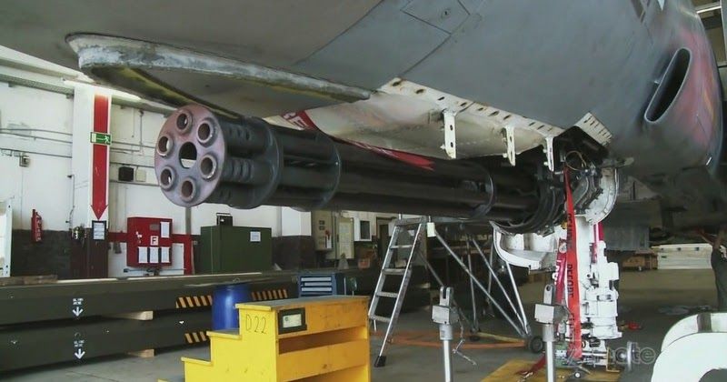
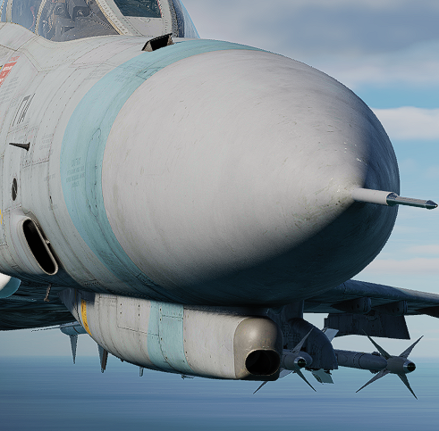

# Guns

## Internal Cannon M61A1 Vulcan

The General Electric M61 Vulcan cannon finally went to war as an integral part
of the Phantom with the advent of the F-4E, with the nose profile and APQ-120
modified to fit the weapon. Carrying 639 rounds in the internal drum, the
six-barreled Gatling style rotary cannon provides a user-selectable rate of fire
from 4000 to 6000 rounds per minute, delivering a muzzle velocity in excess of
3,450 ft/s, with armor piercing incendiary and high explosive incendiary round
options available. Useful in both air to air and air to ground roles, the Vulcan
was used for four confirmed kills by the USAF over Vietnam with the F-4E.

To utilize the M61, the GUN station select switch must be selected, the Master
Arm must be ON, and the Gun selection on the Pinky Switch (Aft) must be
actuated. This will illuminate the GUN lamp on the Head Up Display.

For air to air usage, the optical sight should be selected to A/A mode. In air
to air mode, the optical sight functions as a lead computing optical sighting
(LCOS), thus maneuvering in both elevation and azimuth relative to a radar
locked target, or a default 1000' range setting in the event of no lock. With a
lock, the range bar presentation is relative to 6700' just to the left of the
tick at the 1 o-clock position, down to 1000' at the 6 o-clock position.

For air to ground use, the optical sight should be selected to A/G mode, the
Delivery Mode knob should be set in the OFF or Direct mode, and the desired
sight depression mil setting be entered for the intended attack profile.
Depression is set relative from the Fuselage Reference Line (FRL). While
Depression will lower the reticle in elevation, there is no azimuth drift due to
relative aircraft motion.

Gun rate is controlled with the Rate switch on the Pedestal panel, and is
selectable as High (6000 rounds per minute) or Low (4000 rounds per minute).
Also on the Pedestal panel is the gun rounds remaining indicator.

Of note is the Auto Clear function; the cannon will fire approximately between 5
and 11 rounds from the point the pilot has released the trigger to clear all
bolt actions in the cannon; this spindown takes approximately one second, and
the gun cannot be fired again during this operation. While the Pedestal panel
carries the Auto Clear switch, this switch does not have any control over the
internal M61A1 cannon, and can only deactivate round clearance for podded
external cannon installations.

## External Cannon Pods SUU-16/A and SUU-23/A

Built to both provide gun capability to aircraft that did not mount them
internally, and to increase available direct fire in the close air support
mission, the SUU-16/A and SUU-23/A gun pods were both built around the M61A1 and
a 1200 round ammunition load. Both pods are fixed-rate at 6000 rounds per
minute, and up to three can be concurrently installed and driven by the fire
control system; while up to five can be loaded for ferry purposes, and
promotional images have shown such a configuration, only three can be activated.

The primary difference between the -16/A and -23/A pods are their method of
power; the former using a ram air turbine arrangement to drive its motor, while
the latter is internally powered. This difference had an effect on relative
utility- while the -23/A could be fired at any airspeed, thus allowing it to be
loaded onto slower aircraft, the -16/A's ram air turbine required a minimum
speed of 300 knots to fire, and only reached its optimum performance above 400
knots. Both pods have an auto-clear function for safety, which cause rounds
loaded in the breeches to be released back into the ammo bin, which does entail
a momentary delay of one to two seconds prior to being able to fire the pod
again.

Activation of the SUU pods are performed by selecting their respective Station
Select switches, and placing the Delivery Mode knob in OFF or Direct. The Weapon
Selector knob can be in any position other than TV or ARM, unless CAGE mode is
activated. The desired Auto-Clear setting should be selected, and Master Arm set
to ON to activate the pod. On the SUU-16, the Master Arm activation deploys the
ram air turbine.

Installed, the guns are boresighted along the Fuselage Reference Line. Thus,
with the optical sight in air to air mode, the rounds will fall in accordance
with reticle center, just as the main cannon- only with the natural offset of
their respective pylon position, thus allowing for effective natural gunnery, if
only affected by a moderate increase in resulting CEP. In the same fashion, in
air to ground mode, the SUU pods observe the same performance relative to the
reticle depression schedule as the internal cannon, again, with their respective
offsets from centerline and CEP increase.

To safe the gun pods after combat, prior to deactivating Master Arm, the Auto
Clear switch should be placed into the Auto Clear position, the trigger squeezed
momentarily, and the respective Station Select buttons pushed to off. On the
SUU-16, this will close the ram air turbine.
