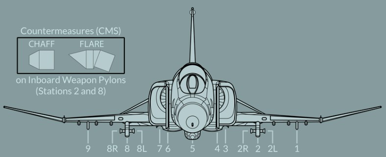

# Weapons & Stores

As a cornerstone of air forces around the globe, the F-4E's effectiveness is not
only attributed to its advanced avionics and airframe design but also to its
formidable array of weapons and stores.

The F-4E features three main types of [Air-to-Air](./air_to_air/overview.md)
Weaponry including Heat-Seeking Missiles with the [AIM-9](./air_to_air/aim_9.md)
in different [variants,](./air_to_air/aim_9.md#variants) the semi-active radar
homing missile [AIM-7](./air_to_air/aim_7.md) in different
[variants](./air_to_air/aim_7.md#variants) and a
[M61A1 Vulcan cannon](./guns.md#internal-cannon-m61a1-vulcan) that can be used
against Air and Ground Targets.

The aircraft can be armed with a variety of
[bombs](./air_to_ground/bombs/overview.md),
[rockets](./air_to_ground/rockets.md), and
[guided munitions](./air_to_ground/missiles/overview.md) to engage and
neutralize ground targets. Precision-guided munitions, such as
[laser-guided bombs](./air_to_ground/bombs/laser_guided_bombs.md), enable the
Phantom II to strike high-value targets with precision, minimizing collateral
damage and maximizing mission success.

In addition to its lethal armament, the F-4E can be configured with
[external fuel tanks](./tanks.md) to extend its operational range. The aircraft
can also carry specialized stores, including
[targeting pods](./pods.md#anavq-23-pave-spike) and
[electronic warfare (EW) systems](./pods.md#alq-131-ecm-pod).

## Loadout

The following diagram gives an overview of all stores that can be loaded on the
stations.

> 💡 In practice, not all combinations might be possible, as there are a lot of
> technical factors resulting in restrictions.

| Store / Station | 9 |  8  | 7 | 6 | 5 | 4 | 3 |  2  | 1 | Total |
|-----------------|:-:|:---:|:-:|:-:|:-:|:-:|:-:|:---:|:-:|------:|
| AIM-9           |   | (2) |   |   |   |   |   | (2) |   |     4 |
| AIM-7           |   |     | 1 | 1 |   | 1 | 1 |     |   |     4 |
| AGM-45          | 1 |  1  |   |   |   |   |   |  1  | 1 |     4 |
| AGM-65          |   |  3  |   |   |   |   |   |  3  |   |     6 |
| AGM-12          |   |  1  |   |   |   |   |   |  1  |   |     2 |
| MK-81           | 6 |  3  |   |   | 6 |   |   |  3  | 6 |    24 |
| MK-82           | 6 |  3  |   |   | 6 |   |   |  3  | 6 |    24 |
| Mk-83           | 2 |  3  |   |   | 3 |   |   |  3  | 2 |    13 |
| Mk-84           | 1 |     |   |   | 1 |   |   |     | 1 |     3 |
| M117            | 3 |  3  |   |   | 5 |   |   |  3  | 3 |    17 |
| Mk-20           |   |  3  |   |   | 6 |   |   |  3  |   |    12 |
| CBU-52          | 3 |  2  |   |   |   |   |   |  2  | 3 |    10 |
| CBU-87          | 3 |  2  |   |   | 4 |   |   |  2  | 3 |    14 |
| GBU-10          | 1 |  1  |   |   |   |   |   |  1  | 1 |     4 |
| GBU-12          | 1 |  2  |   |   |   |   |   |  2  | 1 |     6 |
| GBU-24          | 1 |  1  |   |   |   |   |   |  1  | 1 |     4 |
| BDU-33          | 6 |     |   |   | 6 |   |   |     | 6 |    18 |
| BDU-50          | 6 |  3  |   |   | 6 |   |   |  3  | 6 |    24 |
| BDU-45          |   |  2  |   |   |   |   |   |  2  |   |     4 |
| BLU-107         |   |  3  |   |   | 6 |   |   |  3  |   |    12 |
| AGM-62          |   |  1  |   |   |   |   |   |  1  |   |     2 |
| GBU-8           | 1 |  1  |   |   |   |   |   |  1  | 1 |     4 |
| GBU-15          |   |  1  |   |   |   |   |   |  1  |   |     2 |
| FFAR (×19)      | 3 |  3  |   |   | 3 |   |   |  3  | 3 |   285 |
| SUU-23          | 1 |     |   |   | 1 |   |   |     | 1 |     3 |
| SUU-25 (x8)     | 2 |     |   |   | 2 |   |   |     | 2 |    48 |
| ALQ-131         |   |  1  |   |   |   | 1 |   |  1  |   |     3 |
| AN/AVQ-23       |   |     |   |   |   | 1 |   |     |   |     1 |
| AN/ALE-40       |   | (1) |   |   |   |   |   | (1) |   |     2 |
| Fuel Tank       | 1 |     |   |   | 1 |   |   |     | 1 |     3 |

In general, stations 3, 4, 6 and 7 can be used to load Air-To-Air Missiles, or
also Jammer and Targeting Pods.

Air-To-Ground Ordnance is mostly carrier on pylons 1, 2, 5, 8 and 9.

Pylons 2 and 8 are special, since they can be equipped with the
Special-Weapons-Adapter (SWA) and have additional attach-points on their sides
(labelled 2L, 2R, 8L, 8R) for loading AIM-9 Sidewinder missiles without
occupying the entire pylon.

> 💡 AIM-9 Sidewinder can be loaded onto pylon 2 and 8 additionally to other
> ordnance. Hence, it is still possible to equip for example a Maverick on the
> same pylon.

Further, AN/ALE-40 Countermeasure Dispensers can be attached to the aft section
of Pylon 2 and 8. Allowing the aircraft to carry a mix between 120 chaff and 30
flares in total.
