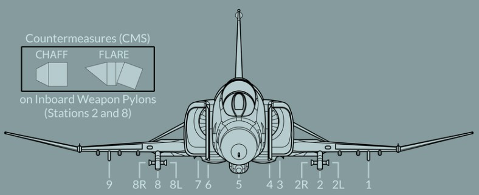

# Weapons & Stores

As a cornerstone of air forces around the globe, the F-4E's effectiveness is not
only attributed to its advanced avionics and airframe design but also to its
formidable array of weapons and stores.

The F-4E features three main types of [Air-to-Air](./air_to_air/overview.md)
Weaponry including Heat-Seeking Missiles with the [AIM-9](./air_to_air/aim_9.md)
in different [variants,](./air_to_air/aim_9.md#variants) the semi-active radar
homing missile [AIM-7](./air_to_air/aim_7.md) in different
[variants](./air_to_air/aim_7.md#variants) and a
[M61A1 Vulcan cannon](./guns.md#internal-cannon-m61a1-vulcan) that can be used
against Air and Ground Targets.

The aircraft can be armed with a variety of
[bombs](./air_to_ground/bombs/overview.md),
[rockets](./air_to_ground/rockets.md), and
[guided munitions](./air_to_ground/missiles/overview.md) to engage and
neutralize ground targets. Precision-guided munitions, such as
[laser-guided bombs](./air_to_ground/bombs/laser_guided_bombs.md), enable the
Phantom II to strike high-value targets with precision, minimizing collateral
damage and maximizing mission success.

In addition to its lethal armament, the F-4E can be configured with
[external fuel tanks](./tanks.md) to extend its operational range. The aircraft
can also carry specialized stores, including
[targeting pods](./pods.md#anavq-23-pave-spike) and
[electronic warfare (EW) systems](./pods.md#alq-131-ecm-pod).

## Loadout

The following diagram gives an overview of all stores that can be loaded on the
stations.

> 💡 In practice, not all combinations might be possible, as there are a lot of
> technical factors resulting in restrictions.

| Store / Station |  9  |  8  |  7  |  6  |  5  |  4  |  3  |  2  |  1  | Total |
| --------------- | :-: | :-: | :-: | :-: | :-: | :-: | :-: | :-: | :-: | ----: |
| AIM-7           |     |     |  1  |  1  |     |  1  |  1  |     |     |     4 |
| AIM-9           |     | (2) |     |     |     |     |     | (2) |     |     4 |
| AGM-12          |  1  |  1  |     |     |     |     |     |  1  |  1  |     4 |
| AGM-45          |  1  |  1  |     |     |     |     |     |  1  |  1  |     4 |
| AGM-62          |  1  |     |     |     |     |     |     |  1  |     |     2 |
| AGM-65          |     |  3  |     |     |     |     |     |  3  |     |     6 |
| MK-81           |  6  |  3  |     |     |  6  |     |     |  3  |  6  |    24 |
| MK-82           |  6  |  3  |     |     |  6  |     |     |  3  |  6  |    24 |
| Mk-83           |  2  |  3  |     |     |  3  |     |     |  3  |  2  |    13 |
| Mk-84           |  1  |  1  |     |     |  1  |     |     |  1  |  1  |     5 |
| M117            |  3  |  3  |     |     |  5  |     |     |  3  |  3  |    17 |
| SAMP-250        |  3  |  3  |     |     |  3  |     |     |  3  |  3  |    15 |
| Mk-20           |     |  3  |     |     |  6  |     |     |  3  |     |    12 |
| CBU-1/A         |  2  |     |     |     |  1  |     |     |     |  2  |     5 |
| CBU-2/A         |  2  |     |     |     |  1  |     |     |     |  2  |     5 |
| CBU-52          |  3  |  2  |     |     |     |     |     |  2  |  3  |    10 |
| CBU-87          |  3  |  2  |     |     |  4  |     |     |  2  |  3  |    14 |
| BL-755          |  2  |  3  |     |     |  3  |     |     |  3  |  2  |    13 |
| GBU-10          |  1  |  1  |     |     |     |     |     |  1  |  1  |     4 |
| GBU-12          |  1  |  2  |     |     |     |     |     |  2  |  1  |     6 |
| GBU-24          |  1  |  1  |     |     |     |     |     |  1  |  1  |     4 |
| BDU-33          |  6  |  3  |     |     |  6  |     |     |  3  |  6  |    24 |
| BDU-45          |  1  |  2  |     |     |     |     |     |  2  |  1  |     6 |
| BDU-50          |  6  |  3  |     |     |  6  |     |     |  3  |  6  |    24 |
| BLU-107         |     |  3  |     |     |  6  |     |     |  3  |     |    12 |
| GBU-8           |  1  |  1  |     |     |     |     |     |  1  |  1  |     4 |
| FFAR (×19)      |  3  |  3  |     |     |  3  |     |     |  3  |  3  |   285 |
| Zuni (×4)       |  3  |  3  |     |     |     |     |     |  3  |  3  |    48 |
| SUU-23          |  1  |     |     |     |  1  |     |     |     |  1  |     3 |
| GPU-5           |     |     |     |     |  1  |     |     |     |     |     1 |
| SUU-25 (x8)     |  2  |     |     |     |  2  |     |     |     |  2  |    48 |
| ALQ-131         |     |  1  |     |     |     |  1  |     |  1  |     |     3 |
| AN/AVQ-23       |     |     |     |     |     |  1  |     |     |     |     1 |
| AN/ASQ-T50      |     | (2) |     |     |     |     |     | (2) |     |     4 |
| AN/ALE-40       |     | (1) |     |     |     |     |     | (1) |     |     2 |
| Fuel Tank       |  1  |     |     |     |  1  |     |     |     |  1  |     3 |

In general, stations 3, 4, 6 and 7 can be used to load Air-To-Air Missiles, or
also Jammer and Targeting Pods.

Air-To-Ground Ordnance is mostly carrier on pylons 1, 2, 5, 8 and 9.

Pylons 2 and 8 are special, since they can be equipped with the
Special-Weapons-Adapter (SWA) and have additional attach-points on their sides
(labelled 2L, 2R, 8L, 8R) for loading AIM-9 Sidewinder missiles without
occupying the entire pylon.

> 💡 AIM-9 Sidewinder can be loaded onto pylon 2 and 8 additionally to other
> ordnance. Hence, it is still possible to equip for example a Maverick on the
> same pylon.

Further, AN/ALE-40 Countermeasure Dispensers can be attached to the aft section
of Pylon 2 and 8. Allowing the aircraft to carry a mix between 120 chaff and 30
flares in total.

## Unavailable Weapons

In the following various weapons are listed that the simulated variant of the
F-4E is not able to equip.

The reasons for this can be manifold, for example the laser guidance kit of a
bomb making it too long to fit on a wing pylon without being in the way of the
flaps movement range. Or also the aircraft never being able to operate a
specific weapon despite pictures showing it on a pylon; but that aircraft either
being modified and not representing the simulated variant (test aircraft,
aircraft operated by other countries), or the ordnance also simply only being
put on the pylon without it being operable.

| Ordnance           | Explanation                         |
| ------------------ | ----------------------------------- |
| AIM-9X             | Too late                            |
| AIM-7C             | Too early                           |
| AIM-7MH/P          | Never carried                       |
| AIM-120            | Modification (AUP, F-4F)            |
| AAM-3              | Modification (F-4EJ)                |
| AAM-4              | Modification (F-4EJ)                |
| AGM-65L/H/K/E/F    | Modification                        |
| AGM-78             | Modification (Kurnass, F-4G)        |
| AGM-88             | F-4G                                |
| AGM-142            | Modification (Kurnass, Terminator)  |
| MK-83 AIR          | Never carried                       |
| B61 Nuclear        | Compatible, but no nuclear ordnance |
| ALQ-87             | Too early                           |
| ALQ-184            | Tests only and F-4G                 |
| AN/AAQ-14 Lantirn  | Never carried                       |
| AN/AAQ-28 Litening | Modification (Terminator, AUP)      |

### Loadout Limitations

While some ordnance can be used with the jet, some specific loadout combinations
might not be supported. Usually this is due to clearance issues, for example
with the gear doors, flaps or speedbrakes.

| Ordnance  | Stations | Clearance   |
| --------- | -------- | ----------- |
| MK-84     | 1, 9     | Flaps       |
| MK-84     | 2, 8     | Speedbrakes |
| MK-84 AIR | 5        | Fuselage    |
| 3x BL-755 | 1, 9     | Speedbrakes |
| CBU-52    | 5        | Gear        |
| ALQ-131   | 6        | Gear Door   |

### Compatible

Some currently unavailable weapons are compatible with the simulated F-4E
variant and might still be added in the future.

| Ordnance                | Details |
| ----------------------- | ------- |
| AIM-9D                  |         |
| AIM-9E                  |         |
| AIM-7E-3                |         |
| AIM-4                   |         |
| AGM-45(B)               |         |
| BLU-1 Napalm            |         |
| BLU-27 Napalm           |         |
| MJU-1 Chaff Bomb        |         |
| M129 Leaflet Bomb       |         |
| M118 GP                 |         |
| GBU-10A                 |         |
| GBU-10B                 |         |
| GBU-11                  |         |
| GBU-12A                 |         |
| GBU-15                  | DMAS    |
| MXU-658 Travel Pod      |         |
| ALQ-101                 |         |
| ALQ-119                 |         |
| AN/AXQ-14 DL            | DMAS    |
| AN/AVQ-26 Pave Tack     | DMAS    |
| TISEO                   | DMAS    |
| AN/ALE-38 CMS           |         |
| AN/AKQ-14 Telemetry     |         |
| Early hi-G CL Tank      |         |
| Royal Jet CL low-G Tank |         |
| RMK-19 Towed Target     |         |
