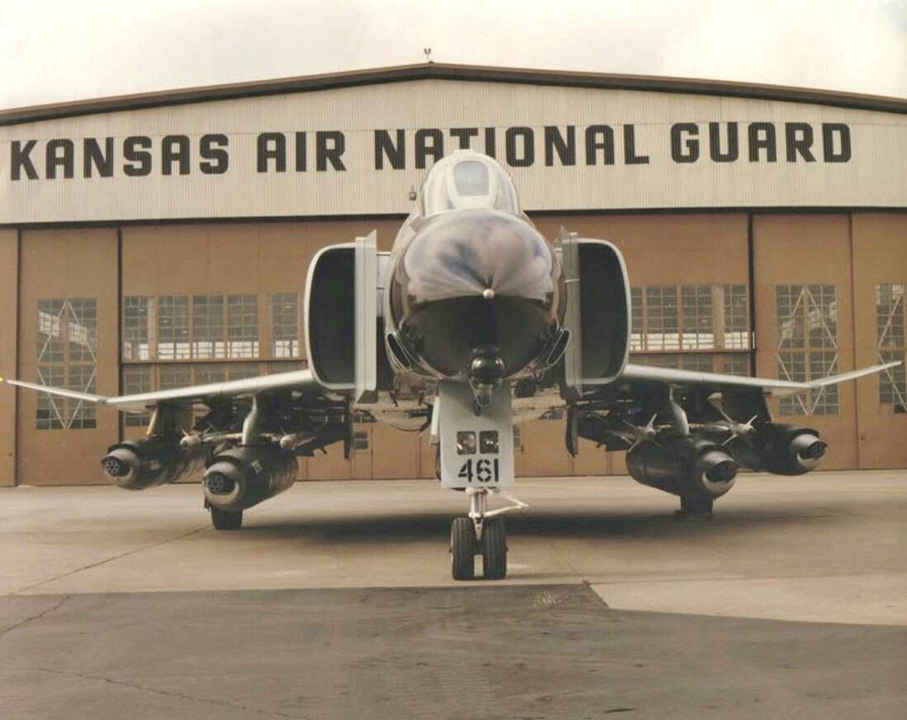
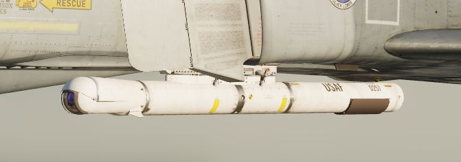
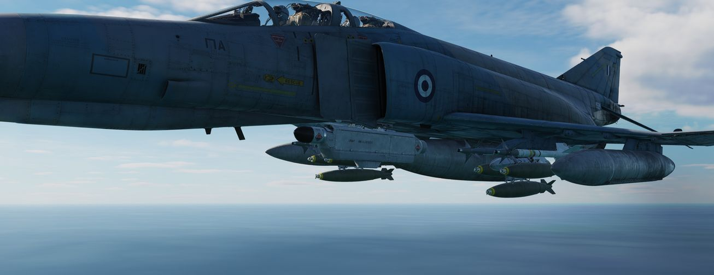

# Pods

## SUU-23/A Gun Pod

External gun pods holding 1200 rounds of ammunition, firing at a rate of 6000
rounds per minute. See the [gun section](guns.md) for more.

## AN/AVQ-23 Pave Spike

The AN/AVQ-23 Pave Spike targeting pod, capable of spotting and tracking targets
during daylight-conditions and using a laser to guide weapons on target. See the
[systems section](../systems/weapon_systems/pave_spike/overview.md) for more.

## ALQ-131 ECM Pod

Pod for electronic countermeasures, such as jamming radars and radar
guided missiles.

## ALE-40 Dispenser

Countermeasure dispensers holding chaff and flare. See the
[countermeasures section](../systems/defensive_systems/countermeasures.md) for more.
