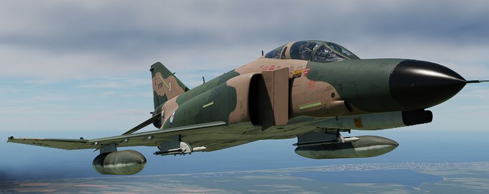

# 副油箱

为扩大航程，“鬼怪”最多可挂载三个副油箱——绰号 _Sargent Fletcher 油箱_：

- 1x 600 加仑中线副油箱
- 2x 370 加仑机翼副油箱

三个副油箱可同时挂载，来从不挂载副油箱时的 12896 磅增加到惊人的 21606 磅燃油总量，使燃油量增加了近
一倍。

挂载一个中线副油箱时，燃油总量为 16796 磅，在挂载两个机翼副油箱时，燃油总量为 17706 磅。

详见 [3.2.2. 燃油章节](../systems/engines_and_fuel_systems/fuel_system.md) 来查看如何使用副油箱。
