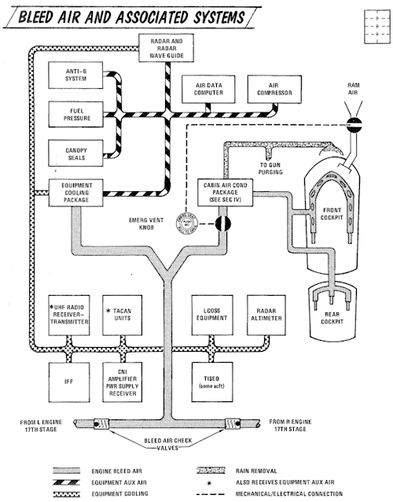

# Bleed Air System

The bleed air system supplies high temperature, high
pressure air from the engines to the boundary layer
control system (on aircraft without slats), the cabin air
conditioning system, and the fuel cell pressurization
system. Control of the bleed air flow, temperature and
pressure is initiated and regulated by the requirements of
each system. The system utilizes engine compressor bleed
air tapped off the 17th stage compressor. Normally, both
engines supply the air for the operation of these systems,
but when necessary, single engine operation will supply
sufficient air for their operation.
<!-- straight from the flight manual -->

