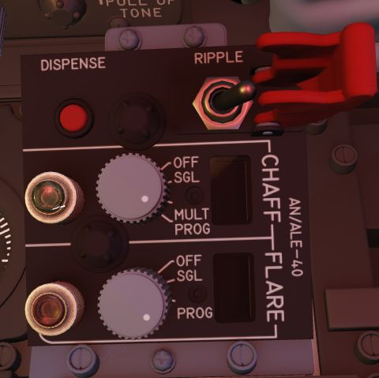
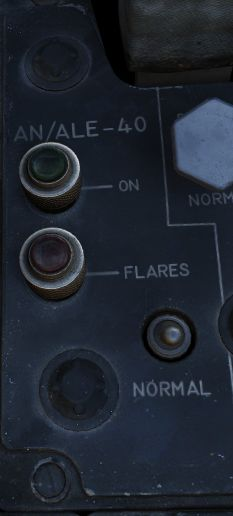

# Countermeasures

## AN/ALE-40 Countermeasures System

The AN/ALE-40 countermeasures dispenser set provides the capability of
dispensing RR-170 A/AL chaff cartridges or MJU-7/B infrared flare cartridges, or
a combination of both. The system consists of four chaff dispensers, or a
combination of two chaff dispensers and two flare dispensers located on the
inboard armament pylons; a programmer and flares select switch in the pilot
cockpit; a cockpit control unit (CCU) in the WSO cockpit; indicator lights
located in both front and rear cockpit; and a dispense button located both in
the pilot and the WSO cockpit. The circuit breaker for the ALE-40 is located on
the No.4 Circuit Breaker Panel above the aft left console in the WSO cockpit.

| Loadout Combination     | Description                    |
|-------------------------|--------------------------------|
| Empty                   | No chaff or flares loaded      |
| 120x chaff              | Only chaff loaded              |
| 15x Flares + 90x chaff  | 15 flares and 90 chaff loaded  |
| 30x flares + 60x chaffs | 30 flares and 60 chaffs loaded |
| 30x flares              | Only 30 flares loaded          |

Dispensing of countermeasures can be initiated by either the pilot or the WSO
from either the front or the rear cockpit. The CCU will initiate the various
modes of operation. The programmer will generate the firing commands in
different combinations called bursts or salvos. A group of several bursts
constitutes a salvo. The pylon mounted dispensers will convert the firing
commands to individually sequenced firing signals. If the operation mode is set
to chaff, the dispensing will start in the left pylon dispenser and then
transfer the dispensing signals to the right pylon dispenser upon depletion of
stores in the left dispenser. If the operation mode is set to flare, dispensing
will start in the right pylon master dispenser and upon depletion of stores the
sequencer switch will transfer the dispensing signal to the left master
dispenser. Flares can also be jettisoned from their dispensers at a rate of 10
flares per second by activating the ripple switch located on the CCU.

### AN/ALE-40 Cockpit Control Unit (CCU)

The Cockpit Control Unit (CCU) is installed on the left console of the rear
cockpit. It consists of a chaff and a flare mode rotary knob, two subtraction
counters, two indicator lights, a guarded ripple switch and a chaff/flare
dispenser button. The CCU issues dispense and mode signals through the
programmer.

### Chaff Mode Knob

The chaff operating modes can be selected by turning the chaff mode knob from
the OFF position to either the SGL, MULT or PROG positions. With the flare
select switch in the NORMAL position and flaps and speed brakes retracted, the
switch positions function as follows:

OFF Chaff system not activated/ not operational. SGL A single burst command that
is sent to the chaff dispenser whenever either dispense button is pressed. MULT
One salvo of fire commands is sent to the dispenser through the programmer
whenever either dispense button is pressed. PROG A group of salvo fire commands
is sent to the dispenser through the programmer whenever either dispense button
is pressed.

### Flare Mode Knob

The flare operating modes can be selected by turning the flare mode knob from
the OFF position to either the SGL or PROG positions. With the flare select
switch in the NORMAL position and flaps and speed brakes retracted, the switch
positions function as follows:

OFF Flare system not activated/ not operational. SGL A single burst command that
is sent to the flare dispenser whenever either dispense button is pressed. PROG
One salvo of fire commands is sent to the dispenser through the programmer
whenever either dispense button is pressed.

### Chaff and Flare Counters

There are two subtraction counters, one for the chaff system and one for the
flare system. They indicate the quantity of remaining chaff and flare cartridge
dispensers independent of the mode switch position.

NOTE: When the slave dispenser is set to Chaff Double (CD), the chaff counter
should be set to half the number of total chaff cartridges loaded or the chaff
counter will show twice the number of chaff cartridge dispenses remaining.

### Chaff Double (CD)

When Chaff Double is selected in the Mission Editor, the ground crew will activate it. In Chaff
double mode both dispensers, left and right, will dispense at the same time.

### Chaff and Flare Indicator Lights

Both the flare and the chaff system have one green indicator light each.
Whenever a mode is selected on the respective mode knob, the corresponding
indicator light will illuminate.

NOTE: Both flare and chaff modes can be operated simultaneously provided a mixed
chaff/flare loadout has been selected.

### Ripple Switch

The ripple switch is guarded. When the guard is lifted and the switch is set to
ON, it will initiate flare dispensing regardless of the position of any other
switches or mode knobs in the countermeasures system- if the flaps and the speed
brakes are retracted. The flares will be dispensed at a rate of 10 flares per
second until both left and right pylon dispensers are empty.

### Dispense Button (Rear Cockpit)

When pressing the dispense button chaff/flare dispensing is initiated as set on
the CCU and AN/ALE-40 programmer if the flaps and speed brakes are retracted,
and provided either or both the chaff/flare mode knobs are in any position other
than OFF.

### AN/ALE-40 Programmer

The AN/ALE-40 Programmer contains the controls and circuitry used to send
specific fire commands to the chaff/flare dispensers. The following functions
are available:

Control Function

| Setting     | Options                               |
|-------------|---------------------------------------|
| CHAFF BURST | COUNT 1, 2, 3, 4, 6, 8 (units)        |
|             | INTERVAL 0.1, 0.2, 0.3, 0.4 (seconds) |
| CHAFF SALVO | COUNT 1, 2, 4, 8, C (continuous)      |
|             | INTERVAL 1, 2, 3, 4, 5, 8, R (random) |
| FLARE BURST | COUNT 1, 2, 4, 8, C (continuous)      |
|             | INTERVAL 3, 4, 6, 8, 10 (seconds)     |

### Flares Select Switch

If the flares select switch is in the NORMAL position, it arms the
countermeasures dispenser system and allows for chaffs and flares to be
dispensed as set by the CCU and the programmer by pressing either dispense
button.

If the flares select switch is in the FLARES position it only affects the front
cockpit dispense button by ignoring all switches and knobs in the
countermeasures system, provided that the flaps and speed brakes are retracted.
This allows the pilot to dispense a single flare each time he presses the
dispense button. Rear cockpit dispense functions are unaffected by the switch
position.

### Flares Indicator Light (Amber)

The FLARES indicator light is amber. It illuminates when the flares select
switch is set to FLARES. When illuminated, flares can be dispensed by pressing
the front cockpit dispense button regardless of programmer and CCU switch and
knob positions, if the flaps and speed brakes are retracted.

### AN/ALE-40 Power On Indicator Light (Green)

The AN/ALE-40 power on indicator light is green. It illuminates when the flares
select switch is set to NORMAL and either (or both) of the chaff and flare mod
knobs are in any position other than OFF.

### Dispense Button (Front Cockpit)

When pressing the dispense button chaff/flare dispensing is initiated as set on
the CCU and AN/ALE-40 programmer if the flaps and speed brakes are retracted and
the flares select switch is set to NORMAL. Additionally single unit flare
dispensing can be initiated by a single button press if the flares select switch
is set to FLARES.

### AN/ALE-40 Dispensers

The AN/ALE-40 countermeasures dispensers are divided into two distinct dispenser
configurations. The master (outboard) dispenser contains the electronics and
sequencer switch for both dispensers on each pylon and is installed on the
outboard side of the inboard armament pylons. The slave (inboard) dispenser is
installed on the inboard side of the inboard armament pylons and is connected to
the master dispenser by an interconnect cable. The aircraft can be configured
either with four chaff payload modules on all four dispensers or two chaff
payload modules on the slave dispensers and two flare payload modules on the
master dispensers. Only chaff payload modules can be installed on the slave
dispensers; flare payload modules can only be installed on the master
dispensers.

### Master Dispenser Assembly

NOTE: Operation of the master dispenser assembly is done automatically by the
ground crew in DCS, according to the AN/ALE-40 loadout selected in the loadout
menu.

One master dispenser assembly is installed on the outboard side of each inboard
armament pylon. It consists of a sequencer switch, a breech assembly, a
RESET/OPERATE circuit breaker switch, a payload control switch, a safety pin
switch with safety pin and warning streamer and relevant electrical circuitry.
The sequencer switch converts the firing commands into individual firing signals
for each pyrotechnic squib in both the master and slave dispensers. The breech
assembly provides the interface to mount the chaff or flare payload modules.
Insertion of the safety pin removes electrical power to both pylon mounted
dispensers. After a full chaff or flare module has been loaded, the
RESET/OPERATE switch is placed in OPERATE. The chaff or flare sections will fire
in sequence. After flight, if a partial load of chaff or flares remains, the
switch should be left in OPERATE. If the switch is moved to RESET, the empty
chaff or flare stations have to be stepped through before loaded stations will
fire. The payload selector switch positions C (chaff) and F (flare) only define
the master dispenser mode of deployment and are set automatically in DCS
according to the selected loadout.

### Slave Dispenser Assembly

Note: The payload selector switch position is set to CS (chaff single dispense)
by default in DCS. To set it to CD (chaff double dispense), you have to do so
either in the Mission Editor Unit Aircraft Additional Options tab or in the
kneeboard. This action can only be performed on the ground and/or before mission
start.

One slave dispenser assembly is installed on the inboard side of each inboard
armament pylon. It contains a payload selector switch to set either chaff single
or chaff double dispense, a breech assembly and relevant electrical circuitry.
If the payload selector switch is left in the default CS position, one chaff
cartridge will be dispensed for each chaff burst commanded. If the payload
selector switch is set to the CD position, two chaff cartridges will be
dispensed simultaneously, one from each dispenser, for each chaff burst
commanded. The breech assembly provides the interface to mount the chaff payload
module.

### Flare Housing Adapter

The flare housing adapter is installed between the master dispenser assembly and
the flare payload module. The wedge shaped adapter ensures that the flares will
be ejected aft and down from the aircraft. It cannot be mounted to the slave
dispenser.

### Chaff Payload Module and Cartridges

The chaff payload module is attached to the master or slave dispenser breech
assembly with four quick release fasteners. The chaff cartridge consists of a
basic plastic sleeve, chaff dipoles and a plastic end cap. When dispensed the
chaff dipoles are ejected from the sleeves and leave the disposable sleeve and
empty squib case behind. The cartridge base provides a recess for the chaff
pyrotechnic squib.

WARNING: Accidental discharge of the chaff cartridges can cause injury to
personnel or damage to the aircraft. The master dispenser safety pin must be
installed at all times when loading, unloading or maintaining the system.

### Flare Payload Module and Cartridges

The flare payload module can only be installed on the master dispenser assembly.
The flare housing adapter serves as the interface. The flare cartridge consists
of a metal outer sleeve, a flare element, a safe-ing and initiation device and a
plastic end cap. An indentation in the cartridge base allows for proper flare
installation.

WARNING: Accidental discharge of the flare cartridges can cause injury to
personnel or damage to the aircraft. The master dispenser safety pin must be
installed at all times when loading, unloading or maintaining the system.

### Pyrotechnic Squibs

The chaff pyrotechnic squibs are installed immediately prior to use and are
stored separately from the chaff cartridges. They are metal encased and
electrically fired.

The flare pyrotechnic squibs are larger in diameter and have an O-ring groove.
They are installed immediately prior to use and are stored separately from the
flare cartridges.
