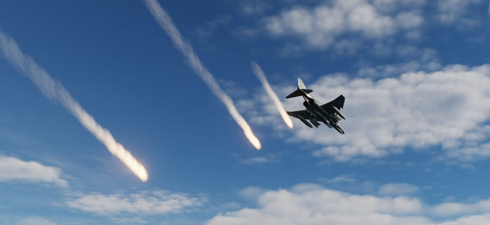
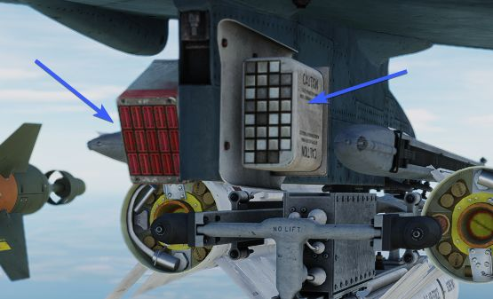
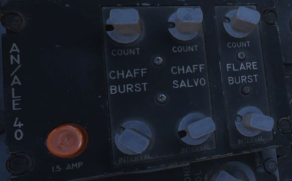
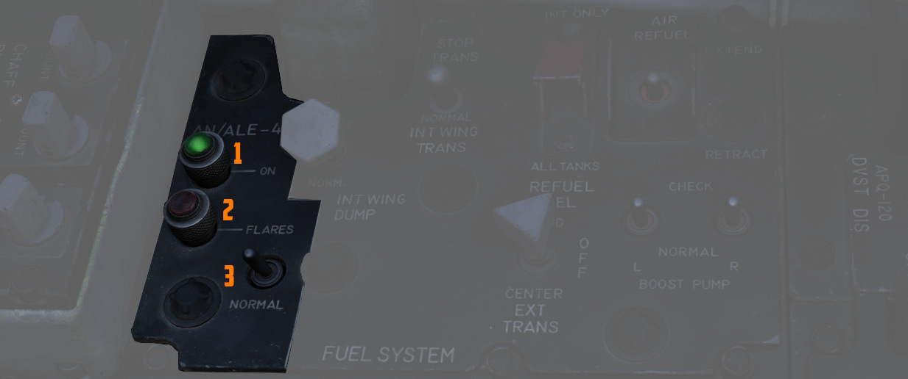
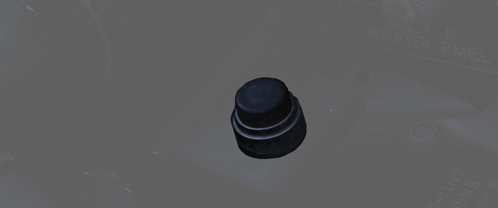

# Countermeasures

## AN/ALE-40 Countermeasures System

The AN/ALE-40 countermeasures dispenser set provides the capability of
dispensing RR-170 A/AL chaff cartridges and MJU-7/B infrared flare cartridges.
The system consists of four dispenser slots located on the
inboard armament pylons (2 on each) as well as cockpit controls.

The pilot cockpit contains a programmer,
a flares select switch with two lamps
and a dispense button located on the throttle.
The WSO pit has a cockpit control unit (CCU).

The main circuit breaker for the AN/ALE-40 is located on
the No. 4 Circuit Breaker Panel above the aft left console in the WSO cockpit.

| Dispenser Configuration | Description                          |
|-------------------------|--------------------------------------|
| No payload              | Dispensers installed without payload |
| 120 chaff               | Only chaff loaded                    |
| 60 chaff + 30 flare     | 60 chaff and 30 flares loaded        |
| 90 chaff + 15 flare     | 90 chaff and 15 flares loaded        |
| 30 flare                | Only flares loaded                   |

## General operation

Operation of the AN/ALE-40 is controlled from both the
front and rear cockpit. The CCU initiates the various
modes of operation. The programmer will generate the firing commands in
different combinations.

The pylon mounted dispensers will convert the firing
commands to individually sequenced firing signals. If the operation mode is set
to chaff, the dispensing will start in the left pylon dispenser and then
transfer the dispensing signals to the right pylon dispenser upon depletion of
stores in the left dispenser. If the operation mode is set to flare, dispensing
will start in the right pylon master dispenser and upon depletion of stores the
sequencer switch will transfer the dispensing signal to the left master
dispenser. Flares can also be jettisoned from their dispensers at a rate of 10
flares per second by activating the ripple switch located on the CCU.

Dispensing of countermeasures can be initiated
by either the pilot (Button on the Throttle)
or the WSO (Dispense Button or Ripple Switch on the CCU).

Countermeasures will be dispensed according to Flares Select Switch, CCU and Programmer settings.

Chaff and Flare programs are divided into two categories:

* BURST - single dispense signal
* SALVO - group of bursts

> 💡 To dispense countermeasures, flaps and speed brakes have to be retracted.

## Cockpit Control Unit (CCU) - WSO Cockpit

The Cockpit Control Unit (CCU) is installed on the left console of the rear
cockpit. It consists of two mode knobs, two
counters and two indicator lights (one for chaff and one for flare),
as well as a guarded ripple switch and a dispense button.

The CCU issues signals which are sent to the programmer or directly to the dispensers,
depending on selected modes.

### Chaff Mode Knob

With the chaff select switch (<num>4</num>) in the NORMAL position and flaps and speed brakes
retracted, the
switch positions function as follows. For every dispense button press:

* OFF - No dispenses, as the chaff system is **inactive**.
* SGL - A **single** chaff is dispensed.
* MULT - Chaff dispensed according to **CHAFF BURST** settings of the Programmer.
* PROG - Chaff dispensed according to **CHAFF BURST** and **CHAFF SALVO** settings of the
  Programmer.

> 💡 When Chaff Double mode is selected in the
[Mission Editor](../../dcs/mission_editor.md#chaff-double-dispense),
> twice as many chaff will be released in every mode
> (2 chaff for every single chaff dispense signal).
> The counter is then set to half the number of total chaff cartridges loaded to indicate
> the number of remaining dispenses, i.e. not the cartridges.

### Flare Mode Knob

With the flare select switch (<num>7</num>) in the NORMAL position and flaps and speed brakes
retracted,
the switch positions function as follows. For every dispense button press:

* OFF - No dispenses, as the flare system is **inactive**.
* SGL - A **single** flare is dispensed.
* PROG - Flares dispensed according to **FLARE BURST** settings of the Programmer.

### Chaff and Flare Counters

There are two subtraction counters (3 and 6), one for the chaff system and one for the
flare system. They indicate the quantity of remaining chaff and flare cartridges.

### Chaff and Flare Indicator Lights

Both the flare and the chaff system have one green indicator light (5 and 8) each.
Whenever a mode (other than OFF) is selected on the respective mode knob,
the corresponding indicator light will illuminate.

> 💡 Both chaff and flare can be used simultaneously provided a mixed
> chaff and flare loadout is used.

### Ripple Switch

The ripple switch (<num>2</num>) is guarded. When the guard is lifted and the switch is activated,
it will initiate flare dispensing regardless of the position of any other
switches or mode knobs in the countermeasures system (if the flaps and the speed
brakes are retracted). The flares will be dispensed at a rate of 10 flares per
second until both left and right pylon dispensers are empty.

### Dispense Button

The dispense button (<num>1</num>), when pressed, initiates chaff/flare
dispensing as selected by the CCU and
Programmer provided the flaps and speed brakes are
retracted and the chaff/flare mode knobs are in
any position other than OFF.

## Programmer - Pilot Cockpit

The AN/ALE-40 Programmer contains the controls and circuitry used to send
specific fire commands to the chaff and flare dispensers. The following settings
are adjustable:

| Category    | Knob                    | Values                       | Description                      |
|-------------|-------------------------|------------------------------|----------------------------------|
| CHAFF BURST | COUNT (<num>4</num>)    | 1, 2, 3, 4, 6, 8 (units)     | quantity of bursts (per salvo)   |
|             | INTERVAL (<num>1</num>) | 0.1, 0.2, 0.3, 0.4           | time interval between each burst |
| CHAFF SALVO | COUNT   (<num>5</num>)  | 1, 2, 4, 8, C (continuous)   | number of salvos                 |
|             | INTERVAL (<num>2</num>) | 1, 2, 3, 4, 5, 8, R (random) | time interval between each salvo |
| FLARE BURST | COUNT (<num>6</num>)    | 1, 2, 4, 8, C (continuous)   | quantity of bursts               |
|             | INTERVAL (<num>3</num>) | 3, 4, 6, 8, 10               | time interval between each burst |

> 💡 All intervals are expressed in seconds.

## Fuel System Control Panel - Pilot Cockpit

### Flares Select Switch

If the flares select switch (<num>3</num>) is in the **NORMAL** position, it arms the
countermeasures dispenser system and allows for chaffs and flares to be
dispensed as set by the CCU and the programmer by pressing either dispense
button.

If the flares select switch is in the **FLARES** position it only affects the front
cockpit dispense button by ignoring all switches and knobs in the
countermeasures system, provided that the flaps and speed brakes are retracted.
This allows the pilot to dispense a single flare each time he presses the
dispense button. Rear cockpit dispense functions are unaffected by the switch
position.

### AN/ALE-40 Power On Indicator Light (Green)

This green light illuminates (<num>1</num>) when the Flares
Select switch is set to NORMAL and at least one of the chaff and flare mode
knobs are in any position other than OFF.

### Flares Indicator Light (Amber)

This amber indicator (<num>2</num>) illuminates when the Flares Select
switch is set to FLARES.

When illuminated, flares can be dispensed by pressing
the front cockpit dispense button regardless of programmer and CCU settings,
provided the flaps and speed brakes are retracted.

## Dispense Button (Pilot Cockpit)

When pressing the dispense button chaff/flare dispensing is initiated as set on
the CCU and AN/ALE-40 programmer if the flaps and speed brakes are retracted and
the flares select switch is set to NORMAL. Additionally single unit flare
dispensing can be initiated by a single button press if the flares select switch
is set to FLARES.

## AN/ALE-40 Dispensers

The AN/ALE-40 countermeasures dispensers are divided into two distinct dispenser
configurations. The master (outboard) dispenser contains the electronics and
sequencer switch for both dispensers on each pylon and is installed on the
outboard side of the inboard armament pylons. The slave (inboard) dispenser is
installed on the inboard side of the inboard armament pylons and is connected to
the master dispenser by an interconnect cable. The aircraft can be configured
either with four chaff payload modules on all four dispensers or two chaff
payload modules on the slave dispensers and two flare payload modules on the
master dispensers. Only chaff payload modules can be installed on the slave
dispensers; flare payload modules can only be installed on the master
dispensers.

### Master Dispenser Assembly

> 💡 Operation of the master dispenser assembly is done automatically by the
> ground crew in DCS, according to the AN/ALE-40 loadout selected in the loadout
> menu.

One master dispenser assembly is installed on the outboard side of each inboard
armament pylon. It consists of a sequencer switch, a breech assembly, a
RESET/OPERATE circuit breaker switch, a payload control switch, a safety pin
switch with safety pin and warning streamer and relevant electrical circuitry.
The sequencer switch converts the firing commands into individual firing signals
for each pyrotechnic squib in both the master and slave dispensers. The breech
assembly provides the interface to mount the chaff or flare payload modules.
Insertion of the safety pin removes electrical power to both pylon mounted
dispensers. After a full chaff or flare module has been loaded, the
RESET/OPERATE switch is placed in OPERATE. The chaff or flare sections will fire
in sequence. After flight, if a partial load of chaff or flares remains, the
switch should be left in OPERATE. If the switch is moved to RESET, the empty
chaff or flare stations have to be stepped through before loaded stations will
fire. The payload selector switch positions C (chaff) and F (flare) only define
the master dispenser mode of deployment and are set automatically in DCS
according to the selected loadout.

### Slave Dispenser Assembly

> 💡 The payload selector switch position is by default set to CS (chaff single dispense).
> However, it can also be set to CD (chaff double dispense
> via the [Mission Editor](../../dcs/mission_editor.md#chaff-double-dispense).

One slave dispenser assembly is installed on the inboard side of each inboard
armament pylon. It contains a payload selector switch to set either chaff single
or chaff double dispense, a breech assembly and relevant electrical circuitry.
If the payload selector switch is left in the default CS position, one chaff
cartridge will be dispensed for each chaff burst commanded. If the payload
selector switch is set to the CD position, two chaff cartridges will be
dispensed simultaneously, one from each dispenser, for each chaff burst
commanded. The breech assembly provides the interface to mount the chaff payload
module.

### Flare Housing Adapter

The flare housing adapter is installed between the master dispenser assembly and
the flare payload module. The wedge shaped adapter ensures that the flares will
be ejected aft and down from the aircraft. It cannot be mounted to the slave
dispenser.

### Chaff Payload Module and Cartridges

The chaff payload module is attached to the master or slave dispenser breech
assembly with four quick release fasteners. The chaff cartridge consists of a
basic plastic sleeve, chaff dipoles and a plastic end cap. When dispensed the
chaff dipoles are ejected from the sleeves and leave the disposable sleeve and
empty squib case behind. The cartridge base provides a recess for the chaff
pyrotechnic squib.

> 🔴 WARNING: Accidental discharge of chaff cartridges can cause injury to
> personnel or damage to the aircraft.
<!-- The master dispenser safety pin must be
installed at all times when loading, unloading or maintaining the system. -->

### Flare Payload Module and Cartridges

The flare payload module can only be installed on the master dispenser assembly.
The flare housing adapter serves as the interface. The flare cartridge consists
of a metal outer sleeve, a flare element, a safe-ing and initiation device and a
plastic end cap. An indentation in the cartridge base allows for proper flare
installation.

> 🔴 WARNING: Accidental discharge of flare cartridges can cause injury to
> personnel or damage to the aircraft.
<!-- The master dispenser safety pin must be
installed at all times when loading, unloading or maintaining the system. -->

### Chaff/Flare Pyrotechnic Squibs

The chaff pyrotechnic squibs are installed immediately prior to use and are
stored separately from the chaff cartridges. They are metal encased and
electrically fired.

The flare pyrotechnic squibs are larger in diameter and have an O-ring groove.
They are installed immediately prior to use and are stored separately from the
flare cartridges.
