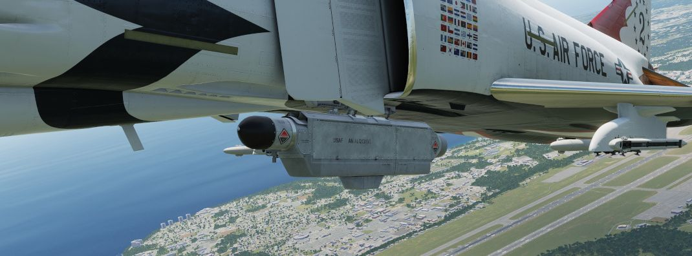

# Electronic Countermeasures

*"It's got ECM, it's got ECCM, IBM,
folk, we'll give you M&Ms"*

The Phantom can be equipped with ECM pods capable of jamming radar signals to
protect it from getting tracked by other aircraft or radar guided missiles.

<iframe width="560" height="315" src="https://www.youtube.com/embed/CK-gaIUW0Co?si=Mb6up8RG2Us7U1ZD"
title="DCS: F-4E Countermeasures and ECM Tutorial (Pilot, Jester, WSO)" frameborder="0"
allow="accelerometer; autoplay; clipboard-write; encrypted-media; gyroscope; picture-in-picture; web-share"
referrerpolicy="strict-origin-when-cross-origin" allowfullscreen></iframe>

During its service, it saw a number of pods with different capabilities.

Early pods such as the AN/ALQ-71 or AN/ALQ-87 have been used effectively during
the Vietnam war. During mid 1970s, mostly AN/ALQ-119 and AN/ALQ-131 have been in
service.

The Phantom supports ECM pods on the two inboard pylons (stations 4 and 6) and
the inner wing pylons (stations 2 and 8). However, the ECM signals are connected
in a chain on each side respectively, only allowing control of one jammer pod
per side. Additionally, many pods have restrictions only allowing them to be
loaded on some specific pylons. For example, AN/ALQ-119 and AN/ALQ-131 may not
be equipped on the right inboard pylon (station 6).

> 💡 Due to engine limitations, we can not influence the effectiveness
> of the Phantoms jammers.
> Equipping multiple pods does not increase their strength or coverage.

## Controls

The electronic counter-measurement systems are all controlled by
the WSO via controls on the right sub-panel.

The controls are duplicated for any pod carried on the left stations (<num>4</num> or <num>2</num>)
and for the right stations (<num>6</num> and <num>8</num>) respectively.

Interpretation of the modes, techniques and exact operation of the lights (<num>3</num>)
depend on the loaded jammer model.

Generally, the jammers differentiate between two modes or techniques that can be used.
Both of which usually have a warmup phase indicated by the Standby Lights on the panel.

The knob (<num>1</num> and <num>4</num>) can be used to place either technique in Standby or, once ready,
activate transmission (XMIT 1, XMIT 2, BOTH).

Some jammer models can also detect that they are actively jamming an enemy radar,
indicated by the AI light.

> 🔴 WARNING: To prevent exposing personnel to radiation, the mode knob must not
> be placed in XMIT while on ground.

### Reset Button and Lamp

The reset lamp (<num>3</num> lowest red one), if lit, indicates a fault in the jammer system.
Flashing indicates an overheating condition, in which case the pod
should be turned off to prevent damage.

In case of a fault, the reset button (<num>2</num>) can be pressed to reset the
jammer system (similar to turning it OFF and back ON), in which case it will
run through the warmup period again. If the fault could be cleared, the light will go off.

## AN/ALQ-131

In service between 1970 and 1990; may not be equipped on the right inboard station 6.

Technique 1 and 2 are identical and require a warmup period of around 3 minutes
before being activated.

> 💡 The warmup logic is hardwired - flipping the pod off and on, or having a
> short loss of power, will result in the full warmup period being required again before use.

Standby lamps illuminate to indicate that warmup phase has finished and the
technique is ready to be activated.

The pod can overheat, in which case the fault lamp will illuminate.
In this case, make sure to set the mode to Standby immediately and give it some time to
cool down first. Ignoring the lamp will cause parts of the pod to melt, damaging
it irreparably.

> 🟡 CAUTION: As a rule-of-thumb, do not transmit
> for longer than 20 minutes without allowing for cooling between uses.
> Limit continued slow and low level flight while operating the jammer to 30 minutes.
> For extreme outside temperatures, adjust the limits accordingly.
