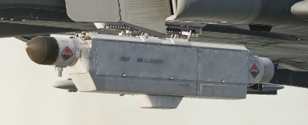

# Electronic Countermeasure

The Phantom can be equipped with ECM pods capable of jamming radar signals to
protect it from getting tracked by other aircraft or radar guided missiles.

During its service, it saw a number of pods with different capabilities, for
example:

- AN/ALQ-71
- AN/ALQ-72
- AN/ALQ-87
- AN/ALQ-101
- AN/ALQ-119
- AN/ALQ-131
- AN/ALQ-162
- AN/ALQ-184

Early pods such as the AN/ALQ-71 or AN/ALQ-87 have been used effectively during
the Vietnam war. During mid 1970s, mostly AN/ALQ-119 and AN/ALQ-131 have been in
service.

The Phantom supports ECM pods on the two inboard pylons (stations 4 and 6) and
the inner wing pylons (stations 2 and 8). However, the ECM signals are connected
in a chain on each side respectively, only allowing control of one jammer pod
per side. Additionally, many pods have restrictions only allowing them to be
loaded on a single specific pylon. For example, AN/ALQ-119 and AN/ALQ-131 may only
be equipped on the left inboard pylon (station 4), requiring the crew to choose
between the Pave Spike targeting pod and a jammer.

>💡 Due to engine limitations, effectiveness of all jammers in DCS are identical.

## Controls

The electronic counter-measurement systems are all controlled by
the WSO via controls on the right sub-panel.

The controls are duplicated for any pod carried on the left stations (4 or 2)
and for the right stations (6 and 8) respectively.

Interpretation of the modes, techniques and exact operation of the lights
depend on the loaded jammer model.

Generally, the jammers differentiate between two modes or techniques that can be used.
Both of which usually have a warmup phase indicated by the Standby Lights on the panel.

The knob can be used to place either technique in Standby or, once ready,
activate transmission (XMIT 1, XMIT 2, BOTH).

Some jammers models can also detect that they are actively jamming an enemy radar,
indicated by the AI light.

### Reset Button and Lamp

The reset lamp, if lit, indicates a fault in the jammer system.
Flashing indicates an overheating condition, in which case the pod
should be turned off to prevent damage.

In case of a fault, the reset button can be pressed to reset the
jammer system (similar to turning it OFF and back ON), in which case it will
run through the warmup period again. If the fault could be cleared, the light will go off.

## AN/ALQ-131

In service between 1970 and 1980; may only be equipped on the left inboard station 4.

Technique 1 and 2 are identical and require a warmup period of around 3 minutes
before being activated.

The warmup logic is hardwired - flipping the pod off and on, or having a
short loss of power, will result in the full warmup period being required again before use.

The pod can overheat, in which case the fault lamp will blink. To prevent issues with
high temperature, limit its use during slow and low altitude flights.
