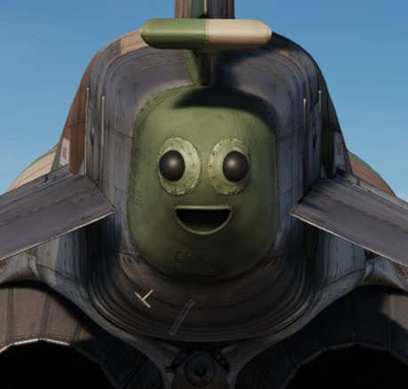
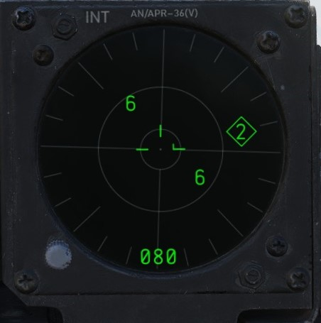
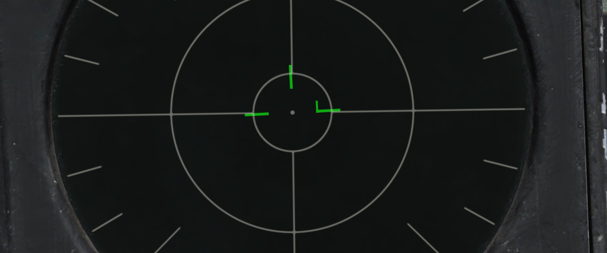
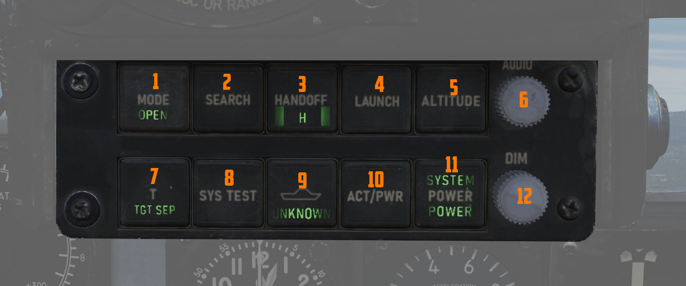
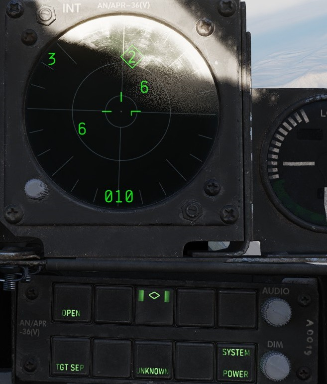
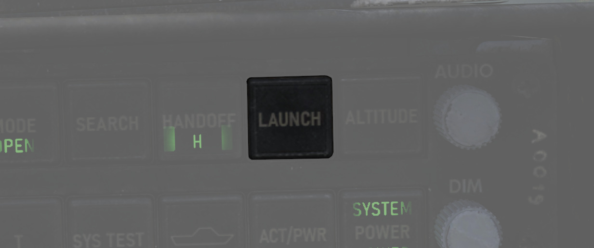
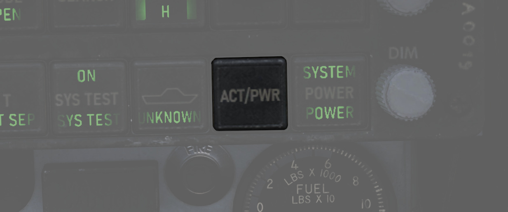
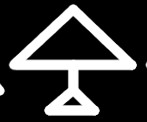

# Radar warning receiver

The ALR-46 Radar Warning Receiver (subsequently RWR) is the F-4E's passive
situational awareness system for detection of airborne and surface-to-air radar
threats. The system captures signals from multiple pairs of directional antennas
installed at the aft of the fuselage, on each wingtip and under the nose; the
difference in relative timing of detection and angle by the antennas is used by
the system to define a relative bearing to the emitting radar. Further
processing of the received radiation references the stored threat catalog to
identify emitter type, as well as to define a relative threat range as a
function of received power versus known output.

> 🚧 The ALR-46 is currently installed in the housing of a APR-36 earlier RWR model.

The resulting processed threat signal is then presented on the RWR's CRT (cathode-ray tube)
display, with bearing to
the emitter shown on the display with the top relative to the nose (12 o'clock) and the bottom the
tail (6 o'clock), and with proximity to center relative to the system's calculation of the level of
threat - with closer indications being of higher danger, and those within the middle ring being
classified within engagement range. In normal operation, the ALR-46 can present 16 threats on the
CRT concurrently. The highest priority threat as computed by the ALR-46's threat and range catalog
is presented on the display with a diamond superimposed by its symbol; this is considered "floating"
diamond functionality, with the ALR-46 defining priority. In the event of possible engagement by a
threat emitter (concurrent with the illumination of the ACTIVITY and/or MISSILE LAUNCH buttons), the
event is signified by a circle around the emitter symbol.

## ALR-46 Controls

### RWR Display Intensity Knob

Found adjacent to the RWR situation display in the lower left corner of the panel, the Intensity
Knob functions as a dimmer to control the brightness of the displayed RWR returns. Clockwise raises
the brightness, counter-clockwise lowers the brightness.

### Excess Noise Strobe Indicators

During normal operation, a trio of three T shaped indicators appear in the 9, 12, and 3 o'clock
positions near the center of the RWR CRT. These indicators signify the absence of excess noise in
the low (<num>9</num>), mid (<num>12</num>), and high (<num>3</num>) band amplifier detection. In
the event noise becomes too
significant in a given amplifier channel, the indicator for the respective band will disappear.
Should this occur, a SYS TEST can be performed to confirm the channel is still functioning; in the
event of a pass, the channel can be considered working at a reduced detection capacity.

A fourth indicator may appear as part of the SYS TEST or power up cycle. This fourth indicator in
the 6 o'clock position does not signify any function.

### ALR-46 Control Panel

The ALR-46 Control Panel consists of ten multipurpose, illuminated buttons, along with a pair of
rotary knobs for controlling the system's volume and panel brightness.

Controls are duplicated for pilot and WSO. The pilot controls are
directly below the RWR Indicator, while the controls for the WSO are found
below the Central Indicator in the front of the view.

#### Mode

The ALR-46 defaults on power-up to OPEN mode (<num>1</num>), which presents up to 16 threats on the
display at one time, depending on how many emitters are visible and current system settings (Search,
LOW ALT, etc.). In the event the crew requires immediate prioritization of the most pressing threats
in a saturated environment, the PRIORITY button can be pressed to display the five emitters the
system deems the most dangerous. When pressed, the OPEN illumination will swap to the PRIORITY
position, and revert back upon selection back to OPEN.

#### Search

By default, the ALR-46 is programmed to prioritize and display emitters tied to weapons that can
engage and destroy the aircraft. However, missions will require monitoring of early warning and
search radar systems working with longer pulse-widths for extended range detection and tracking of
possible intruders - i.e., the F-4. These emitters can be displayed using the Search mode
(<num>2</num>), which
presents them on the RWR with the S symbol to signify their function as a long range search radar.
Entry into Search mode is displayed on the button with an illuminated "S".

Because of their low threat priority, it is important to note that search radar symbology may often
fall off the display due to their reduced importance - especially when the ALR-46 is placed into
PRIORITY mode.

#### Handoff

The Handoff button (<num>3</num>) provides the opportunity for the flight crew to define the
priority emitting
threat. By default, the ALR-46 defines the highest priority threat as a function of range, current
transmitting mode, and the threat catalog. This priority threat is visualized with a diamond
superimposed around the emitter's symbol. In the event the pilot wishes to define a different
emitter as the target, the Handoff button is pressed and held to cycle the priority diamond through
the various emitters. Once the desired emitter is focused upon and surrounded with the diamond, the
button can be released, and the priority symbol will remain latched with that emitter and
the double caret (<>) symbol on the
button illuminated to signify latched mode. With a latched diamond focus emitter, the system will
remain focused on said emitter until the signal is either lost, the crew selects another focus
emitter with the Handoff button, or the button is pressed momentarily to return to normal floating
diamond threat priority mode.

<!--  -->

In the event that the emitter is tight grouping of other symbols on the display, the TGT SEP mode
will be applied.

When diamond symbol is latched, the diamond (handoff) audio can be heard through the intercom.
It's a constant synthetical tone generated in the system based on the current PRF
(pulse repetition frequency) of the given emitter. It's not affected by the received power
so the amplitude won't change in time as in some other systems.

#### Launch

In the event a missile launch is detected by way of discrete SAM guidance commands being received,
the MISSILE LAUNCH indications in this button (<num>4</num>) will illuminate, and a circle is
superimposed
around the threat emitter defined as guiding the inbound weapon. Pressing the button
will initiate the built-in-test which provides [launch audio](#launch-audio) through the intercom.

> 💡 Keep in mind that ALR-46 can detect missile launches only from certain systems.

#### Altitude

The ALR-46 utilizes own-ship altitude as a defining aspect of threat priority, thus causing low
altitude AAA and SAM threats to lose priority in the event the aircraft is at an altitude that is
estimated to place it outside of their threat envelope. Activating LOW ALT mode (<num>5</num>)
removes this envelope estimate from the threat prioritization and places low altitude threats back
into priority, useful for circumstances such as a high to low dive attack or target ingress profile,
and is confirmed as the active mode with the illuminated LOW ALT descriptor on the button.

#### Target Separation

In the event of a number of emitters being detected at such close proximity that the symbology
overlaps on the RWR display, the Target Separation button (<num>7</num>) provides the option to
expand symbology on the display from emitters in the same area to allow for clarity on the type and
number of radars being detected. Pressing the button triggers the lower TGT SEP illumination on the
button, and any emitter groups the system defines as being eligible for the expanded presentation
will do so for three seconds on the RWR display before reverting back to the standard view.

#### System Test

The system power on test (<num>8</num>) provides a three band (1 low, 2 mid, 3 high) check in all
four quadrants for proper sensitivity, along with an angle confirmation of 225 degree
relative bearing for diagnostic purposes. The test sequence begins with 1s in all four quadrants,
with the lower left value in a diamond (signifying a heading of 225, which is displayed on the
panel); the second and third continue this process, cycling band 2 and band 3. The tests are
accompanied with a sequence of tones for adjustment of audio monitoring level.

This button is also used when switching the threat files. Exact procedure is explained
in the [symbology](#symbology) section.

#### Unknown

When an emitter is detected that does not have a catalog entry, but is recognized by received power,
duration, and pulse as being a possible threat, the U indicator on the Unknown button (<num>9</num>)
will flash. Pressing the button will provide a U symbol on the RWR CRT at the correct azimuth
position for reference and monitoring.

The default condition of the Unknown button is with the U symbol illuminated, but steady.

#### Activity Power

In the event SAM guidance commands are detected, the ACTIVITY button (<num>10</num>) will
illuminate. This
button's function is similar to the MISSILE LAUNCH indication insofar as that it responds to a
guidance directive to a SAM, but does not respond to discrete changeover signals. Thus, an
illuminated ACTIVITY warning may in fact indicate a launch, depending on the system engaging the F-4
and the circumstances surrounding it. The indication will provide a circle around the threat
emitter.

#### System Power

The System Power button (<num>11</num>) is the on/off switch for the ALR-46. When pressed to
activate the
system, the RWR control panel and display will cycle through their initial 9-second warmup, with the
display and illuminated buttons undergoing rapid flashing as the system is prepared for use and
proper functioning is confirmed. Search mode is deactivated by default upon startup, and if in the
event the aircraft was powered down and restarted, the altitude priority mode (LOW ALT or normal)
will be in the same state it was left prior to shut down.

In the event of a system power failure, the ALR-46 has an automatic restart function. Once power is
recovered, the receiver will restart after a fifteen-second delay, in addition to its 9-second power
on self test. The system will resume state in the same fashion as a normal restart - with Search
mode deactivated and the altitude priority as when power was lost.

#### Audio Knob

The AUDIO Knob (<num>6</num>) is the direct volume control for the situational audio from the
ALR-46. Turning
the knob clockwise increases the audio volume, turning counter-clockwise lowers the audio volume.

#### DIM Knob (Dimmer)

The DIM knob (<num>12</num>) on the ALR-46 control panel manages the brightness setting of the
illuminated control buttons; turning the knob clockwise increases the brightness, counter-clockwise
reduces the brightness.

## Audio Alerts

### New Guy Audio

The audio alert issued when a new
emtter is first displayed, or when PRF (pulse repetition frequency)
of an existing display
changes is known as *new guy audio*. It consists of three
beeps within 1.5 seconds, each at PRF of emitter which has
diamond symbol. The new guy audio alerts a crewmember
to a change in threat environment so he can check his
azimuth indicator for update. The AUDIO control on
indicator-control can adjust volume from maximum to
completely off.

### Launch Audio

The synthetic launch tone generated
when an emitter goes into launch state is called *launch
audio* or *ML interrupt audio*. It consists of approximately
seven beeps in 1.5 seconds of a 1 kHz tone generator in the
signal processor. Only one launch audio is generated per
launch; i.e., after approximately seven beeps, no launch
audio is heard from that emitter.

Volume of the launch audio is controlled by the main
RWR audio knob as well as dedicated ML audio knob in each cockpit.
The resultant volume is a function of both knobs positions.

## Symbology

The ALR-46 features a limited number of symbols for the different radar threats. The following
symbols can stand for the different threats. The ALR-46 can save up to three files containing threat
tables.

* Land file (default) - land and air threats
* Sea file - sea and air threats
* Training file - additional configurable threats (empty by default)

The Pilot can switch between the land and the training file by
simply pressing the SYS TEST (<num>8</num>) and within a one second timespan pressing the TGT
SEP (<num>7</num>) button. A T symbol will be displayed within the lower portion of azimuth when the
training file is selected. To switch to the sea file simply press the SYS TEST (<num>8</num>) button
and within a one second timespan press the UNKNOWN (<num>9</num>) button. When the sea file is
selected a ship symbol will be displayed in the lower half of azimuth.

### Land and Air based Threats

| Symbol                                                                  | Possible threat                                                                                                                                                               |
|-------------------------------------------------------------------------|-------------------------------------------------------------------------------------------------------------------------------------------------------------------------------|
|                      | SA-2 S-75 "Fan Song" TR                                                                                                                                                       |
|      | SA-2 S-75 RD-75 Amazonka RF                                                                                                                                                   |
|                  | SA-3 S-125 "Low Blow" TR                                                                                                                                                      |
|                    | SA-5 S-200 "Square Pair" TR                                                                                                                                                   |
|                      | SA-6 Kub "Straight Flush" TR                                                                                                                                                  |
|                  | HQ-7 TR                                                                                                                                                                       |
|                  | Osa 9A33 ln                                                                                                                                                                   |
|                      | SA-10 S-300PS "Flap Lid"                                                                                                                                                      |
|                | SA-11 9K37 Buk                                                                                                                                                                |
|                        | SA-15 9K331 Tor                                                                                                                                                               |
|                        | SA-19 2k22M Tunguska                                                                                                                                                          |
|                          | ZSU-23-4 Shilka                                                                                                                                                               |
|          | Fire Can SON-9                                                                                                                                                                |
|      | Gepard, C-RAM Phalanx                                                                                                                                                         |
|                          | MIM-23 Hawk                                                                                                                                                                   |
|          | MIM-104 Patriot                                                                                                                                                               |
|                          | Rapier, Roland                                                                                                                                                                |
|                          | SA-6 Kub "Straight Flush" SR, Roland SR, C-Ram Phalanx SR, PPRU-1 "Dog Ear", HQ-7 SR, Hawk CWAR, NASAMS, Rapier Dagger, SA-11 Snow Drift, SA-10 "Big Bird", S-300PS 40B6MD SR |
|  | E-2D Hawkeye, E-3C Sentry, A-50                                                                                                                                               |
|            | F-14, F-15C, F-15E, F-16, F-18C, JF-17, M-2000C, Mig-29, SU-27, MiG-31, Tornado IDS/GR4                                                                                       |
|    | F-1, AJS-37, F-4E, MiG-19, MiG-21, MiG-23, F-5E-3                                                                                                                             |
|          | Unknown (Low band)                                                                                                                                                            |
|          | Unknown (Medium band)                                                                                                                                                         |
|      | Unknown (High band)                                                                                                                                                           |

### Sea and Air based Threats

| Symbol                                                                  | Possible threat                                                                                                                                         |
|-------------------------------------------------------------------------|---------------------------------------------------------------------------------------------------------------------------------------------------------|
|                    | Rezky, Albatros                                                                                                                                         |
|                      | Battlecruiser Pyotr Velikiy, Cruiser Moskva, Type 052C Destroyer, Frigate Neustrashimy                                                                  |
|                  | Type 054A Frigate, Type 052B Destroyer                                                                                                                  |
|                    | CV 1143.5 Kuznetsov                                                                                                                                     |
|          | La Combattante II                                                                                                                                       |
|          | Type 071, Leander Class                                                                                                                                 |
|      | Ropucha Class                                                                                                                                           |
|                          | CVN-71 Theodore Roosevelt, CVN-72 Abraham Lincoln, CVN-73 George Washington, CVN-74 John C Stennis, CVN-75 Harry S. Truman, USS Forrestral, LHA Tarrawa |
|                          | O.H. Perry                                                                                                                                              |
|                          | Leander Class                                                                                                                                           |
|          | Ticonderoga, USS Arleigh Burke                                                                                                                          |
|                          | Rezky Head Net SR, Neustrashimy SR, Invincible SR, Leander SR, Slava Class SR, Kuznetsov SR, Ropucha SR                                                 |
|  | E-2D Hawkeye, E-3C Sentry, A-50                                                                                                                         |
|            | F-14, F-15C, F-15E, F-16, F-18C, JF-17, M-2000C, Mig-29, SU-27, MiG-31, Tornado IDS/GR4                                                                 |
|    | F-1, AJS-37, F-4E, MiG-19, MiG-21, MiG-23, F-5E-3                                                                                                       |
|          | Unknown (Low band)                                                                                                                                      |
|          | Unknown (Medium band)                                                                                                                                   |
|      | Unknown (High band)                                                                                                                                     |

### Missiles

| Symbol                                              | Possible threat      |
|-----------------------------------------------------|----------------------|
|      | correlated missile   |
|  | uncorrelated missile |

## Threat Indications

Due to weapon systems all operating very differently, the RWR indications always
have to be interpreted individually per threat platform. This requires
understanding how the expected threats work, how they guide missiles, if they
have separate search and tracking radars and similar.

The following table gives an overview how the RWR indicates certain events for
commonly faced threats.

> 💡 Symbols `S` and `U` require activating the **SEARCH** and **UNKNOWN** mode
> respectively to be shown on the screen.

Actual missile launches can only be detected by the presence of C/D band
guidance signals, indicated by the **LAUNCH** lamp. This is the case for some
SAM systems. Some actively guided radar missiles can be identified individually
and will be shown with specific Missile systems.

Beyond those clear indications, missile launches are often preceded by the
target platform activating a specific tracking-radar or significantly increasing
its PRF, which the RWR often picks up and plays a _New-Guy_ tone for (3 short
beeps). Activating **HANDOFF** mode often makes the high pitched PRF tone
clearly audible.

### Land

| Threat | Search | Lock | Launch |
| ------ | ------ | ---- | ------ |
| SA-5   | U      | 5    | ❌     |
| SA-8   | U      | 8    | 🟢     |
| SA-10  | S      | 10   | ❌     |
| SA-13  | U      | ❌   | ❌     |

### Sea

| Threat | Search | Lock | Launch |
| ------ | ------ | ---- | ------ |
| Rezky  | U      | 8    | 🟢     |

### Air

| Threat | Search | Lock       | Launch               |
| ------ | ------ | ---------- | -------------------- |
| MIG-21 | 🟢     | PRF change | ❌                   |
| MIG-23 | 🟢     | PRF change | ❌                   |
| MIG-29 | 🟢     | PRF change | R-77 🟢, other ❌    |
| F-16   | 🟢     | PRF change | AIM-120 🟢, other ❌ |
