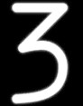

# 雷达告警接收机

ALR-46 雷达告警接收机（下文简称 RWR）是 F-4E 的被动态势感知系统，用于探测机载和面对空雷达威胁。该系
统利用多对安装在机身后部、各翼尖和机头下方的定向天线捕获雷达信号；系统利用天线探测到的时间和角度相
对差异来确定发射雷达的相对方位。系统可参考存储的威胁目录来确定辐射源的类型来对接收到的辐射进行进一
步处理，并根据接收功率对比已知输出功率来确定相对威胁的距离。

> 🚧 ALR-46 目前安装在早期 APR-36 RWR 型号的外壳中。

经过处理的威胁信号随后会显示在 RWR 的 CRT（阴极射线管）显示器上——辐射源显示在显示器顶部表示处在机头
（12 点钟方向）处，底部则为机尾（6 点钟方向），辐射源相对显示器中心的距离与系统计算的威胁等级相关——
距离越近则威胁等级越高，而位于中间圆环内的辐射源被归类为处在攻击距离内。在正常工作时，ALR-46 可以同
时在 CRT 中显示 16 个威胁。ALR46 将根据威胁以及距离目录计算出的最高优先级威胁并在其符号上叠加一个菱
形进行显示；这被称为“浮动”菱形功能，并由 ALR-46 确定优先级。在可能受到一个威胁辐射源攻击的情况下
（ACTIVITY 和/或 MISSILE LAUNCH 按钮同时亮起），辐射源符号上会叠加一个圆环。

## ALR-46 控制开关/按钮

### RWR 显示亮度旋钮

位于 RWR 显示器左下角的旋钮是亮度旋钮，可用来调整显示器中 RWR 符号的亮度。顺时针方向增加亮度，逆时
针方向转动降低亮度。

### 超噪射线指示器

正常工作时，在 RWR CRT 中心附近的 9、12 和 3 点钟位置将出现三个 T 形指示符。指示符表示在低
(<num>9</num>)、中(<num>12</num>)和高(<num>3</num>)波段放大器探测中没有超量噪声。如果在某一放大器信
道中噪声变得太明显，相应波段的指示将消失。如果发生这种情况，可以执行 SYS TEST 来确认信道仍在工作；
在确认功能通过后，可以认为该信道的探测能力减弱。

第四个指示符可能作为 SYS TEST 或通电循环的一部分亮起。位于 6 点钟位置的第四个指示符并不代表任何功能
。

### ALR-46 控制面板

ALR-46 控制面板由 10 个多用途背光按钮，以及两个分别用于控制系统音量和面板背光亮度的转动旋钮组成。

飞行员和 WSO 驾驶舱中的 RWR 控制开关/按钮一致。飞行员的控制开关/按钮位于 RWR 显示器的正下方，而 WSO
的控制开关/按钮则位于航线指示器的下方。

#### 模式按钮

ALR-46 通电时默认进入 OPEN(<num>1</num>)模式——取决于有多少辐射源信号可见以及当前的系统设置（搜索，
低高度等），系统将同时显示最多 16 个威胁。在机组需要在饱和环境下立即优先处理最紧迫的威胁时，可以按
下优先按钮来显示 5 个系统认定最具威胁的辐射源信号。当按下按钮后，OPEN 灯光将切换至 PRIORITY 位置亮
起，并在切换回 OPEN 模式时重新亮起。

### 搜索按钮

默认情况下，ALR-46 的程序为优先显示可攻击并摧毁本机的武器配套辐射源。但是，执行任务时需要对早期预警
与搜索雷达系统进行监控，这些系统使用更长的脉宽来远距离探测和跟踪可能的入侵者，如 F-4。机组可以使用
搜索模式(<num>2</num>)来显示这些辐射源，当 RWR 出现“S”符号时，即表示其为远程搜索雷达。进入搜索模式
后，按钮上会显示一个发光的“S”。

值得注意的是，由于威胁的优先级较低，搜索雷达符号往往会因为优先级降低消失在显示屏中——尤其是当 ALR-46
进入优先模式时。

#### 切换按钮

切换按钮 (<num>3</num>) 可让机组人员手动设置正在照射本机的辐射源的优先级。默认情况下，ALR-46 会根据
距离、当前发射模式和威胁目录确定最高优先级的威胁。辐射源符号上会叠加一个菱形来表示为最高优先级的威
胁。如果飞行员希望将其它的辐射源选中为优先目标，则可按住切换按钮，使优先级菱形在不同的辐射源符号之
间循环。当菱形符号包围所需的辐射源，此时飞行员可以松开按钮，优先符号将锁定在该辐射源符号上，按钮上
的双插入符（<>）也将亮起，表示进入锁定模式。在菱形符号锁定在辐射源后，系统将一直聚焦在该辐射源信号
上，直到信号丢失、机组人员使用切换按钮选择锁定到另一个辐射源符号上，或者短按按钮返回正常的浮动菱形
威胁优先模式。

<!--  -->

如果辐射源符号与显示屏上的其它符号紧密成群，则应使用 TGT SEP 模式。

当菱形符号锁定好辐射源时，菱形（切换）音频将通过内话系统播放。系统将根据指定辐射源的当前 PRF（脉冲
重复频率）来生成恒定合成音。接收功率不会对音频合成造成影响，因此振幅不会像其它系统那样随时间变化。

#### 发射按钮

如果探测到不连续 SAM 制导指令识别出导弹发射，该按钮(<num>4</num>)上的“MISSILE LAUNCH”指示灯将亮起，
并在威胁辐射源符号上叠加一个圆环，表示该辐射源正在为来袭武器提供制导。按下按钮将开始机内自检，内话
系统将为机组提供 [发射音频](#发射音) 。

> 💡 请记住，ALR-46 只能探测某些系统进行导弹发射。

#### 高度按钮

ALR-46 利用本机高度作为确定威胁优先级的一个因素，因此，如果系统预测飞机处在低空 AAA 和 SAM 的威胁包
线之外，那么这些威胁将失去优先级。激活低空模式(<num>5</num>)将把包线预测从威胁优先级中移除，并将低
空威胁重新置于优先级排列中，在例如高-低俯冲攻击或目标进入剖面时低空模式将十分有用，按钮上 LOW ALT
亮起来确认激活低空模式。

#### 目标分隔按钮

如果探测到数个距离相近的辐射源使得 RWR 显示器上的符号重叠，则可以使用目标分隔按钮(<num>7</num>)来展
开显示器中处在同一区域的的辐射源符号，以便清楚地显示被探测到的雷达的类型和数量。按下按钮将触发按钮
下方的 TGT SEP 亮起，系统将为确定符合展开显示条件的任何辐射源组在 RWR 显示器上进行三秒展开显示，然
后返回到标准显示。

#### 系统测试按钮

系统通电测试(<num>8</num>)对所有四个象限进行三波段（1 低、2 中、3 高）检查来确保灵敏度正常，以及一
个相对方位角 225 度确认，以便进行诊断。测试序列从所有四个象限中的第一象限开始，左下角的值带菱形符号
（表示航向 225，显示在面板上）；第二和第三个象限继续这一过程，循环使用 2 和 3 波段。测试时会伴有一
连串音调提示，用于调节监控音量。

切换威胁文件时也使用此按钮。具体步骤请参阅 [标识符](#标识符) 部分。

#### 不明按钮

当探测到一个不在威胁目录中的辐射源信号，但通过接收的功率、持续时间和脉冲识别为可能的威胁时，不明按
钮(<num>9</num>)上的 U 指示灯将闪烁。按下该按钮，RWR CRT 上的 U 符号将显示在正确的方位，以供参考和
监控。

默认情况下不明按钮上的 U 符号常亮显示。

#### 主动照射按钮

如果检测到 SAM 制导指令，主动照射按钮(<num>10</num>)将亮起。这个按钮的功能类似于导弹发射指示，都为
响应面对空导弹的制导指令，但主动照射按钮不响应不连续变换信号。因此，根据攻击 F-4 的系统及其周围环境
，主动照射警告亮起实际上可能表示导弹发射。此时会在威胁辐射源符号上叠加一个圆环。

#### 系统电源按钮

系统电源按钮(<num>11</num>)是 ALR-46 的电源开关。当按下按钮来激活系统时，RWR 控制面板和显示器将进行
9 秒初始预热阶段，显示屏和亮起按钮将快速闪烁，指示系统准备就绪并确认正常工作。系统在开启时默认关闭
搜索模式，如果飞机断电并重新起动，高度优先模式(低空或正常)将保持与关机前的相同状态。

ALR-46 具有自动重启功能，可在当系统电源故障时使用。一旦电源恢复，RWR 将在 15 秒的延迟后重新启动，此
外还有 9 秒的通电自检。系统将和正常重启一样恢复工作状态——搜索模式停用，高度优先与断电前相同。

#### 音量旋钮

音量旋钮(<num>6</num>)用来直接 ALR-46 播放的态势音量，顺时针旋转来增加音量，逆时针旋转来减小音量。

#### 亮度调节旋钮

ALR-46 控制面板上的亮度旋钮(<num>12</num>)用来管理背光按钮的亮度设置；顺时针旋转旋钮增加亮度，逆时
针旋转旋钮降低亮度。

## 音频警告

### 新接触音

当新辐射源首次出现或在现有辐射源出现 PRF（脉冲重复频率）变化时，系统将发出音频警告，即“新接触音频
”。音频为 1.5 秒内播放三次的哔哔声，并且提示音和菱形符号辐射源的 PRF 一致。新接触音频用来提醒机组人
员注意威胁环境发生变化，让机组查看方位指示器来更新态势。机组可使用指示器控制面板上的音量控制旋钮来
调节音量，从最大音量到完全关闭。

### 发射音

在辐射源进入发射状态时系统将合成名为 _发射音_ 或 _ML 中断音_ 合成发射音。信号处理器将生成 1 Khz 哔
哔音调发射音并在 1.5 秒内播放 7 次，但每次发射只会播放一次发射音；也就是，播放完七次哔哔声后，发射
导弹的辐射源将不再播放发射音。

发射音的音量由主 RWR 音频旋钮以及每个驾驶舱中专用的 ML 音频旋钮控制。因此音量将根据两个旋钮的档位进
行控制。

## 标识符

ALR-46 内置了有限的符号数量来对应不同的雷达威胁。下列符号可代表不同的威胁。ALR-46 最多可保存三个包
含有威胁表的威胁文件。

- 地面文件 (默认) - 地面和机载威胁
- 水面文件 - 舰载和机载威胁
- 训练文件 - 额外可配置威胁（默认空白）

飞行员只需按下 SYS TEST (<num>8</num>)，并在一秒内按下 TGT SEP (<num>7</num>) 按钮，即可在地面和训
练文件之间切换。选定训练文件时，方位指示器底部将显示 T 符号。如需切换到水面文件，只需按下 SYS TEST
(<num>8</num>) 按钮，并在一秒内按下 UNKNOWN (<num>9</num>) 按钮即可进行切换。选择水面文件时，方位指
示器的底部将显示舰船符号。

### 地面和机载威胁

| 符号                                                                    | 可能威胁                                                                                                                                          |
| ----------------------------------------------------------------------- | ------------------------------------------------------------------------------------------------------------------------------------------------- |
|                      | SA-2 S-75 "扇歌" TR                                                                                                                               |
|      | SA-2 S-75 RD-75 亚马森卡 RF                                                                                                                       |
|                  | SA-3 S-125 "偷袭" TR                                                                                                                              |
|                    | SA-5 S-200 "双正方形" TR                                                                                                                          |
|                      | SA-6 Kub "同花顺" TR                                                                                                                              |
|                  | HQ-7 TR                                                                                                                                           |
|                  | 黄蜂 9A33 ln                                                                                                                                      |
|                      | SA-10 S-300PS "活动板"                                                                                                                            |
|                | SA-11 9K37 山毛榉                                                                                                                                 |
|                        | SA-15 9K331 道尔                                                                                                                                  |
|                        | SA-19 2k22M 通古斯卡                                                                                                                              |
|                          | ZSU-23-4 石勒喀河                                                                                                                                 |
|          | 火罐 SON-9                                                                                                                                        |
|      | 猎豹, C-RAM 密集阵                                                                                                                                |
|                          | MIM-23 霍克                                                                                                                                       |
|          | MIM-104 爱国者                                                                                                                                    |
|                          | 轻剑, 罗兰德                                                                                                                                      |
|                          | SA-6 库班河 "同花顺" SR, 罗兰德 SR, C-Ram 密集阵 SR, PPRU-1 "狗耳", HQ-7 SR, 霍克 CWAR, NASAMS, 轻剑, SA-11 雪堆, SA-10 "大鸟", S-300PS 40B6MD SR |
|  | E-2D 鹰眼, E-3C 望楼, A-50                                                                                                                        |
|            | F-14, F-15C, F-15E, F-16, F-18C, JF-17, M-2000C, Mig-29, SU-27, MiG-31, 狂风 IDS/GR4                                                              |
|    | F-1, AJS-37, F-4E, MiG-19, MiG-21, MiG-23, F-5E-3                                                                                                 |
|          | 不明 (低波段)                                                                                                                                     |
|          | 不明 (中波段)                                                                                                                                     |
|      | 不明 (高波段)                                                                                                                                     |

### 舰载和机载威胁

| 符号                                                                    | 可能威胁                                                                                                                           |
| ----------------------------------------------------------------------- | ---------------------------------------------------------------------------------------------------------------------------------- |
|                    | 克里瓦克 II, 格里莎级                                                                                                              |
|                      | 战巡彼得大帝, 巡洋舰莫斯科, 052C 型驱逐舰, 不惧护卫舰                                                                              |
|                  | 054A 型护卫舰, 052B 型驱逐舰                                                                                                       |
|                    | CV 1143.5 库兹涅佐夫                                                                                                               |
|          | 斗士 II                                                                                                                            |
|          | 071 型, 利安德级                                                                                                                   |
|      | 蟾蜍级                                                                                                                             |
|                          | CVN-71 西奥多.罗斯福, CVN-72 亚伯拉罕.林肯, CVN-73 乔治.华盛顿, CVN-74 约翰.C.斯坦尼斯, CVN-75 哈利.S.杜鲁门, 福莱斯特号, 塔拉瓦号 |
|                          | 佩里                                                                                                                               |
|                          | 利安德级                                                                                                                           |
|          | 提康德罗加级, 阿利伯克级                                                                                                           |
|                          | 克里瓦克 II 级 SR, 不惧 SR, 无敌级 SR, 利安德级 SR, 光荣级 SR, 库兹涅佐夫 SR, 蟾蜍级 SR                                            |
|  | E-2D 鹰眼, E-3C 望楼, A-50                                                                                                         |
|            | F-14, F-15C, F-15E, F-16, F-18C, JF-17, M-2000C, Mig-29, SU-27, MiG-31, 狂风 IDS/GR4                                               |
|    | F-1, AJS-37, F-4E, MiG-19, MiG-21, MiG-23, F-5E-3                                                                                  |
|          | 不明 (低波段)                                                                                                                      |
|          | 不明 (中波段)                                                                                                                      |
|      | 不明 (高波段)                                                                                                                      |

### 导弹

| 符号                                                | 可能威胁   |
| --------------------------------------------------- | ---------- |
|      | 已关联导弹 |
|  | 未关联导弹 |

## 威胁指示

由于武器系统工作方式差距甚远，因此飞行员根据各威胁平台的具体情况来解读 RWR 指示。这就需要了解预计威
胁的工作方式、导弹制导方式和是否存在单独搜索和跟踪雷达或类似设备。

下列表格将概述 RWR 如何指示常见威胁的某些事件。

RWR 只能在探测到存在 C/D 波段制导信号时来指示辐射源实际发射导弹，此时 **LAUNCH** 灯将亮起，来指示某
些 SAM 系统发射导弹。RWR 可单独识别某些主动雷达制导导弹，并显示特定的导弹符号。

除开这些明确指示外，目标平台开启一台特殊跟踪雷达或显著升高其 PRF 时也是发射导弹的前兆，通常 RWR 也
会捕捉到这一变化并播放 **新接触** 音调（3 短提示音）。飞行员可激活 **HANDOFF** 模式来更清楚地听取高
音 PRF 提示音。

> 💡 符号 **S** 和 **U** 分别需要激活 **SEARCH** 和 **UNKNOWN** 模式来使其能够出现在指示器上。

### 地面

| 威胁  | 搜索 | 锁定 | 发射 |
| ----- | ---- | ---- | ---- |
| SA-5  | U    | 5    | ❌   |
| SA-8  | U    | 8    | 🟢   |
| SA-10 | S    | 10   | ❌   |
| SA-11 | S    | 11   | ❌   |
| SA-13 | U    | ❌   | ❌   |

### 舰载

| 威胁           | 搜索 | 锁定 | 发射 |
| -------------- | ---- | ---- | ---- |
| 克里瓦克 II 级 | U    | 8    | 🟢   |

### 机载

| 威胁   | 搜索 | 锁定     | 发射                |
| ------ | ---- | -------- | ------------------- |
| MIG-21 | 🟢   | PRF 变化 | ❌                  |
| MIG-23 | 🟢   | PRF 变化 | ❌                  |
| MIG-29 | 🟢   | PRF 变化 | R-77 🟢, 其它 ❌    |
| F-16   | 🟢   | PRF 变化 | AIM-120 🟢, 其它 ❌ |
