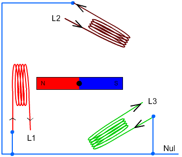
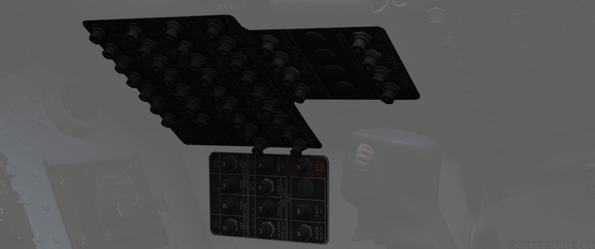
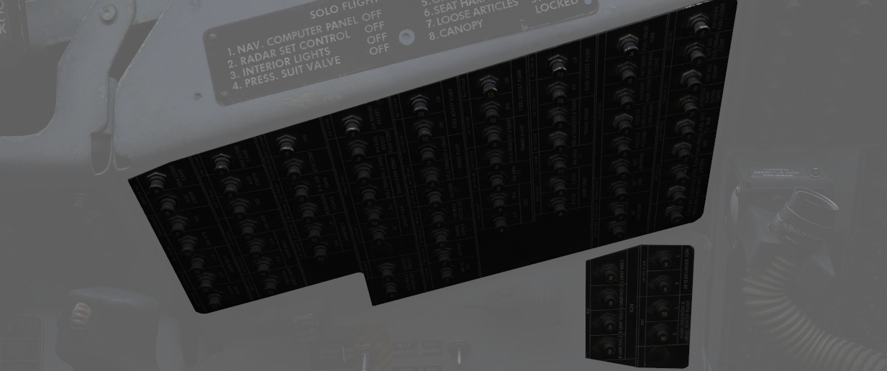
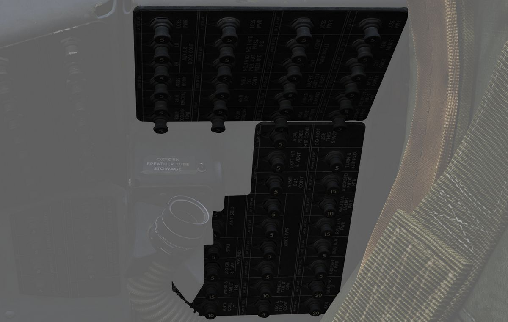
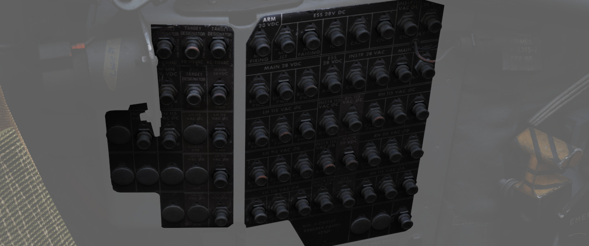
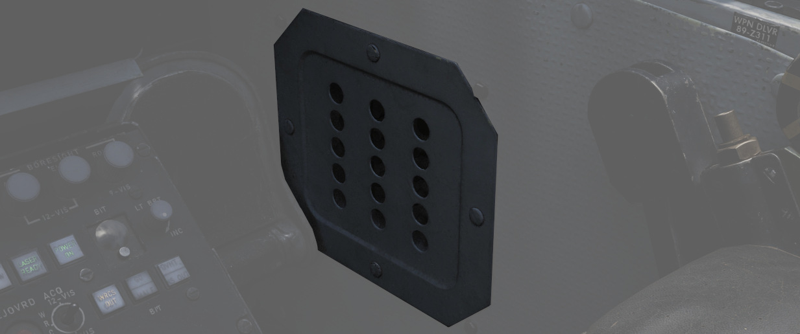

# 电气

F-4E 的电力一对由 [J79 发动机](../systems/engines_and_fuel_systems/engines.md)
驱动的交流发电机、一对交流变直流变压器和一个电池——用于在发动机脱机时提供电力。此
外，“鬼怪” II 还可以接收地勤人员提供的地电。两台发电机通常是独立工作的，但也包括
一个总线汇流条，可将两条总线连接在一起，以便在发生故障时从一台发电机获取电力。

<iframe width="560" height="315" src="https://www.youtube.com/embed/7FK2KzCHk1E?si=9gBRVQutut4lDa3K" title="F-4E Electrical and Lighting Systems | DCS World" frameborder="0" allow="accelerometer; autoplay; clipboard-write; encrypted-media; gyroscope; picture-in-picture; web-share" referrerpolicy="strict-origin-when-cross-origin" allowfullscreen></iframe>

> 💡 [EFB](../../dcs/efb.md##电力页面) 包括一个电力页面，可让玩家深入了解系统工
> 作状态。

## 发电机

两台发电机通过对应发动机提供的滑油来液压驱动发电。发电机提供三相 AC 电源，标称为
在 8000 RPM 时输出 115 V 电压。各发电机能够单独承受整架飞机负载——其额定负载为
30.000 W。

### 工作原理

### 调节器

两台发电机都调节至每相输出 150±2.5 V 电压。此外，如果单台发电机未能输出目标电压
，系统将启用欠压、过电压保护致使对应发电机离线来防止损伤系统。

### 控制器

飞机内的一个控制器系统将监控并调整两台发电机来实现同步。因此，两台发电机必须同频
转动并保持在同一相位，来让三相信号都想相匹配。

系统会在两台发电机频率差在 6 Hz 内，相位差异在 135° 或更低时接通。

在频率和相位保持一致后，此时发电机已同步并且控制器将允许两台发电机平行操作，在两
台发电机之间进行负载均衡。这一操作通过 **BUS TIE** （总线汇流条）来实现。

### 发电机控制开关

在右侧控制台上每台发动机各有一枚发电机控制开关。这三档位开关——ON（前）、OFF、ON
External（后）——分别控制每个发电机的状态。在发电机可能出现故障的情况下，选择 OFF
档位来关闭故障发电机，则电源总线将从其余发电机向另一半电气系统供电。当连接地面电
源时，选择 ON External 来进行地面作业，并为除 CNI 和 AFCS 以外的所有仪表供电。

### 发电机指示灯

发电机指示灯面板上有三个警告指示灯：LH GEN OUT、RH GEN OUT 和 BUS TIE OPEN。当相
关发电机发生故障时，相应的 GEN OUT 告警将亮起。BUS TIE OPEN 指示表示一台正常工作
的发电机正在为整架飞机供电。如果发电机发生故障，主注意也会亮起。但是，如果两台发
电机都发生故障，则 GEN OUT 灯不会亮起。

## 电池

鬼怪安装了一个容量约为 11 Ah 的镍镉电池。

电池将保持供电并连接至电池总线。某些关键系统，例如 EJECT 灯或白色泛光灯都被连接
至电池总线，因此即使在未启动时或两台发电机都离线时都可用。

电池也可用于为直流电系统提供电源。接入 DC 系统时系统的标称电压为 28V，但是电池通
常只能提供 26V 左右电压，或者在低电量时耕更低。

在正常工作中 DC 系统通过发电机来供电并且电池将为充电状态。

## 总线系统

电池和发电机为多条总线供电，总线接着再将电流输送到相关系统。

总线系统由三组组成：

- AC 系统
  - 主组
    - 左主 115V AC 总线
    - 左主 28V AC 总线
    - 左主 14V AC 总线
    - 右主 115V AC 总线
    - 右主 28V AC 总线
  - 仪表组
    - 仪表 115V AC 总线
    - 仪表 28V AC 总线
    - 仪表 14V AC 总线
    - 告警灯 28V AC 总线
    - 告警灯 14V AC 总线
- DC 系统组
  - 主 28V DC 总线
  - 应急 28V DC 总线
  - 武器 28V DC 总线
  - 电池 DC 总线

机上发电机直接为三条 115V 总线提供三相 AC 电源。低电压工作的 AC 总线（28V 和
14V）为单相供电并且通过自动变压器来将发电机提供的三相 115V AC 降至需求电压。

两条告警灯总线由对应的仪表总线直接供电。

对于 DC 系统，整流变压器将发电机三相 115V AC 电转换至单相 28V DC 之后再向 DC 系
统供电。

AC 和 DC 系统都有 BUS TIE（汇流条）来实现另一台发电机在单台发电机故障的情况下为
两条回路供电。

> 💡 每台发电机都能满足整架飞机的负载消耗。

### 仪表地面电源开关

WSO 可在连接地面电源时(<num>1</num>)（如果发电机控制开关设置为 EXT ON）通过仪表
地面电源开关来选择为仪表总线（115/200 伏交流、28 伏交流和 14 伏交流）供电，开关
位于后座右侧墙板上。一旦地电断开或发动机发电机上线，开关就会回到 OFF 档位。

## 断路器

在达到实际使用系统前，总线输送的电源将先通过断路器。

💡 由于引擎限制，WSO 驾驶舱中的 CB 暂时无法访问。

大多数断路器都安装在 WSO 机舱的两侧墙板上，只有一个面板安装在飞行员驾驶舱中，其
中包括飞行操作面和类似关键系统的断路器。

### 飞行员面板

该面板位于飞行员驾驶舱的右侧墙板上，包含 7 个断路器，负责飞行操作面和对飞机安全
操作至关重要的其它系统。

- AIL Feel-Trim（副翼感受配平）(<num>1</num>)
- STAB Feel-Trim（平尾感受配平）(<num>2</num>)
- Speed Brake（减速板）(<num>3</num>)
- Landing Gear（起落架）(<num>4</num>)
- Flaps（襟翼）(<num>5</num>)
- Trim Controls（配平控制开关）(<num>6</num>)
- Rudder Trim（方向舵配平）(<num>7</num>)

### 照明面板

在飞行员驾驶舱远传信号灯面板右侧的一捆电缆后面，隐藏着两个控制灯光的断路器。

位于上方(<num>1</num>)的断路器负责为主要仪表灯供电，而低处(<num>2</num>)的断路器
则为所有指示灯和告警灯供电。

### CB 面板 1

WSO 驾驶舱右侧墙板的前部。

包括所有挂点、武器和武器系统的断路器。

### CB 面板 2

WSO 驾驶舱右侧墙板的中部。

主要负责发动机和液压系统的操作。

### CB 面板 3

WSO 驾驶舱右侧墙板的后部。

例如防冰或拦阻钩等辅助功能的断路器。

### CB 面板 4

WSO 驾驶舱左侧墙板的后部。

控制通过所有总线、飞行计算机和瞄准吊舱的电源的主控制断路器。

### CB 面板 7

位于 WSO 驾驶舱右方向舵脚蹬旁。

隐藏在盖板后方，面板包括所有 ECM 和干扰设备的断路器。

## 故障和应急电源分配

如果飞机受损，失去左侧和/或右侧发电机以及主 28 伏直流总线，则相应总线上的数个不
同系统将无法工作。

### 左手发电机脱机 - Bus Tie Open

如果左手发电机停止工作，以下系统将无法正常工作：

| _**关键系统**_ | _**非关键系统**_                     |
| -------------- | ------------------------------------ |
| 防冰系统       | AN/ARW 77 (用来发射 AGM-12 “小斗犬”) |
| 防滑系统       | 防撞灯 (单丝)                        |
| 加力燃烧室点火 | DSCG                                 |
| INS 加热器     | ECM 吊舱                             |
| 着陆灯         | 设备冷却 (比如 Pave Spike)           |
|                | 机身灯                               |
|                | 前座控制台灯光                       |
|                | 前座红色仪表泛光灯 (DIM)             |
|                | 计算提前角的光学瞄准具               |
|                | 左手 28V 变压器                      |
|                | 左手升压油泵                         |
|                | 左手导弹发射                         |
|                | 左手导弹电源                         |
|                | 左手变压器-整流器                    |
|                | No. 4 电动输油泵                     |
|                | 机头航炮                             |
|                | 雷达                                 |
|                | 雷达屏幕相机                         |
|                | 红色控制台泛光灯                     |
|                | 右手导弹电源                         |
|                | 座椅调节                             |
|                | AGM-45 “百舌鸟”制导                  |
|                | 目标指示器 (Pave Spike)              |
|                | 通用/地图照明灯                      |
|                | 共用电源 AC                          |
|                | 机翼和垂尾灯 DIM                     |
|                | WRCS 电源                            |

### 右手发电机脱机 - Bus Tie Open

如果右手发电机停止工作，以下系统将无法正常工作：

| _**关键系统**_         | _**非关键系统**_        |
| ---------------------- | ----------------------- |
| 皮托管加热器           | ADF                     |
| AOA 管加热器           | 副翼感受配平            |
| 收敛放气皮托加热器     | 副翼-方向舵交联         |
| 驾驶舱加热和通风       | ALR-46 雷达告警系统     |
| 燃油油量表             | 高度编码器              |
| IFF                    | 防撞灯 (单丝)           |
| 后座航线指示器航向指针 | APR-36/37 雷达接收机    |
| TACAN                  | APX 80 空对空 IFF       |
| VOR: 方位指针          | 武器电源                |
|                        | 自动驾驶                |
|                        | 辅助接收机              |
|                        | CADC                    |
|                        | ECM 吊舱                |
|                        | 编队灯                  |
|                        | 前座仪表灯光            |
|                        | 航炮准星照相枪          |
|                        | 空中受油 (IFR) 口泛光灯 |
|                        | 左发斜板控制            |
|                        | No.6 电动输油泵         |
|                        | 氧气储量表              |
|                        | 雷达高度表              |
|                        | 右发斜板控制            |
|                        | 右手 28V 变压器         |
|                        | 右手升压油泵            |
|                        | 右手变压器-整流器       |
|                        | 增稳                    |
|                        | 滑行灯                  |
|                        | 风挡温度感测            |
|                        | 机翼和垂尾灯 BRT        |

### 主 28 伏 DC 总线断电

如果主 28 伏 DC 总线断电，以下系统将无法正常工作：

| _**关键系统**_                         | _**非关键系统**_            |
| -------------------------------------- | --------------------------- |
| 防滑                                   | ACM IN-RANGE 和 SHOOT 灯    |
| 总线汇流条继电器 (BUS TIE OPEN 灯亮起) | ADF                         |
| 驾驶舱加热和通风                       | 副翼-方向舵交联             |
| 机翼放油                               | 机载录像机 (AVTR)           |
| 着陆和滑行灯                           | ALE-40 对抗措施布撒器       |
| 前轮转向                               | 高度表振动器                |
| TACAN                                  | APR-36/37 雷达接收机        |
| 转弯侧滑仪 (后座)                      | APX 80 A/A IFF              |
|                                        | 拦阻钩 (仅限收上操作)       |
|                                        | AUX 气门                    |
|                                        | AUX 接收机                  |
|                                        | 传统武器投放                |
|                                        | 战斗档案相机                |
|                                        | DSCG                        |
|                                        | ECM 控制                    |
|                                        | ECM 吊舱                    |
|                                        | 发动机可变收敛放气          |
|                                        | 设备冷却控制                |
|                                        | 机身、防撞和垂尾灯          |
|                                        | 航炮准星照相枪              |
|                                        | 计算提前角的光学瞄准具      |
|                                        | 左手升压油泵                |
|                                        | 导弹发射                    |
|                                        | No.4 电动输油泵             |
|                                        | No.6 电动输油泵             |
|                                        | 机头航炮                    |
|                                        | 气动压缩机                  |
|                                        | 雷达                        |
|                                        | 雷达高度表                  |
|                                        | 除雨                        |
|                                        | 雷达屏幕相机                |
|                                        | 右手升压油泵                |
|                                        | 方向舵配平/可变收敛放气控制 |
|                                        | 减速板                      |
|                                        | 特殊武器中线互锁解除保险    |
|                                        | 挂点选择和挂点选择灯        |
|                                        | 平尾配平指示器              |
|                                        | 目标指示器 (Pave Spike)     |
|                                        | 共用电源                    |
|                                        | VGH 录像机电源              |
|                                        | “白星眼” indent 电源        |
|                                        | 告警灯 (DIM)                |
|                                        | WRCS 电源                   |

### 仅电池电源

如果仅电池电源可用，下述系统将继续工作：

| _**关键系统**_                         | _**非关键系统**_     |
| -------------------------------------- | -------------------- |
| 迎角指示器                             | 所有挂载应急抛弃     |
| EGT 表                                 | 迎角音调提示发生器   |
| 弹射灯                                 | 燃油控制             |
| 应急姿态仪                             | 燃油阀门电源         |
| 发动机或在和过热探测（测试功能）       | 前座仪表泛光灯 (BRT) |
| 机翼副油箱输油 (控制)                  | 应急接收机           |
| 襟翼/缝翼控制                          | KY-28                |
| 缝翼/襟翼指示器                        | 导弹发射             |
| 燃油油量表                             | 导弹抛弃             |
| 空中受油                               | 喷口位置表           |
| ILS: CDI、下滑道指示器、音频、指点信标 | 外侧挂点抛弃         |
| 内话                                   | 特殊武器中线互锁安全 |
| 机翼油箱输油 (控制)                    | 特殊武器解锁         |
| 起落架控制                             | 配平控制             |
| 起落架位置指示器                       |                      |
| 左右主点火                             |                      |
| 平尾感受配平                           |                      |
| VOR: CDI、向-背和音频                  |                      |
| 白色泛光灯                             |                      |
