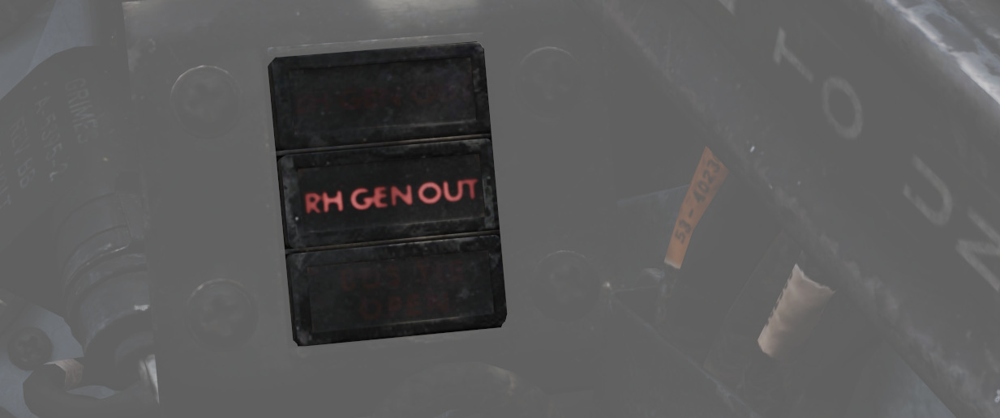

# Electrics

The F-4E derives electrical power from a pair of AC generators driven by the [J79
engines](../systems/engines_and_fuel_systems/engines.md), a pair of AC to DC transformers, and a
battery for electrical functions
with the engines offline. In addition, the Phantom
II can receive external
electrical power from ground crew. The two generator arrangement, while normally
working independently, includes a bus tie that can connect both buses together
to draw power from a single generator in case of failure.

<iframe width="560" height="315" src="https://www.youtube.com/embed/7FK2KzCHk1E?si=9gBRVQutut4lDa3K"
title="F-4E Electrical and Lighting Systems | DCS World" frameborder="0"
allow="accelerometer; autoplay; clipboard-write; encrypted-media; gyroscope; picture-in-picture; web-share"
referrerpolicy="strict-origin-when-cross-origin" allowfullscreen></iframe>

> 💡 The [EFB](../dcs/efb.md#electrics-page) provides an Electrics page, giving detailed
> insights into the system mid-flight.

## Generators

The two generators are driven hydraulically by oil pressure supplied from the respective engine.
They supply 3-phase AC power, aiming for 115V at 8000 RPM. Each generator is capable of handling
the load of the entire aircraft alone, rated for 30.000 W.

### Principle

### Regulators

Both generators are regulated to supply 150±2.5 V on all 3 phases. Further, should a generator fail
to supply the target voltage, under- and over-voltage protections are enabled which put the
respective generator offline to prevent damage to the systems.

### Controller

A controller system monitors and tweaks both generators to allow syncing them.
Therefore, both generators need to rotate at the same frequency and at the same offset,
so that the signals of all 3 phases match.

The system kicks in when the generators frequency error is within 6 Hz and the phases are
135° or less apart from each other.

Once frequency and phases line up, the generators are synced and the controller allows parallel
operation of both generators, balancing the load between them. This is achieved through the **BUS TIE**.

### Generator Control Switches

A pair of Generator Control Switches are found on the right console, one for each engine. These
three position switches - ON (Forward), OFF, ON External (Aft) - control the state of each
respective generator. In the event of a possible generator failure, selecting OFF for
the generator that is believed to be offline will cause the power bus to provide electricity from
the remaining generator to the other half of the electrical system. The External On setting is used
for ground handling purposes when connected to external power, and provides electric power to all
instruments, except the CNI and the AFCS.

### Generator Indicator Lights

Three warning indicators are found on the generator indicator panel: LH GEN OUT,
RH GEN OUT, and BUS TIE OPEN. The respective GEN OUT warning will illuminate in
the event the generator in question fails. The indication of BUS TIE OPEN is an
acknowledgement that a single functioning generator is providing power to the
entire aircraft. In the event of a generator failure, the Master Caution will
also illuminate. However, in case both generators fail, no GEN OUT light will illuminate.

## Battery

The aircraft is equipped with a nickel cadmium battery that has a capacity of around 11 Ah.

The battery is always powered and connected to the Battery Bus. Some crucial systems,
such as the EJECT light or the white floodlight are connected to this bus and hence available
even on a cold aircraft or after loss of both generators.

The battery can be used to provide power to the DC system. Buses on that system are rated for 28V
while the battery typically is able to only provide around 26V, or even lower if less capacity is left.

During normal operations the DC system is supplied with power by the generators and the
battery is instead recharged.

## Bus System

The battery and generators power several buses which then route current to the relevant systems.

The bus system consists of three groups:

- AC system
  - Main group
    - Left Main 115V AC Bus
    - Left Main 28V AC Bus
    - Left Main 14V AC Bus
    - Right Main 115V AC Bus
    - Right Main 28V AC Bus
  - Instrument group
    - Instrument 115V AC Bus
    - Instrument 28V AC Bus
    - Instrument 14V AC Bus
    - Warning Light 28V AC Bus
    - Warning Light 14V AC Bus
- DC system group
  - Main 28V DC Bus
  - Essential 28V DC Bus
  - Armament 28V DC Bus
  - Battery DC Bus

The three 115V buses operate on 3-phase AC power, coming straight from the generators.
The AC buses running on lower voltage (28V and 14V) are single-phased and supplied by auto-transformers
that transform the 3-phase 115V AC from the generators down to the required voltage.

The two Warning Light buses are powered directly through the respective Instrument buses.

Power for the DC system is supplied by the generators through two transformer-rectifiers,
converting the 3-phase 115V AC to single-phased 28V DC.

The AC and DC system both feature a BUS TIE that allows the other generator
to supply power for both circuits should one generator fail.

> 💡 Each generator is capable of providing enough load to power the entire aircraft.

### Instrument Ground Power Switch

Power from an external source to the instrument buses (115/200 volt ac, 28 volt
ac, and 14 volt ac), can be provided by the Instrument Ground Power Switch (<num>1</num>) (if
the generator switches are set to EXT ON), found on the right wall in the
rear cockpit. Once external electrical power is disengaged or an engine
generator comes online, it will switch off.

## Circuit Breakers

From the buses, power is first routed through Circuit Breakers before they
reach the actual systems.

> 💡 Due to engine limitations, CBs in the WSO cockpit are currently not accessible.

Most circuit breakers are placed in the WSO pit on either wall, with the exception
of one panel in the pilot pit, housing breakers for the flight control surfaces
and similar crucial systems.

### Pilot Panel

Located on the right wall of the pilot cockpit, this panel contains
seven circuit breakers responsible for flight control surfaces and
other systems important for safe operation of the aircraft.

- AIL Feel-Trim (<num>1</num>)
- STAB Feel-Trim (<num>2</num>)
- Speed Brake (<num>3</num>)
- Landing Gear (<num>4</num>)
- Flaps (<num>5</num>)
- Trim Controls (<num>6</num>)
- Rudder Trim (<num>7</num>)

### Lighting Panel

Hidden behind a bundle of cables to the right of the telelight panel in the Pilot
cockpit are two circuit breakers controlling lights.

The upper one (<num>1</num>) is responsible for powering the primary instrument lights, while
the lower (<num>2</num>) circuit breaker powers all indicator and warning lights.

### CB Panel 1

Front section of right wall in WSO cockpit.

Has the circuit breakers for all stations, the armament and weapon system.

### CB Panel 2

Center section of right wall in WSO cockpit.

Mostly responsible for Engine and Hydraulics operation.

### CB Panel 3

Aft section of right wall in WSO cockpit.

Contains breakers for auxiliary functions, such as Anti-Icing or the Arresting Hook.

### CB Panel 4

Aft section of left wall in WSO cockpit.

Master controls of power coming through all buses, the flight computer and targeting pod.

### CB Panel 7

Next to the right rudder pedal in WSO cockpit.

Hidden behind a cover, this panel houses all breakers for the ECM and Jamming equipment.

## Failures and Emergency Power Distribution

In the event of damage to the Airplane and loss of either the left and/or right generator, as well
as the Main 28 Volt DC Bus there are several different systems that are inoperative for the
respective bus.

### Left Hand Generator Out - Bus Tie Open

If the left-hand generator stops working the following systems won't work:

| _**Critical Systems**_ | _**Non-Critical Systems**_                     |
|------------------------|------------------------------------------------|
| Anti-Ice System        | AN/ARW 77 (Used to fire AGM-12 Bullpup)        |
| Anti-Skid System       | Anti-Collision Light (one filament)            |
| Afterburner Ignition   | DSCG                                           |
| INS Heater             | ECM Pods                                       |
| Landing light          | Equipment cooling (e.g. Pave Spike)            |
|                        | Fuselage lights                                |
|                        | Front Cockpit console lights                   |
|                        | Front Cockpit red instrument floodlights (DIM) |
|                        | Lead Computing Optical Sight                   |
|                        | Left-hand 28V Transformer                      |
|                        | Left-hand fuel boost pump                      |
|                        | Left-hand missile firing                       |
|                        | Left-hand missile power                        |
|                        | Left-hand transformer rectifier                |
|                        | No. 4 Electrical fuel transfer pump            |
|                        | Nose gun                                       |
|                        | Radar                                          |
|                        | Radar Scope Camera                             |
|                        | Red console floodlights                        |
|                        | Right-hand missile power                       |
|                        | Seat adjust                                    |
|                        | AGM-45 Shrike guidance                         |
|                        | Target designator (Pave Spike)                 |
|                        | Utility light                                  |
|                        | Utility Power AC                               |
|                        | Wing and Tail light DIM                        |
|                        | WRCS Power                                     |

### Right Hand Generator Out - Bus Tie Open

If the right-hand generator stops working the following systems do not work:

| _**Critical Systems**_          | _**Non-Critical Systems**_                    |
|---------------------------------|-----------------------------------------------|
| Airspeed Pitot Heater           | ADF                                           |
| AOA Probe Heater                | Aileron feel trim                             |
| Bellmouth Pitot Heater          | Aileron rudder interconnect                   |
| Cockpit heat and venting        | ALR-46 Radar Warning System                   |
| Fuel quantity indicator         | Altitude Encoder                              |
| IFF                             | Anti-Collision light (one filament)           |
| Rear cockpit ci heading pointer | APR-36/37 Radar Receiver                      |
| TACAN                           | APX 80 Air-to-Air IFF                         |
| VOR: Bearing Pointers           | Armament power                                |
|                                 | Autopilot                                     |
|                                 | Auxiliary receiver                            |
|                                 | CADC                                          |
|                                 | ECM Pods                                      |
|                                 | Formation lights                              |
|                                 | Front cockpit instrument lights               |
|                                 | Gunsight Camera                               |
|                                 | In-Flight-Refuel (IFR) receptacle floodlights |
|                                 | Left Engine ramp control                      |
|                                 | No.6 Electric fuel transfer pump              |
|                                 | Oxygen Gage                                   |
|                                 | Radar altimeter                               |
|                                 | Right Engine ramp control                     |
|                                 | Right-hand 28V transformer                    |
|                                 | Right-hand fuel boost pump                    |
|                                 | Right-hand transformer rectifier              |
|                                 | Stability augmentation                        |
|                                 | Taxi light                                    |
|                                 | Windshield temp sensing                       |
|                                 | Wing and Tail Light BRT                       |

### Main 28 Volt DC Bus Out

If the Main 28 Volt DC Bus stops working the following systems do not work:

| _**Critical Systems**_                | _**Non-Critical Systems**_               |
|---------------------------------------|------------------------------------------|
| Anti-Skid                             | ACM IN-RANGE and SHOOT lights            |
| Bus Tie Relay (BUS TIE OPEN light ON) | ADF                                      |
| Cockpit heat and venting              | Aileron Rudder Interconnect              |
| Internal wing fuel dump               | Airborne Video Tape Recorder (AVTR)      |
| Landing and Taxi lights               | ALE-40 Countermeasure Dispenser          |
| Nose Wheel Steering                   | Altimeter Vibrator                       |
| TACAN                                 | APR-36/37 Radar Receiver                 |
| Turn & Slip Indicator (Rear Cockpit)  | APX 80 A/A IFF                           |
|                                       | Arresting Hook (only the up operation)   |
|                                       | AUX Air doors                            |
|                                       | AUX receiver                             |
|                                       | Conventional Weapons Release             |
|                                       | Combat Documentation Cameras             |
|                                       | DSCG                                     |
|                                       | ECM Control                              |
|                                       | ECM Pods                                 |
|                                       | Engine Variable Bellmouth                |
|                                       | Equipment cooling control                |
|                                       | Fuselage, Anti-Collision and Tail lights |
|                                       | Gunsight Camera                          |
|                                       | Lead Computing Optical Sight             |
|                                       | Left-hand fuel boost pump                |
|                                       | Missile firing                           |
|                                       | No.4 Electrical fuel transfer pump       |
|                                       | No.6 Electrical fuel transfer pump       |
|                                       | Nose Gun                                 |
|                                       | Pneumatic compressor                     |
|                                       | Radar                                    |
|                                       | Radar Altimeter                          |
|                                       | Rain Removal                             |
|                                       | Radar Scope Camera                       |
|                                       | Right-hand Fuel boost pump               |
|                                       | Rudder Trim/Bellmouth control            |
|                                       | Speed brake                              |
|                                       | Special Weapons Centerline Interlock Arm |
|                                       | Station select and Station select lights |
|                                       | Stabilator Position indicator            |
|                                       | Target Designator (Pave Spike)           |
|                                       | Utility power                            |
|                                       | VGH Recorder Power                       |
|                                       | Walleye indent power                     |
|                                       | Warning lights (DIM)                     |
|                                       | WRCS Power                               |

### Battery Power Only

If only Battery Power is available the following systems will still work:

| _**Critical Systems**_                                 | _**Non-Critical Systems**_                 |
|--------------------------------------------------------|--------------------------------------------|
| AOA Indicator                                          | All Stores EMER jettison                   |
| EGT Indicators                                         | AOA Aural Tone Generator                   |
| Ejection Light                                         | Fuel Control                               |
| EMER Attitude Indicator                                | Fuel Valve Power                           |
| Engine Fire and Overheat Detection (Test Functions)    | Front Cockpit Instrument Floodlights (BRT) |
| External Wing Fuel transfer (Control)                  | Guard Receiver                             |
| Flaps/Slats control                                    | KY-28                                      |
| Flaps/Slats Position Indicator                         | Missile Fairing                            |
| Fuel Quantity Indicator                                | Missile Jettison                           |
| In-Flight-Refueling                                    | Nozzle Position Indicator                  |
| ILS: CDI, Glide Slope Indicators, Audio, Marker Beacon | Outboard Station jettison                  |
| Intercom                                               | Special Weapons Centerline Interlock Safe  |
| Internal Wing Fuel transfer (Control)                  | Special Weapons Unlock                     |
| Landing Gear Control                                   | Trim Control                               |
| Landing Gear Position Indicator                        |                                            |
| Left and Right Main Ignition                           |                                            |
| Stabilator Feel Trim                                   |                                            |
| VOR: CDI, TO-From and Audio                            |                                            |
| White Flood light                                      |                                            |
