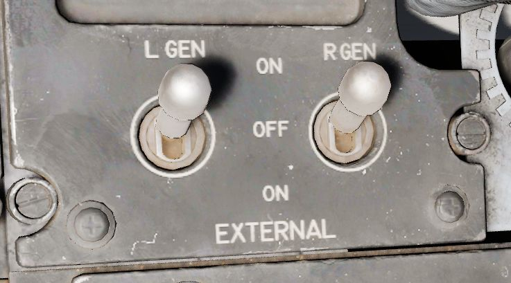
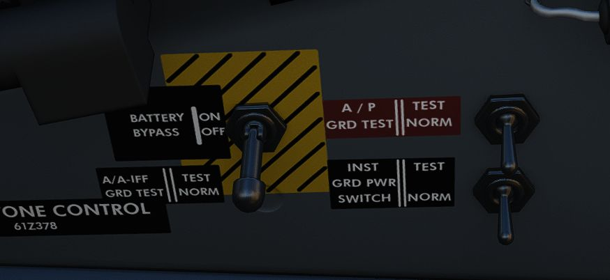
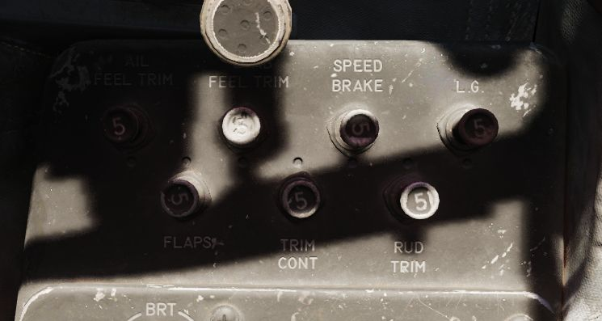

# Electrics

The F-4E derives electrical power from a pair of AC generators driven by the [J79
engines](../systems/engines_and_fuel_systems/engines.md), a pair of AC to DC transformers, and a
battery for electrical functions
with the engines offline. In addition, the Phantom
II can receive external
electrical power from ground crew. The two generator arrangement, while normally
working independently, includes a bus tie that can connect both buses together
to draw power from a single generator in case of failure.

## Generator Indicator Lights

Three warning indicators are found on the generator indicator panel: LH GEN OUT,
RH GEN OUT, and BUS TIE OPEN. The respective GEN OUT warning will illuminate in
the event the generator in question fails. The indication of BUS TIE OPEN is an
acknowledgement that a single functioning generator is providing power to the
entire aircraft. In the event of a generator failure, the Master Caution will
also illuminate. However, in case both generators fail, no GEN OUT light will illuminate.

## Generator Control Switches

A pair of Generator Control Switches are found on the right console, one for each engine. These
three position switches - ON (Forward), OFF, ON External (Aft) - control the state of each
respective generator. In the event of a possible generator failure, selecting OFF for
the generator that is believed to be offline will cause the power bus to provide electricity from
the remaining generator to the other half of the electrical system. The External On setting is used
for ground handling purposes when connected to external power, and provides electric power to all
instruments, except the CNI and the AFCS.

## Instrument Ground Power Switch

Power from an external source to the instrument buses (115/200 volt ac, 28 volt
ac, and 14 volt ac), can be provided by the Instrument Ground Power Switch (if
the generator switches are set to EXT ON), found on the right wall in the
rear cockpit. Once external electrical power is disengaged or an engine
generator comes online, it will switch off.

## Bus System

The battery and generators power several buses which then route current to the relevant systems:

- Left Main AC Bus
- Right Main AC Bus
- Instrument AC Bus
- Warning Light AC Bus
- Main DC Bus
- Essential DC Bus
- Armament DC Bus
- Battery Bus

## Circuit Breakers

From the buses, power is first routed through Circuit Breakers before they
reach the actual systems.

> 💡 Due to engine limitations, CBs in the WSO cockpit are currently not accessible.

Most circuit breakers are placed in the WSO pit on either wall, with the exception
of one panel in the pilot pit, housing breakers for the flight control surfaces
and similar crucial systems.

### Pilot Panel

Located on the right wall of the pilot cockpit, this panel contains
seven circuit breakers responsible for flight control surfaces and
other systems important for safe operation of the aircraft.

- AIL Feel-Trim
- STAB Feel-Trim
- Speed Brake
- Landing Gear
- Flaps
- Trim Controls
- Rudder Trim

### Lighting Panel

Hidden behind a bundle of cables to the right of the telelight panel in the Pilot
cockpit are two circuit breakers controlling lights.

The upper one is responsible for powering the primary instrument lights, while
the lower circuit breaker powers all indicator and warning lights.

### CB Panel 1

Front section of right wall in WSO cockpit.

Has the circuit breakers for all stations, the armament and weapon system.

### CB Panel 2

Center section of right wall in WSO cockpit.

Mostly responsible for Engine and Hydraulics operation.

### CB Panel 3

Aft section of right wall in WSO cockpit.

Contains breakers for auxiliary functions, such as Anti-Icing or the Arresting Hook.

### CB Panel 4

Aft section of left wall in WSO cockpit.

Master controls of power coming through all buses, the flight computer and targeting pod.

### CB Panel 7

Next to the right rudder pedal in WSO cockpit.

Hidden behind a cover, this panel houses all breakers for the ECM and Jamming equipment.
