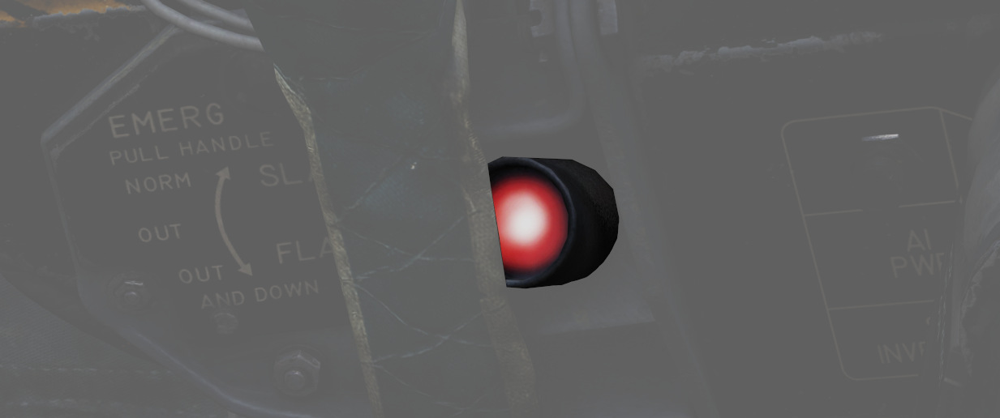
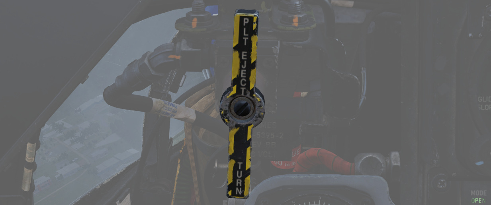
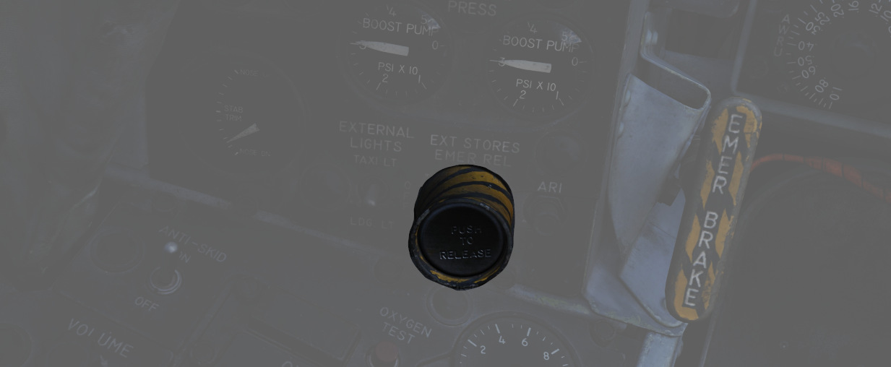

# 应急系统

## 告警与指示灯

### 远传信号灯面板

大多数驾驶舱告警灯位于飞行员驾驶舱右侧子面板上的远传信号灯面板上，以下是告警灯列表：

| 灯光                 | 解释                                                                                                                 | 灯光                | 解释                                                                           | 灯光                 | 解释                                                                              |
| -------------------- | -------------------------------------------------------------------------------------------------------------------- | ------------------- | ------------------------------------------------------------------------------ | -------------------- | --------------------------------------------------------------------------------- |
| Alt Encoder out      | 如果高度编码器装置的信号不可靠或没有信号，告警灯将会亮起。在快速爬升、俯冲机动或跨声速飞行期间，灯光也可能短暂亮起。 |                     |                                                                                |                      |                                                                                   |
| IFF                  | Mode 4 编码被擦除或未插入编码时亮起                                                                                  | DC Bus              | 两台发电机失效或如果主直流和应急直流母线直接电压降低，灯光将亮起               |                      |                                                                                   |
| Canopy Unlocked      | 如果任意座舱盖未放下并锁定，飞行员驾驶舱中的灯光将两栖。WSO 驾驶舱中的灯光仅在后座座舱盖未放下并锁定时亮起。         | Hook down           | 拦阻钩未收上并锁定时灯光亮起。                                                 |                      |                                                                                   |
| Autopilot Ptich Trim | 当接通 AFCS 并且自动俯仰配平跟随失效或在飞机机动后明显滞后时灯光亮起                                                 | Autopilot Disengage | 在首次接通 AFCS 后断开自动驾驶时，灯光亮起                                     |                      |                                                                                   |
| Left Ext Fuel        | 如果选择了副油箱并且未向机身油箱输油时，灯光亮起。                                                                   | CTR Ext Fuel        | 如果选择了副油箱并且未向机身油箱输油时，灯光亮起。                             | Right Ext Fuel       | 如果选择了副油箱并且未向机身油箱输油时，灯光亮起。                                |
| Fuel Level Low       | 在 1 油箱和 2 油箱中的油量到达预定燃油状态 1650 ± 200 磅时指示灯亮起                                                 | CHK Fuel Filters    | 当燃油过滤器堵塞时亮起。过滤器将自动切换至旁通管路使得系统能正常向发动机输油。 | Radar On Cool Off    |                                                                                   |
| L Anti Ice On        | 当除冰引气系统开启时灯光亮起。                                                                                       | R Anti Ice On       | 当除冰引气系统开启时灯光亮起。                                                 | Static Corr Off      | 如果 SPC 失效或 CADC 开关拨至 CORR OFF 档位时亮起。                               |
| L Aux Air Door       | 当左辅助气门和起落架手柄工作不同步时亮起。                                                                           | R Aux Air Door      | 当右辅助气门和起落架手柄工作不同步时亮起。                                     | Speedbrake out       | 减速板展开或未完全收起时指示灯亮起。                                              |
| Windshield Temp High | 当使用风挡除水功能时，风挡接近会引起光学畸变的温度时，指示灯会亮起。应立即关闭风挡除水功能。                         | Duct Temp High      | 当压气机进口温度超限时，指示灯亮起。                                           | Check Hyd Gauges     | 任意系统压力低于 1500 ± 100 psi 时指示灯将会亮起。                                |
| Slats In             | 缝翼超控开关拨至 IN 档位时，由于 AOA 变化导致缝翼停止移动时亮起。                                                    | Pitch Aug Off       | 缝翼超控开关拨至 IN 档位时，由于 AOA 变化导致缝翼停止移动时亮起。              | Cabin Turb Overspeed | 如果制冷装置的座舱涡轮受到超出正常工作的压力和温度，指示灯将会亮起。              |
| Inertial Nav Sys Out | 如果惯导系统失效或关闭，指示灯都将亮起。                                                                             | Tank 7 Full         |                                                                                |                      |                                                                                   |
| Oxygen Low           | 液氧储量少于 1 升时指示灯亮起。                                                                                      |                     |                                                                                | Fire Sys             | 当火灾/过热探测器传感器管烧穿、探测器电线磨损至接地或控制模块失效时，指示灯亮起。 |

### 主注意

位于飞行员驾驶舱的“主注意”（MASTER CAUTION）向飞行员提供关于飞机潜在危险的前置警告。MASTER CAUTION
与远传信号灯面板上的大多数告警灯和发电机指示灯同时亮起；不会触发 MASTER CAUTION 灯的警告在远传信号
灯面板列表中有注明。

飞行员可以通过按下右侧控制台上的重置按钮来解除“主注意”警告。然而，重要的是要注意，按下“主注意”按钮
并不会清除信号灯板上的警告；相反，警告将保持不变，直到问题解决。如果一个已经触发信号灯告警的系统发
生第二次事件，MASTER CAUTION 灯不会再次亮起。

### 告警灯测试电路

机组可以使用位于两个驾驶舱机内照明控制面板上的告警灯测试电路来确认指示灯正常工作。这些电路并不执行
单个警告系统的功能，只是确认灯会亮起。

## 发动机火灾与过热探测系统

在飞行员驾驶舱右上仪表板中有四个告警灯——两个火灾（FIRE）和两个过热（OVRHEAT）灯，每侧一个。如果探测
到发动机舱出现火灾，相应的 FIRE 灯将会亮起。过热探测器安装在机身后部靠近发动机喷口处，如果温度对飞
机构成危险，相应的 OVRHEAT 灯将会亮起。

### 火灾测试按钮

按下此按钮时，将测试 FIRE（火灾）和 OVRHT（过热）灯是否正常工作。按钮还可以与告警灯测试开关一起使用
，以确认火灾和过热告警系统的探测和连贯性能。将告警灯测试开关保持在 WARN TEST（警告测试）档位，然后
同时按下并松开火灾测试按钮来进行测试。当按下火灾测试按钮时，FIRE 和 OVRHT 灯熄灭，然后在松开时亮起
，从而确认系统正常工作。

## 弹射座椅

鬼怪 II 使用两个 Martin Baker Mk. H-7 弹射座椅，以确保在机体故障时安全地弹射机组人员。使用面罩或下
部弹射手柄触发弹射并通过安装在座位上的打火器抛弃座舱盖。一旦座舱盖脱离飞机，弹射火箭的主火药弹爆燃
，解锁座椅并开始座椅向上弹出。随着座椅上升，束缚在腿部的拉紧带将腿部拉回以确保贴合，并设置开伞定时
器。在适当的高度，一根将弹射火箭与飞机机身连接的短索会触发击针，点火弹射火箭以使座椅迅速脱离飞机。
此时，之前设置的射伞枪发射，放出一对小降落伞以稳定座椅的姿态并开始减速。

一旦座椅达到预设的气压高度（在 11500 至 14500 英尺之间），或在更低高度稳定后的瞬间，投伞机构会将带
有生存包的椅座从弹射框架中释放，并放主降落伞。如果在气压计高度以下弹射， WSO 的降落伞将在弹射启动后
5 秒完全打开，飞行员的降落伞在 1 秒后打开。

### 弹射灯

如果内话系统断电，飞行员可以通过按下位于座舱盖左侧边缘，襟翼开关前方的的弹射开关来警告 WSO 准备弹射
。这会使位于 WSO 驾驶舱指示器面板上的一对告警灯亮起。WSO 也可以通过同样的方式来警告飞行员即将进行弹
射。

### 指令选择阀手柄

在 WSO 驾驶舱仪表手柄的左上方是指令选择阀手柄。这个手柄决定从后座启动的弹射顺序——是双座弹射还是仅后
座弹射。手柄上标有 PLT EJECT PULL TURN。当手柄垂直朝向时，选择的是仅后座弹射；如需设置双座弹射，将
手柄顺时针旋转至水平位置。

飞行员驾驶舱中启动弹射序列始终将带离两名机组。

## 挂载抛离系统

F-4 携带的大部分挂载可以在飞行中、起落架收起且舱门关闭的情况下从飞机上抛弃。抛弃操作不会抛弃挂架
，AIM-9“响尾蛇”导弹不能被抛弃。

| 名称     | 描述                                                                         |
| -------- | ---------------------------------------------------------------------------- |
| OFF      | 选择抛弃控制面板中的 PUSH TO JETT 按钮安全                                   |
| STORES   | 按下 PUSH TO JETT 后投放所有 MER/TER、单发、挂载在 LAU-88 上的挂载或副油箱。 |
| L/R FWD  | 抛弃对应位置的 AIM-7。CL TK ON 时将被禁止。                                  |
| L/R AFT  | 抛弃对应位置的 AIM-7。                                                       |
| L/R WING | 配合 TV 或 ARM，抛弃单枚挂载在机翼上的 AGM-65“幼畜”或 AGM-45“百舌鸟”。       |

### 应急挂载抛弃按钮

位于飞行员驾驶舱左侧子面板上的应急挂载抛弃开关，也被称为恐慌按钮，将抛弃所有空对地武器、副油箱以及
任何可抛弃的吊舱。“麻雀”和“响尾蛇”导弹以及所有挂架将保持原位。按下按钮将显示其凹槽内的黄色涂料，以
确认启动应急挂载抛弃。执行应急挂载抛弃将自动断开副油箱输油，使机翼油箱正常进行输油，而无需飞行员进
行操作。只要飞机的起落架处于收起状态，或者在飞行员驾驶舱起落架手柄故障的情况下，只要 WSO 驾驶舱起落
架手柄保持在收起（IN）档位，并且机轮不负重时，即可使用按钮执行应急抛弃。

### 挂点选择抛离

将抛弃旋钮转动至 STORES 档位，选择所需的挂点选择按钮来投放，并按下 PUSH TO JET，通过这种方式来单独
抛弃机翼和中线挂载。所有挂点上的挂架或导弹发射架将保持原位，但包括 MER 和 TER 在内的挂载将被抛弃。

例如，如需抛弃左右副油箱，飞行员必须选择 STORES 档位，按下对应的挂点选择按钮 LO 和 RO，接着按下
PUSH TO JET 按钮。

### AIM-7 抛弃

例如，如需抛弃左右副油箱，飞行员必须选择 STORES 档位，按下对应的挂点选择按钮 LO 和 RO，接着按下
PUSH TO JET 按钮。

### AGM-65 抛弃

如需抛弃 AGM-65，将武器选择旋钮转动至 TV 或 ARM，按下所需的挂点选择按钮，将抛弃旋钮转到 L WING 或 R
WING 档位，接着按下 PUSH TO JET。每按一次抛弃一枚导弹；在一侧机翼抛弃完成后，使用抛弃旋钮转到另一侧
机翼并重复 PUSH TO JET 步骤。
