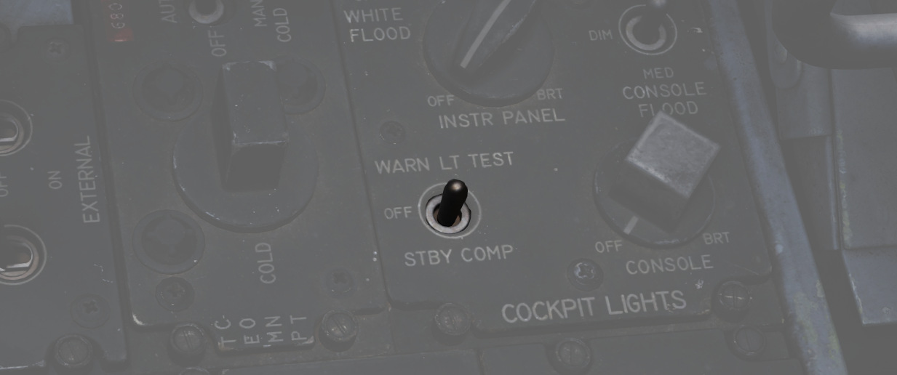

# Emergency Systems

## Warning and Indicator Lights

### Telelight Panel

The majority of cockpit warning lamps are found on the telelight panel on the
right sub-panel in the front cockpit. A list of them follows:

### Master Caution

Found in the front cockpit, the MASTER CAUTION provides the pilot with an
up-front warning of potential hazard to the aircraft. The MASTER CAUTION
illuminates concurrently with most warning lamps on the telelight panel and the
generator indicators; warnings that do not set off MASTER CAUTION are noted in
the Telelight Panel list.

MASTER CAUTION can be deactivated by the pilot pressing the reset button on the
right console. However, it is important to note that pressing MASTER CAUTION
does not clear a warning on the telelight panel; instead, the warning will
remain until rectified. Should a second event occur in a system already giving a
telelight warning, MASTER CAUTION will not illuminate a second time.

### Warning Light Test Circuit

Confirmation of bulb function can be performed using the Warning Test Light
Circuit found on the interior light control panel in both cockpits. These do not
perform a function text for the individual warning systems, only confirm that
the lights will illuminate.

## Engine Fire and Overheat Detector System

On the right upper instrument panel in the front cockpit are four warning lamps-
two FIRE and two OVRHEAT lights, one for each side. Should a fire be detected in
an engine compartment, the applicable FIRE lap will illuminate. Overheat
detectors are mounted at the rear of the fuselage adjacent to the engine
nozzles, and illuminate the respective OVRHEAT lamp should temperatures become
dangerous to the aircraft.

### Fire Test Button

When pressed, this button tests for functionality of the FIRE and OVRHT lamps.
Can also be used in conjunction with the Warning Lights Test switch to confirm
detection and continuity performance of the fire and overhead warning systems.
Holding the Warning Lights Test switch in the WARN TEST position, then
simultaneously pressing and releasing the Fire Test Button performs the test.
Proper system function is confirmed with the four FIRE and OVRHT lamps off while
the Fire Test Button is pressed, then illuminating when it is released.

## Ejection Seats

The Phantom II uses the Martin Baker Mk. H-7 ejection seat in both positions for
safe aircrew extraction in the event of airframe loss. Triggering ejection using
the face curtain or lower ejection handles fires the seat mounted initiator that
jettisons the canopy. Once the canopy is clear of the airframe, the ejection gun
primary charge fires, unlatching the seat from the cockpit and initiating seat
climb-out. As the seat rises, restraints on the legs pull them back for clearance
and the drogue timer is set. At the appropriate height, a lanyard attaching the
rocket motor initiator to the airframe trips the firing pin for the main rocket
engine to clear the aircraft. The previously set drogue gun fires at this time,
deploying a pair of small chutes to stabilize the seat in attitude and initiate
deceleration.

Once the seat has reached a pre-set barometric altitude between 11,500 and
14,500 feet, or momentarily after stabilization if lower, scissor mechanisms
release the crew-member with the survival kit-containing seat pan from the
ejection frame and deploys the main chute. In the event of ejection below the
barostat altitude, the WSO chute is fully deployed at 5 seconds after ejection
initiation, and the pilot one second later.

### Eject Light

In the event of loss of intercom power, the pilot can warn the WSO to prepare
for ejection by pressing the EJECT switch found on the left canopy sill forward
of the flap switch. This illuminates a pair of warning lamps found on the rear
cockpit indicator panel.

### Command Selector Valve Handle

To the left and above the rear cockpit instrument handle is the Command Selector
Valve Handle. This handle determines the sequence by an ejection initiated from
the rear seat- both seats, or the rear seat only. The handle is marked PLT EJECT
PULL TURN. When the handle is oriented vertically, single seat ejection is
selected; to set dual seat ejection, the handle is rotated clockwise to the
horizontal.

All ejections initiated from the front seat are dual ejections.

## Jettison System

The majority of stores carried by the F-4 can be jettisoned from the aircraft
while in flight and with the landing gear stowed and doors closed. Jettison does
not remove pylons, and the AIM-9 Sidewinder is non-jettison-able.

### External Stores Emergency Release Button

Found on the front left cockpit sub-panel, the External Stores Emergency
Release, also known as the panic button, will release all air to ground
munitions, external tanks, and any pods subject to jettison. Sparrow and
Sidewinder missiles, along with all pylons, will remain in place. Pushing the
button will show the yellow paint inside its recess to confirm its actuation.
Performing the actuation disengages external fuel tank transfer automatically,
permitting proper flow of internal wing tanks without further pilot action. The
button is active so long as the aircraft gear is up, or, in the event of a
forward gear handle failure, so long as the rear gear handle remains IN, and
weight is off wheels.

### Selective Jettison

Wing and centerline stores can be jettisoned independently using the Jettison
Knob in the STORES position, selecting the desired Station Select Buttons to
release, and pressing PUSH TO JET. Any pylon or missile launcher at the station
will remain in place, but stores- including MERs and TERs, will be released.

### AIM-7 Jettison

AIM-7 Sparrow missiles are released individually using the L/R FWD or L/R AFT
positions on the Jettison Knob, then pressing PUSH TO JETT.

### AGM-65 Jettison

To release AGM-65 missiles, choose TV or ARM on the Weapon Select Knob, press
the desired Station Select Button(s), select L WING or R WING for the Jettison
Knob, and press PUSH TO JETT. One missile is released per press; once desired
rounds are removed from one wing, select the other wing with the Jettison Knob
and repeat the PUSH TO JETT cycle.
