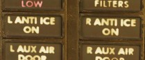

# Engines

The F-4E Phantom is powered by two J79-GE-17 engines built by General Electric,
with a rated static sea-level power delivery of 11,870 pounds of thrust in Mil,
and 17,900 pounds in afterburner. The engines have provision for both assisted
pneumatic start at fields with an available cart, or via a propellant cartridge
to initiate spin-up. Similarly, the engines can utilize the aircraft's internal
battery for initial power, or connection with an external power cart.

> 💡 When the engines are off they make a rattling noise as the respective blades rattle in their
> holders. This is called windmilling.

## Fuel Flow Indicators

Each engine has a fuel flow indicator found in the front cockpit instrument.

The indicators read in thousands
of pounds per hour, from 0 to 12. The indicators provide flow rate up to Mil power; when afterburner
is engaged, a separate fuel delivery system is used to provide fuel directly to the
afterburner stage, and the flow rate is approximately 4 times the value shown. The engine
speed is also controlled by the fuel flow, so a change in fuel flow can be directly observed if the
throttles are moved.

Fuel Flow should not exceed 1200 pph at lightoff and 800 to 1500 pph at idle operations. Fuel
consumption for Engine start is approximately 65 pounds per Engine.

## Oil System

Each engine is equipped with a completely self-contained, dry sump, full pressure oil system. The
oil supply to the lubrication system is interrupted during negative G-flight due to the inability of
the scavenge pumps to recover oil from the sumps and gear boxes. The Engine Oil system is used for
lubrication, variable nozzle positioning and constant speed drive unit operation. The standpipes
which supply the three systems utilizing engine oil are in the reservoir such that the pipe for the
constant speed drive unit is the highest, the one for the nozzle control is the next highest, and
the lubricating system pipe is the lowest. This arrangement is to prevent a critical system failure
if one of the circuits leak. If a leak in the constant speed drive unit would occur it will probably
cause a failure of that system only, while a leak in the nozzle control system may cause failure of
that system and the constant speed drive unit. Oil is also supplied directly from the reservoir to
the constant speed drive unit, where it is used as both the control and final drive medium for
controlling generator speed. The lubrication element of the oil pump supplies oil to cool and
lubricate bearings, gears and other rubbing or moving parts in the engine. Lubricating oil is also
circulated through the engine-driven generator for cooling purposes.

### Oil Pressure Indicators

Oil pressure indicators are on the front cockpit pedestal panel, and calibrated from 0 to 100 PSI.
Important values are:

* 12 psi - Minimum at idle RPM
* 30-60 psi - In-flight military
* 35 psi - Static minimum at military thrust
* 60 psi - Maximum

## Variable Duct Ramp

Optimization of air to the engines is performed by a Variable Duct Ramp system
directed by the Automatic Duct Control (ADC); this optimization uses a pair of variable ramps to
decelerate incoming air to subsonic for best engine performance. In the event
limits are exceeded for inlet temperature, the Duct Temperature High Indicator
Light (DUCT TEMP HI) on the telelight panel will illuminate. Permitting the issue to continue can
cause permanent engine damage.

## Starting System

### Pneumatic Mode Starting

The pneumatic mode is the primary starting mode for all
normal and routine operations.
In this mode the Phantom utilizes an auxiliary start cart that
turns the starter turbine, cranking the engine.

The cart is operated by the crew chief, see the
[Crew Chief chapter](../../crew_chief/overview.md)
for more information about how to interact and request air supply.

### Cartridge Mode Starting

Cartridge mode is considered an alternate method of
starting supplied for operational and emergency needs. A propellant
charge is used to turn the starter turbine, which in turn cranks the engine
to initiate startup. Cartridge ignition is controlled by the engine start switch
providing the respective engine master switch is on.

> 💡 To avoid possible irritation caused by cartridge exhaust smoke/gases,
> it may be advisable to close canopies and select 100% oxygen during start cycle.

Cartridges can be installed by the crew chief, see the
[Crew Chief chapter](../../crew_chief/overview.md)
for how to interact and request cartridges installation.

> 🔴 WARNING: Cartridges are explosive and, unless fired, must not be
> forgotten to be removed.
> Under no circumstances will the aircraft be flown
> with unfired cartridges in the starter.

### Start Switch

Used only for cartridge start, selecting L or R ignites the cartridge installed for
the respective engine.

### Ignition System

The -17E/G engine is equipped with one 28 volt, low energy ignition unit and one 28 volt high energy
unit that improves ground starts in cold weather and air starts using alternate fuel. The main
ignition system produces an electrical arc which ignites the atomized fuel-air mixture in the fourth
and fifth combustion chambers. The remaining eight combustion chambers are ignited through the
crossfire tubes. Pressing the ignition button causes the spark plugs to discharge, igniting the
fuel-air mixture as the throttle is moved from OFF to IDLE during engine start. The spark plugs only
fire while the spring-loaded ignition button is held.

### Afterburner Ingition System

The afterburner ignition system consists of the torch igniter, a spark plug and an afterburner
ignition switch. When the throttle is moved into the afterburner detent, the afterburner ignition
switch closes, and the spark plug supplies a continuous arc. Ignition and torch igniter fuel flow
are maintained until the throttle is removed from the afterburner detent.

### Engine Anti-Icing System

Using
the Anti-Icing Switch
set to DE-ICE, bleed air from stage 17 is distributed to ports installed in the compressor face area
of the engines. This system does not perform de-icing functions, but is to be activated prior to ice
formation. As high Mach speeds provide enough friction heat to the air stream to deny icing in the
compressor stage, usage of the Anti-Icing System is unnecessary and can cause engine damage.

The system should be turned on in turbulent air and thunderstorms, or when a rise in Exhaust Gas
temperature is noted by the pilot as this is an indication for an engine icing condition.

### Anti-Ice Indicator Lights

Activation of the Anti-Icing system will illuminate two lights on the telelight panel, L ANTI-ICE On
and R ANTI-ICE On. A failure of the anti-icing system with the Anti-Icing Switch set to NORMAL will
also light these telelight indicators as a warning. If the aircraft is above Mach 1.2 when this
occurs, immediate speed reduction is necessary to prevent engine loss. Because of the warning
function for the ANTI-ICE ON lamps, a condition that illuminates them will
provide a MASTER CAUTION warning.

## Controls and Indicators

### Exhaust Nozzle Control Unit

Throttle position, nozzle position feedback and exhaust gas temperature are utilized to schedule the
correct nozzle area. During engine operation in the sub-mil region, the nozzle area is primarily a
function of throttle angle and nozzle position feedback. The nozzle is scheduled to approximately
7/8th open at idle and the area is decreased as the throttle is advanced toward the military power
position. However, during a rapid throttle burst from below 79% rpm to 98% rpm, a control alternator
supplies engine speed information to the temperature amplifier, which in turn schedules engine speed
inputs as a function of temnperature limiting. This signal prevents the primary nozzle from closing
beyond a preset position, permitting a rapid increase in engine rpm that could damage the engine.
During engine operation in the military and afterburner region, it becomes necessary to limit the
nozzle schedule as established by the throttle angle and nozzle feedback to prohibit exhaust gas
temperature from exceeding engine design limits and damaging the engine.

### Exhaust Nozzle Position Indicators

Directed by the Exhaust Nozzle Control Unit, the paired primary (the convergent,
inner nozzle) and secondary (the divergent, outer nozzle) are actuated
independently on a schedule to maximize outlet performance versus exhaust gas
temperature. When idle, the engine nozzle will be roughly 7/8ths open, reducing
in size as the throttle approaches MIL. During operation in the MIL and AB
regions, the Control Unit moderates the nozzle size relative to throttle
position and received EGT to maintain temperatures within design limit.

To monitor the current position of the nozzles relative to each other, as well
as EGTs, an indicator
is provided with calibrations from CLOSE to OPEN in four increments. The nozzle indicators enable
the pilot to make a comparison of nozzle position between engines and are also used to establish a
relationship between nozzle position and exhaust gas temperature, as well as nozzle position and
throttle settings.

Normal settings would be OPEN with the engines off until IDLE, 3/4 to 1/2 with
engines in IDLE and 1/4 for MIL power. MAX power will not change the indicator.

### Engine Master Switches

A pair of two-position Engine Master Switches are found on the front cockpit left console on
the inboard engine control panel. Selecting ON powers the fuel boost and transfer pumps for the
respective engine; this will occur whether the aircraft is connected to external auxiliary power or
not, as doing so without will connect the aircraft battery to the pump circuits.

As the Engine Master Switches arm the fuel shutoff valves, to properly shut down the engines without
external power it is necessary to return the throttles to the cutoff position prior to turning
the Engine Master Switches off, otherwise the valves will remain open.

### Throttles

Paired throttles are provided in both cockpits for engine thrust control. In normal use, movement of
the throttles from IDLE to OFF will perform fuel cutoff; to prevent inadvertent engine shutdown, a
pair of finger lifts (<num>3</num>) are provided to lock out the OFF position without performing this
actuation. Afterburner is attained by shifting the throttles outboard (left) at the MIL stop, then
pushing them forward.

The rear cockpit throttles are connected to the front throttles in such a fashion that only the
pilot can start the engines or enter the afterburner range; the WSO can reduce throttles out
of the afterburner region back into MIL operation and lower. While the rear throttles can be shifted
from OFF without pilot assistance, return to OFF for shutdown requires pilot engagement of the
finger lifts.

In the event of opposing commands on the throttle arms between seats, the rear
throttles will be disconnected from the front throttles to prevent damage to
the linkage. This condition may cause a reduction in afterburner authority from the front throttle
pair. Resetting the throttle linkage is performed by placing the front throttles at the IDLE or MIL
stop and moving the rear throttles in the opposite direction to which the disconnect occurred.

The rear throttles only hold a microphone button and speed brake switch.

### Tachometers

Both engines are provided with tachometers on the right side of the front
cockpit instrument panel, and the right side of the rear cockpit instrument panel.
The tachometers will function without external power.

### Exhaust Gas Temperature Indicators

Exhaust Gas Temperature Indicators are found on the front cockpit instrument panel.
The indicators have two pointers each: a large pointer for the 0 to 12 scale referencing 100 degrees
centigrade, and a smaller pointer on a separate scale with 0 to 10 referencing 10 degrees
centigrade. Measuring for these values is performed upon exit of the turbine. For normal operations
the exhaust gas temperature should not be less than 250°C and should not exceed more than 540°C. If
an overtemperature Event occurs the throttle should be returned to the off position. If that is not
possible the respective engine master switch should be turned off.
