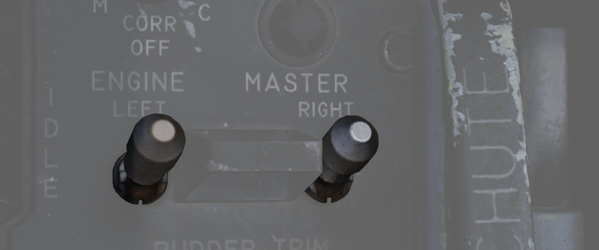

# 发动机

F-4E“鬼怪”II 由通用电气公司制造的两台 J79-GE-17 发动机提供动力，在静态海平面状态下的军推推力为
11870 磅，在加力燃烧下的推力为 17900 磅。发动机可以使用机场气源车起动或通过推进剂药柱来让发动机起旋
。同样地，发动机可以使用飞机的内部电池或连接地面电源进行初期供电。

> 💡 当发动机关车时，安装在轮盘上的各叶片将因为风车效应发出哒哒声。

## 燃油流量表

在飞行员驾驶舱仪表板上，每台发动机都有一个的燃油流量表。

燃油流量表以千磅每小时为单位显示，显示区间从 0 到 12。燃油流量表提供到军推及以下时的流量读数；当开
启加力燃烧后，飞机使用独立的燃油输送系统直接向加力燃烧室段提供燃油，此时流量大约是显示值的 4 倍。发
动机转速也受燃油流量控制，因此如果移动油门握把，可以直接观察到燃油流量的变化。

点火时的燃油流量不应超过 1200 磅每小时，在慢车时应在 800 至 1500 磅每小时之间。每台发动机起动大约需
要消耗 65 磅燃油。

## 滑油系统

每台发动机都配备了完全独立的干槽、全流式滑油系统。由于在负 G 飞行中，回油泵无法从集油池和齿轮箱中回
油，导致滑油系统供油中断。发动机滑油系统用于润滑、可变喷口定位以及恒速驱动装置工作。使用发动机滑油
的三个系统的供油管道位于油箱中，其中恒速驱动装置的供油管道位于最高处，喷口控制的供油管道次之，润滑
系统的供油管道位于最低处，这样排列是为了防止如果其中一个回路泄漏导致严重的系统故障。如果恒速驱动装
置发生泄漏，可能只会导致该系统故障，而喷口控制系统出现泄漏可能导致该系统和恒速驱动装置出现故障。滑
油也直接从滑油箱泵送给恒速驱动装置，在装置内滑油将被用作控制和最终驱动介质，用于控制发电机转速。供
油泵的润滑元件供油来为轴承、齿轮和发动机中的其它摩擦或移动部件提供冷却和润滑。滑油还流经机械驱动式
发电机回路以用于冷却。

### 滑油压力表

滑油压力表位于飞行员驾驶舱的底座面板上，量程为 0 至 100 PSI。重要的数值包括：

- 12 PSI：慢车 RPM 时的最低油压
- 30-60 PSI：飞行中的军推油压区间
- 35 PSI：静态时军推的最低油压
- 60 PSI：最大油压

## 可调风管斜板

F-4E 战机中由自动风管控制（ADC）指令的可调风管斜板系统将对进入发动机的空气进行优化；系统使用一对可
调斜板将进入的空气减速到亚音速，以优化发动机性能。如果进口温度超限，远传信号灯面板中的风管温度过高
（DUCT TEMP HI）指示灯将会亮起。如果问题持续存在，可能会导致发动机出现永久性损坏。

## 起动系统

### 气动模式起动

气动模式是所有正常和常规作业中的主要起动模式。在气动模式下，战机将使用保障车来辅助转动起动涡轮，带
动发动机。

保障车由机工长进行操作，请参阅[机工长章节](../../crew_chief/overview.md)了解更多关于如何互动和请求
地面气源的信息。

### 药柱起动

药柱模式用作满足操作和应急需求的备选起动方法。药柱模式使用推进剂药柱来转动起动涡轮，进而带动发动机
以起动发动机。在对应的发动机主开关开启后，使用发动机起动开关来控制药柱点火。

> 💡 为了避免药柱排气烟雾/气体可能引起的刺激，建议在起动期间关闭座舱盖并选择 100%氧气。

药柱由机工长安装，请参阅[机工长](../../crew_chief/overview.md)章节，了解如何互动和请求安装药柱。

> 🔴 警告：药柱是爆炸物，除非已经点火，否则必须将其取出。在任何情况下，都不得携带未点火的药柱飞行。

### 起动开关

仅用于药柱起动，选择左（L）或右（R）将点燃安装在对应发动机中的药柱。

### 点火系统

-17E/G 发动机配备了一个 28 伏的低能点火装置和一个 28 伏的高能点火装置，这有助于在寒冷天气下在地面启
动以及使用备用燃料进行空中启动。主点火系统产生电火花，点燃第四和第五燃烧室中雾化的油气混合物。其余
八个燃烧室通过联焰管点燃。按下点火按钮会使点火电嘴放电，在发动机起动过程中，将油门从关断档位移至慢
车档位时点燃油气混合物。只有在按住弹簧复位的点火按钮时点火电嘴才会放电。

### 加力燃烧室点火系统

加力燃烧室点火系统由火炬式点火器、点火电嘴和加力燃烧室点火开关组成。当油门移入加力档位时，加力燃烧
室点火开关关闭，点火电嘴连续放电。在将油门移出加力档位前，系统将一直保持点火和火炬点火器燃油流量。

### 发动机防冰系统

将防冰开关设置到 DE-ICE 档位时，系统将 17 级压气机引气分配到安装在发动机压气机进口处的端口防止压气
机结冰。系统并不执行除冰功能，飞行员应在冰形成之前激活系统。由于在高马赫下提供了足够的摩擦热量给气
流加热，阻止压气机段结冰，此时激活防冰系统是不必要的，且可能导致发动机损坏。

在湍流和雷暴中，或当飞行员注意到排气温度上升时（这是发动机结冰条件的一个迹象），应该打开防冰系统。

### 防冰指示灯

激活防冰系统后远传信号灯面板中的 L ANTI-ICE On（左侧防冰开启）和 R ANTI-ICE On（右侧防冰开启）。如
果将防冰开关设置到 NORMAL 档位，但防冰系统出现故障，这些信号灯也会亮起以警告出现故障。如果在飞机空
速超过 1.2 马赫的情况下出现信号灯亮起，必须立即减速以防止发动机受损。由于 ANTI-ICE ON 灯的告警功能
，在灯光亮起时 MASTER CAUTION 灯也会随之亮起。

## 控制开关/按钮和仪表

### 喷口控制装置

油门位置、喷口位置反馈和排气温度用于调定正确的喷口面积。发动机在军推前的工作区间时，喷口面积主要随
油门角度和喷口位置反馈变化而变化。在慢车时，喷口被调整至大约张开 7/8，随着油门向军推推动，喷口面积
将逐渐减小。然而，在油门设置从低于 79%RPM 时突增到 98%RPM，一个为温度放大器提供发动机转速信息的控制
交流发电机，将反向调定发动机转速输入随温度限制变化。这个信号将阻止主喷口闭合超过预设位置，从而让发
动机转速迅速升高，这种情况可能会导致发动机受损。发动机在军推和加力区间工作时，需要限制由油门角度和
喷口反馈建立的喷口制度，以防止排气温度超过发动机设计限制并导致发动机受损。

### 喷口位置表

由尾喷口控制装置驱动的一对主要喷口（收敛的内喷口）和次要喷口（扩散的外喷口）根据制度独立作动来在给
定排气温度下最大化排气性能。当发动机处在慢车状态时，发动机喷口将张开 7/8，随着油门向军推推动，喷口
面积将逐渐减小。在军推和加力区间操作期间，控制装置根据油门位置和接收到的 EGT 调节喷口开闭来保持温度
在设计限制内。

驾驶舱中装有一个喷口位置表来方便飞行员监控当前主次喷口的相对位置以及 EGT，其刻度从“闭合”到“张开”划
分成四个。喷口位置表使飞行员能够比较两台发动机的喷口位置，并用于建立喷口位置与排气温度之间的关系，
以及喷口位置与油门设置之间的关系。

正常设置应该为发动机关车时喷口处于张开状态，到慢车后喷口在 3/4 到 1/2 之间，军推时喷口在 1/4。最大
推力不会发生变化。

### 发动机主开关

在飞行员驾驶舱左侧控制台的内侧发动机控制面板上，有一对二档位的发动机主开关。选择 ON 会启动相应发动
机的升压油泵和输油泵；无论飞机是否连接地面电源，都会启动泵，因为如果没有连接地面电源，油泵电路将接
入飞机电池进行操作。

由于发动机主开关可使燃油关断阀关闭，因此在没有地面电源的情况下要正确关闭发动机，必须在关闭发动机主
开关之前将油门握把移动至关断档位，否则阀门将保持打开状态。

### 油门

两个驾驶舱都一对油门用于控制发动机推力。在正常使用中，将油门从慢车移至关断档位将切断燃油；为了防止
意外关闭发动机，油门握把上装有一对指抬装置来将握把限制在关断行程外。通过在军推限位向外侧（左侧）移
动握把，然后向前推，即可进入加力推力。

WSO 驾驶舱的油门握把与飞行员驾驶舱中油门握把连接的方式使得只有飞行员可以起动发动机或进入加力推力区
间； WSO 可以将油门从加力推力区间收回到军推和更低的位置。尽管 WSO 驾驶舱的油门可以在没有飞行员协助
的情况下移出关断档位，但需要飞行员使用指抬装置来关断停车。

如果两个驾驶舱中的油门握把出现相反的指令，WSO 驾驶舱的油门握把将断开与飞行员驾驶舱中的油门握把连接
，以防止传动机构损坏。这种情况可能会导致从飞行员的油门握把在加力推力区间的权限降低。通过将飞行员油
门握把置于慢车或军推，并将 WSO 驾驶舱油门握把向飞行员油门握把方向移动来重新设置油门连接。

WSO 驾驶舱油门握把上仅包括传声按钮和减速板开关。

### 转速表

在飞行员驾驶舱中仪表板的右侧，两台发动机都配备有一枚转速表。转速表无需地面电源即可工作。

### 排气温度表

排气温度表位于飞行员驾驶舱中的仪表板上。每个仪表中含有两个指针：一个大指针，指示刻度从 0 到 12，单
位为 100 摄氏度；一个小指针，指示刻度从 0 到 10，单位为 10 摄氏度。排气温度在涡轮出口后方测得。在正
常工作中，排气温度不应低于 250°C，不应超过 540°C。如果发生超温事件，应将油门收回至关断档位。如果无
法执行，应关闭对应的发动机主开关。
