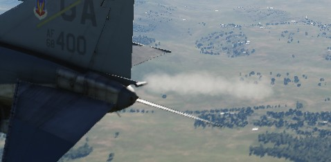

# 燃油系统

鬼怪战斗机的燃油系统是对称的；即，左右发动机的泵和供油布置是相同的，它们共享同一组油箱。机身内部的
7 个油箱和机翼油箱的 JP-4 燃油总量略超过 12000 磅。加上两个 315 加仑机翼副油箱，这个数值将超过
16800 磅。再加上 600 加仑中线副油箱，飞机的燃油总量将接近 20800 磅。

## 输油顺序

F-4 中的 7 组油箱沿机身从前到后分布，并且机翼中还有两个油箱，其中 1 油箱位于 WSO 驾驶舱正后方，其余
油箱按顺序编号直到飞机的尾部。1 油箱是发动机的供油油箱；4 和 6 油箱各装有一个液压和一个电动输油泵，
用于向 1 和 2 油箱供油。其余机身油箱通过重力向 1、4 或 6 油箱供油。3 油箱向 4 和 5 油箱供油，2 油箱
向 1 油箱供油，7 油箱向 6 油箱供油。通过这种用油顺序，将保持飞机沿中心线的重心平衡。直到 1 和 2 油
箱中的燃油总量降至 1800 磅以下，7 油箱才开始转输。

机翼和副油箱中的燃油在升空后使用引气加压来转输；只有飞机离地后才会转输。机翼油箱中的燃油转输到 1 和
3 油箱，而副油箱中的燃油在 1、3 和 5 油箱之间转输保持平衡。

## 机翼油箱输油开关

如有必要，可以使用二档位开关来关闭机翼油箱输油。开关位置在燃油控制面板中，一共有 NORMAL 和 STOP
TRANS 两个档位可供使用。

## 副油箱输油开关

机组可通过副油箱输油开关来控制副油箱输油；副油箱输油开关位于燃油控制面板上，开关有三个档位
：CENTER、OFF 和 OUTBD（外侧），其中 OUTBD 指机翼副油箱。

飞机不能同时从机翼油箱和副油箱输油，如果同时选择了这两个油箱输油，飞机将优先使用副油箱。

## 燃油增压系统

1 油箱供油由一对升压油泵提供。升压油泵安装在油箱底部，以便在负过载情况下供油。飞行员可通过位于驾驶
舱中的升压油泵压力表来确认油泵正常工作。在慢车时，压力为 30 ±5 PSI。若有需要，可使用位于飞行员驾驶
舱中燃油控制面板中的一对升压油泵检查开关来执行地面检查。将其中一个开关保持在 CHECK 档位将关断发动机
，并在对应压力表中提供反馈 。

## 油量指示系统

## 燃油量低告警灯

当 2 油箱中的传感器探测到油量少于 1650 ±200 磅时，位于飞行员驾驶舱，远传信号灯面板中 FUEL LEVEL LOW
告警灯将会亮起。FUEL LEVEL LOW 告警灯独立于燃油量指示系统，亮起还可能表示输油功能失常。

## 副油箱燃油灯

在当传感器探测到副油箱未输油至机身油箱后，远传信号灯面板中对应的指示灯将亮起——L EXT FUEL、CTR EXT
FUEL 或 R EXT FUEL。这些指示灯只会在选择了对应的副油箱输油时亮起，比如，选择了 OUTBD 档位的话，CTR
EXT FUEL 灯就不会亮起，反之亦然。这是因为在油箱输油流量超过发动机耗油量时，系统可能会间歇性地进行输
油，告警灯无法立刻指示副油箱耗尽，且应与油量指示系统进行交叉核实。

> 💡 请在水平直线飞行状态时检查油箱是否消耗完毕，并观察指示灯是否常量并且油量表在一到二分钟内没有上
> 涨。

在进行空中受油时，或在地面加油时，在油箱加满后，位于抬头指示器中的副油箱满指示灯将会亮起。

## 放油系统

飞行员通过机翼放油开关来控制放油，机翼油箱可直接放油而无需输油至机身再进行放油。

将开关拨到 DUMP 档位时，系统将通过位于机翼折叠后缘处的放油管来放出机翼油箱中的油。放油速度取决于油
门设置和高度，高发动机 RPM 和正俯仰角将加快放油速度，低 RPM 以及俯冲姿态的放油速度将减慢。

> 💡 在平飞且发动机转速设置到 85% RPM 的情况下，放油速度大约在 650 磅每分钟。燃油放空大约需要 15 分
> 钟。

## 燃油通气系统

为防止超压，飞机装有一套通气系统。

如果出现超压，系统将自动进行通气来修正油箱压力。

通气操作是全自动完成。机翼副油箱的通气导管与机翼油箱放油管相连，其它所有油箱通气导管都连接至方向舵
下方的通气架。

> 💡 在正常条件下，只有机翼油箱被加压并准备进行输油时才会短暂出现超压。在收起起落架或受油门关闭的时
> 候才会出现这种情况。

