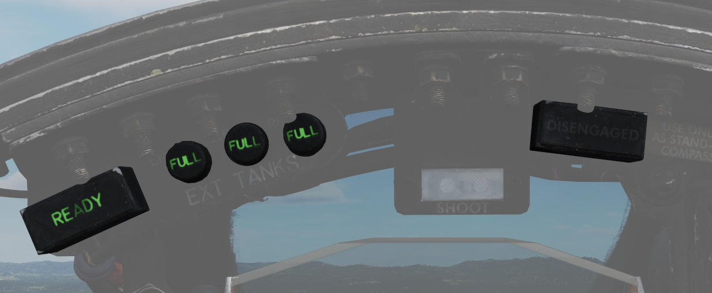

# Fuel System

The Phantom's fuel system is duplicated; that is, their pump and feed
arrangement is the same for both the left and right engines, and they share the
same set of fuel cells. Internal fuselage fuel between all 7 cells and the wing
tanks is just over 12,000 lbs of JP-4. With two external 370 gallon wing tanks,
that value increases to over 16,800 lbs. Adding the centerline 600 gallon tank
will bring the aircraft total fuel state to just under 20,800 lbs of fuel.

## Transfer Sequence

The F-4 carries two internal wing tanks, along with seven fuel cells down the
length of the fuselage, with cell 1 resting just behind the aft cockpit, and the
remaining cells numbered in order to the rear of the aircraft. Cell 1 is the
feed cell for the engines; cells 4 and 6 each carry a hydraulic and an electric
transfer pump to supply fuel to cells 1 and 2. The remaining fuselage cells
perform a gravity feed into cells 1, 4, or 6. Cell 2 feeds cell 1,
cell 3 feeds cell 4; and cell 5, as well as cell 7 feed cell 6.
With this arrangement, center of gravity
balance is maintained along the centerline. Cell 7 is the last cell to initiate
transfer in the sequence, and does not begin until the total fuel in cells 1 and
2 fall below 1800 lbs.

Fuel transfer from the wing and external tanks is performed by bleed air
pressurization once airborne.
Internal wing tank fuel is transferred into fuselage cells 1 and 3,
whereas fuel from external tanks are balanced between cells 1, 3, and 5.

> 💡 Internal wing and external tanks will not transfer with not pressurized.
> This is the case with either the gear out or the AAR door open.

## Internal Wing Transfer Switch

Should it be necessary, a two position switch is available to turn off transfer
from the wing internal tanks. Found on the Fuel Control Panel, the Internal Wing
Transfer Switch can be toggled between NORMAL and STOP TRANS.

## External Transfer Switch

External tank transfer is controlled by the External Transfer Switch; found on
the Fuel Control Panel, the switch has three positions: CENTER, OFF, and OUTBD
(Outboard), with OUTBD referring to the wing external tanks.

It is not possible to transfer from the wing tanks and external tanks at the
same time. If both are selected, the external tanks will take priority.

## Fuel Boost System

Flow from Cell 1 to the engines is performed by a pair of boost pumps. The pumps
are installed at the bottom of the tank to provide fuel in the event of a
negative G excursion. The function of these pumps can be confirmed on the Fuel
Boost Pump Pressure Indicators found in the front cockpit. Engine idle pump flow
rate is 30 PSI, ±5 pounds. To confirm a ground check, a pair of Boost Pump Check
switches are found on the fuel control panel. Holding one of these switches in
the CHECK position will perform an engine shutdown due to the shutoff valve 
being opened, and provide feedback on the respective Pressure Indicator.

## Fuel Quantity Indication System

## Fuel Level Low Warning Light

When the sensor in Cell 2 detects a fuel weight of less than 1650 ±200 lbs, the
FUEL LEVEL LOW warning will illuminate on the front
cockpit telelight panel.
This illumination is independent of the Fuel Quantity Indication System, and can
be indicative of a transfer failure.

## External Tanks Fuel Lights

Any time an external fuel tank is detected to not be flowing fuel into the
fuselage, a respective light will illuminate on the telelight panel - L EXT FUEL, CTR EXT FUEL, or R
EXT FUEL. These lights will only illuminate for the respective external transfer - that is, if OUTBD
is selected, CTR EXT FUEL cannot illuminate, and vice versa. Because transfer can occur
intermittently due to flow from the tanks exceeding engine fuel consumption, the warning lamp is not
immediately indicative of an empty external tank, and should be checked against
the quantity indication system. Further, the lamps will illuminate when the air
refuel switch is set to EXTEND, with the ALL TANKS setting selected.

> 💡 A good general indication that the tanks are empty is the total fuel counter showing a value
> below 11.000 lbs. To confirm, fly calm and level and watch if the light
> stays on and the fuel gauge is not going up for at least one or two minutes.

When air-to-air refueling, or when refueling on the ground and the tanks have
reached a full condition, the External Tanks Full lamps, found under the canopy
bow, will light.

## Air Refueling System

For air-to-air refueling, the F-4E uses a receptacle system compatible with high
pressure USAF-style boom refueling. With this system, fuel can be delivered to
the Phantom at a rate of up to 3900 lbs per minute. Fuel received is delivered
into fuselage cell 2, then equalized through the rest of the aircraft cells,
wing tanks, and, if installed and selected, external tanks.

| Boom Reach                        | Boom Marks                            |
| --------------------------------- | ------------------------------------- |
|  |  |

> 💡 Fully refueling takes roughly between one and three minutes.

### Air Refuel Switch

Preparation for air refueling is performed by toggling the Air Refuel Switch (<num>4</num>) to
EXTEND; doing so extends the receptacle, illuminates the receptacle visual
lamps, depressurizes the fuel cells, activates the transfer pumps to
redistribute received fuel for CG maintenance, and activates the air refuel
READY lamp. RETRACT is used to lower the receptacle and return pressurization
and normal function to the tanks.

If, during AAR, the boom disconnects and the DISENGAGED light illuminates, this
switch has to be flipped to RETRACT and back to EXTEND to reset the system and
allow the boom to connect again.

### Refuel Selection Switch

The two-position Refuel Selection Switch (<num>3</num>) provides options for two modes of
refueling: internal fuselage and internal wing tanks (INT ONLY), and ALL TANKS,
used to include external tanks in the refueling operation.

### Ready Light

With the receptacle extended and tanks depressurized, the READY lamp illuminates
to notify the pilot refueling can begin. The lamp will turn off when the boom is
connected to the receptacle, or the receptacle is lowered by the RETRACT command
on the Air Refuel Switch.

### Disengaged Light

Should the boom separate from the receptacle, the DISENGAGED lamp will illuminate. In the event of a
DISENGAGED signal, the system must be reset to continue refueling. The system must be reset by
toggling the air refuel switch.

### Air Refueling Release Button

On the front seat control stick is the Air Refueling Release Button. Its primary
purpose is to release the receptacle from the boom in the event of a manual
refueling cycle (one in which the boom operator cannot force a disconnect
remotely), or perform a disengagement on demand based on flight conditions or
emergency situation. Pressing the button will disengage the boom, and illuminate
the DISENGAGED lamp.

### AIR REFUEL RECPT Circuit Breaker

In the event of a DISENGAGED situation during air refueling, the system is reset
either by cycling the Air Refuel Switch or by using the AIR REFUEL RECPT circuit breaker,
found on the No 2 circuit breaker panel in the rear cockpit - right side, fourth column,
top breaker.

### External Tanks Full Lights

Three indicators- L.H. FULL, CTR. FULL, and R.H. FULL (Left Hand, Center, Right
Hand) lamps provide confirmation that the external tanks have been filled during
the air refueling process. The lamps will remain lit until the air refueling
receptacle retracted.

## Fuel Dump System

Fuel from the wings can be dumped directly, rather than requiring transfer into
the fuselage, using the Wing Fuel Dump Switch.

This switch, when selected to
DUMP, will release fuel from the internal wing tanks at their dump lines at the
wing fold trailing edge. Flow rate is dependent on power setting and attitude,
higher engine RPM and positive pitch increases dump speed, whereas lower RPM and
a nose low condition reduces dump speed.

> 💡 In level flight at 85% RPM, the dump
> flow rate is roughly 650 pounds per minute. Leading to the entire fuel being
> dumped after roughly 15 minutes.

## Fuel Venting System

To prevent issues with overpressure, the aircraft provides a venting system.

Should an overpressure condition occur, tanks will vent fuel until the pressure
is corrected.

The process is fully automated. External wing tanks vent through the
fuel dump system, while all other cells are connected to the vent
mast below the rudder.

> 💡 Under normal conditions, overpressure only occurs momentarily whenever the internal
> wing fuel tanks are pressurized and made ready for transfer.
> This is the case whenever the gear is retracted or the AAR door is closed.

