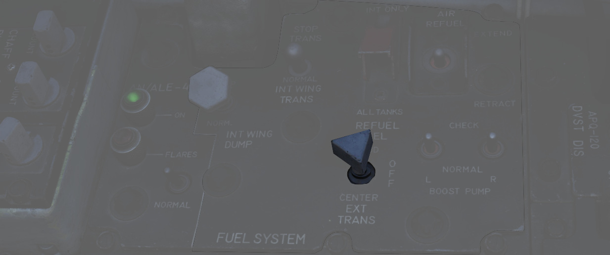

# 燃油系统

鬼怪战斗机的燃油系统为对称设计；即，左右发动机的泵和供油布置是相同的，它们共享同
一组油箱。机身内部的 7 个油箱和机翼油箱的 JP-4 燃油总量略超过 12000 磅。加上两个
370 加仑机翼副油箱，这个数值将超过 16800 磅。再加上 600 加仑中线副油箱，飞机的燃
油总量将接近 20800 磅。

> 💡 [EFB](../../dcs/efb.md#fuel-page) 包括一个燃油页面，可让玩家深入了解系统工
> 作状态。

## 输油顺序

F-4 中的 7 组油箱沿机身从前到后分布，并且机翼中还有两个油箱，其中 1 油箱位于 WSO
驾驶舱正后方，其余油箱按顺序编号直到飞机的尾部。1 油箱是发动机的供油油箱；4 和 6
油箱各装有一个液压和一个电动输油泵，用于向 1 和 2 油箱供油。其余机身油箱通过重力
向 1、4 或 6 油箱供油。2 油箱向 1 油箱供油，3 油箱向 4、5 油箱供油以及 7 油箱向
6 油箱供油。通过这种用油顺序，将保持飞机沿中心线的重心平衡。直到 1 和 2 油箱中的
燃油总量降至 1800 磅以下，7 油箱才开始转输。

机翼和副油箱中的燃油在升空后使用引气加压来转输；机翼油箱中的燃油转输到 1 和 3 油
箱，而副油箱中的燃油在 1、3 和 5 油箱之间转输保持平衡。

> 💡 未加压时机翼油箱和副油箱不会转输。在起落架放下或受油门打开时系统不会加压。

当飞机燃油量低时系统将激活自动燃油转输，不论面板设定都将强制打开机翼油箱和副油箱
的阀门。

> 💡 在激活了自动燃油转输后，飞行员只能通过来回拨动空中加油开关来停用自动转输。
> 务必记住这点，因为在激活后将绕过燃油控制面板上的大部分开关。三盏副油箱灯将无关
> 实际状态亮起来指示系统正在自动转输。

## 机翼油箱输油开关

如有必要，可以使用二档位开关来关闭机翼油箱输油。开关位置在燃油控制面板中，一共有
NORMAL 和 STOP TRANS 两个档位可供使用。

## 副油箱输油开关

机组可通过副油箱输油开关来控制副油箱输油；副油箱输油开关位于燃油控制面板上，开关
有三个档位：CENTER、OFF 和 OUTBD（外侧），其中 OUTBD 指机翼副油箱。

飞机不能同时从机翼油箱和副油箱输油，如果同时选择了这两个油箱输油，飞机将优先使用
副油箱。

## 燃油增压系统

1 油箱供油由一对升压油泵提供。升压油泵安装在油箱底部，以便在负过载情况下供油。飞
行员可通过位于驾驶舱中的升压油泵压力表来确认油泵正常工作。在慢车时，压力为 30 ±5
PSI。若有需要，可使用位于飞行员驾驶舱中燃油控制面板中的一对升压油泵检查开关来执
行地面检查。将其中一个开关保持在 CHECK 档位将打开关断阀致使关断发动机，并在对应
压力表中提供反馈 。

## 油量指示系统

## 燃油量低告警灯

当 2 油箱中的传感器探测到油量少于 1650 ±200 磅时，位于飞行员驾驶舱，远传信号灯面
板中 FUEL LEVEL LOW 告警灯将会亮起。FUEL LEVEL LOW 告警灯独立于燃油量指示系统，
亮起还可能表示输油功能失常。

## 副油箱燃油灯

在当传感器探测到副油箱未输油至机身油箱后，远传信号灯面板中对应的指示灯将亮起——L
EXT FUEL、CTR EXT FUEL 或 R EXT FUEL。这些指示灯只会在选择了对应的副油箱输油时亮
起，比如，选择了 OUTBD 档位的话，CTR EXT FUEL 灯就不会亮起，反之亦然。这是因为在
油箱输油流量超过发动机耗油量时，系统可能会间歇性地进行输油，告警灯无法立刻指示副
油箱耗尽，且应与油量指示系统进行交叉核实。

> 💡 在燃油总量表显示数值低于 11000 磅时是个不错的常用指示来表示副油箱燃油耗尽。
> 请在水平直线飞行状态时检查油箱是否消耗完毕，并观察指示灯是否常量并且油量表在一
> 到二分钟内没有上涨。

另外，只要在选择 ALL TANKS 进行空加时将空中加油开关拨至 EXTEND，燃油灯就将会亮起
，此时副油箱阀门将打开但不会有燃油流出副油箱。

以及，燃油量低以及飞机激活自动燃油转输，强制阀门打开时灯光将会亮起。

> 💡 系统并不能感测是否真的挂载副油箱。灯光仅是简单地连接到对应燃油阀门，感测阀
> 门打开并无燃油流量。也就是说，即使是没有挂载副油箱飞行，三盏灯都将在飞机 AAR
> 打开阀门时或在激活自动燃油转输时亮起。

在进行空中受油时，或在地面加油时，在油箱加满后，位于抬头指示器中的副油箱满指示灯
将会亮起。

## 空中受油系统

空中受油作业中，F-4E 使用一个兼容 USAF 类型高压硬管加油的受油系统进行受油。系统
的受油速度最高可到 3900 磅/分钟来为鬼怪提供燃油。燃油将先进入至 2 油箱，接着均衡
送至剩余的机身油箱、机翼油箱以及，如果有挂载并选择的话——和副油箱。

> 💡 虽然最大支持的受油速度大约可达 3900 磅/分钟，实际受油速度是高度动态并且取决
> 于还能受油的油箱。受油速度受限于管路布置和大小。例如，到了只剩左右副油箱时，那
> 么受油速度将为 1400 磅/分钟。1-7 油箱受油大概需要一到二分钟。此外，加满机翼油
> 箱和副油箱将需要额外四到五分钟完成。

| 硬管区间                          | 硬管标记                              |
| --------------------------------- | ------------------------------------- |
|  |  |

> 💡 加满花费大约一到三分钟。

### 空中加油开关

将空中受油开关(<num>4</num>) 拨至 EXTEND 来准备进行空中受油作业；将开关拨至该档
位将伸出受油器、受油器目视灯光将亮起、油箱减压、转输泵动作来重新分配接收到的燃油
来保持 CG（重心），以及使空加就绪灯亮起。RETRACT 用来收起受油器并恢复增压和油箱
正常功能。

如果在 AAR 中，硬管断开并且 DISENGAGED 灯光亮起，那么开关将必须拨到 RETRACT 并拨
回 EXTEND 来复位系统并让硬管能够再次连接。

### 加油选择开关

二档位开关 (<num>3</num>) 提供了两种受油模式进行选择：机身内油及机翼油箱（INT
ONLY）和 ALL TANKS（所有油箱）——用来在受油作业中向副油箱加油。

### 就绪灯

在受油器伸出以及油箱减压后，READY 灯将会亮起告示飞行员可以开始受油。在受油器连接
硬管后或飞行员使用空中加油开关拨至 RETRACT 后灯光将会熄灭。

### 断开灯

如果硬管和受油器分离开来，DISENGAGED 灯将会亮起。在出现 DISENGAGED 信号后，飞行
员必须复位系统来继续受油。飞行员可通过来回拨动空中加油开关来复位。

### 空中受油断开按钮

空中受油断开按钮位于前作驾驶杆上，主要用途为在需要手动加油循环（循环作业中操作员
无法远程强制断开）或根据飞行条件或应急状况下按需执行断开时断开受油器和硬管的连接
。按下按钮将断开硬管、并且 DISENGAGED 灯将亮起。

### 受油器断路器

在空中受油期间出现 DISENGAGED 状况时，飞行员可通过来回拨动空中加油开关或使用受油
器断路器来复位系统，断路器位于后座的二号断路器面板上——右侧墙板——第四列顶部。

### 副油箱满灯

L.H. FULL、CTR. FULL 和 R.H. FULL （左手、中间和右手）三盏灯可让飞行员来确认副油
箱已在空中受油作业中加满。在收起受油器前，灯光将保持亮起。

## 放油系统

飞行员通过机翼放油开关来控制放油，机翼油箱可直接放油而无需输油至机身再进行放油。

将开关拨到 DUMP 档位时，系统将通过位于机翼折叠后缘处的放油管来放出机翼油箱中的油
。放油速度取决于油门设置和高度，高发动机 RPM 和正俯仰角将加快放油速度，低 RPM 以
及俯冲姿态的放油速度将减慢。

> 💡 在平飞且发动机转速设置到 85% RPM 的情况下，放油速度大约在 650 磅每分钟。燃
> 油放空大约需要 15 分钟。

## 燃油通气系统

为防止超压，飞机装有一套通气系统。

如果出现超压，系统将自动进行通气来修正油箱压力。

通气操作是全自动完成。机翼副油箱的通气通过放油系统，其它所有油箱通气导管都连接至
方向舵下方的通气架。

> 💡 在正常条件下，只有机翼油箱被加压并准备进行输油时才会短暂出现超压。在收起起
> 落架或受油门关闭的时候才会出现这种情况。

> 💡 由于过大负过载，在低速倒飞时也有可能出现燃油通气。在特技飞行时时常出现。
