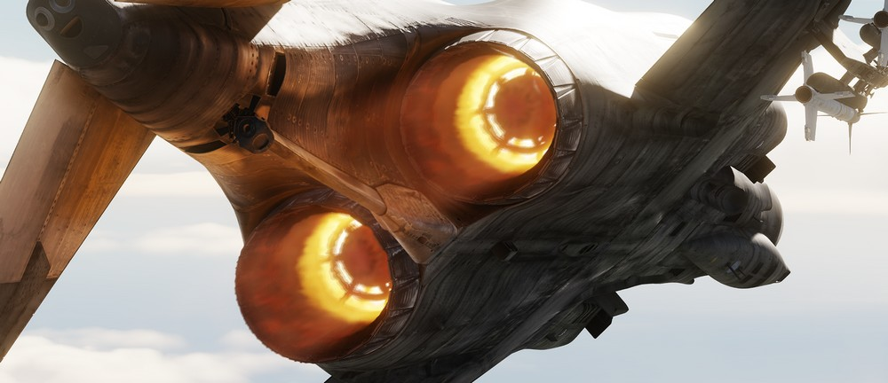
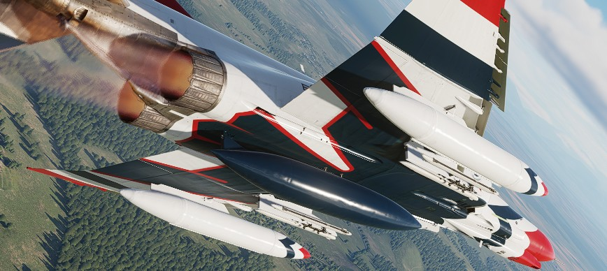

# 发动机和燃油系统

F-4E“鬼怪”II装有两台[通用电气J79-GE-17A/F发动机](./engines.md)。发动机使用地面气源或固体[推进剂药柱](./engines.md#cartridge-mode-starting) 的膨胀气体进行起动。

F-4E“鬼怪”II的燃油供给系统，包括机身内相互连接的油箱和两个机翼油箱。除开机身内油，F-4E还可以携带两个挂载在机翼上的315加仑副油箱和一个挂载在机身上的600加仑副油箱。

