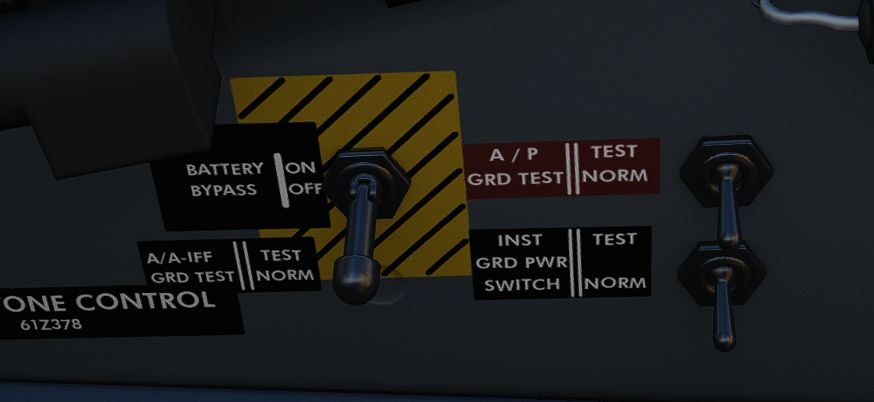
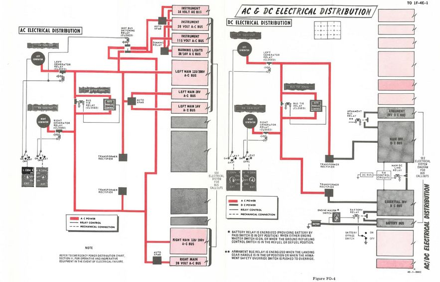

# Electrics

The F-4E derives electrical power from a pair of AC generators driven by the [J79
engines](engines.md), a pair of AC to DC transformers, and a battery for electrical functions
with the [engines](engines.md) offline. In addition, the Phantom II can receive external
electrical power from ground crew. The two generator arrangement, while normally
working independently, includes a bus tie that can connect both buses together
to draw power from a single generator in case of failure.

## Generator Indicator Lights

Three warning indicators are found on the generator indicator panel: LH GEN OUT,
RH GEN OUT, and BUS TIE OPEN. The respective GEN OUT warning will illuminate in
the event the generator in question fails. The indication of BUS TIE OPEN is an
acknowledgement that a single functioning generator is providing power to the
entire aircraft. In the event of a generator failure, the Master Caution will
also illuminate. However, in case both generators fail, no GEN OUT light will illuminate.

## Generator Control Switches

A pair
of [Generator Control Switches](../../cockpit/pilot/right_console/front_section.md#generator-control-switches)
are found on the [right console](../../cockpit/pilot/right_console/front_section.md), one for
each engine. These three position switches - ON (Forward), OFF, ON External (Aft) - control the state
of each respective generator. In the event of a possible generator failure, selecting OFF for the
generator that is believed to be offline will cause the power bus to provide electricity from the
remaining generator to the other half of the electrical system.
The [External On](../../cockpit/pilot/right_console/front_section.md#generator-control-switches)
setting is used for ground handling purposes when connected to external power, and provides electric
power to all instruments, except the CNI and
the [AFCS](../../cockpit/pilot/left_console/center_section.md#afcs-control-panel).

## Instrument Ground Power Switch

Power from an external source to the instrument buses (115/200 volt ac, 28 volt
ac, and 14 volt ac), can be provided by the Instrument Ground Power Switch (if
the [generator switches](../../cockpit/pilot/right_console/front_section.md#generator-control-switches)
are set to EXT ON), found on the [right wall](../../cockpit/wso/right_console/wall.md) in the
rear cockpit. Once external electrical power is disengaged or an engine
generator comes online, it will switch off.

## Electrics diagram

