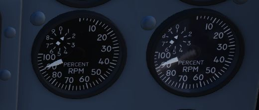

# Engines

The F-4E Phantom is powered by two J79-GE-17 engines built by General Electric,
with a rated static sea-level power delivery of 11,870 pounds of thrust in Mil,
and 17,900 pounds in afterburner. The engines have provision for both assisted
pneumatic start at fields with an available cart, or via a propellant cartridge
to initiate spin-up. Similarly, the engines can utilize the aircraft's internal
battery for initial power, or connection with an external power cart.

## Fuel Flow Indicators

Each engine has a fuel flow indicator found in the [front cockpit instrument
panel.](../../cockpit/pilot/right_main_panel.md#fuel-flow-gauges) The indicators read in thousands
of pounds per hour, from 0 to 12. The indicators provide flow rate up to Mil power; when afterburner
is engaged, a separate fuel delivery system is used to provide fuel directly to the
afterburner stage, and the flow rate is approximately 4 times the value shown.

## Oil Pressure Indicators

Oil pressure indicators are on the front
cockpit [pedestal panel](../../cockpit/pilot/pedestal_group.md), and
are graduated from 0 to 10, and are presented in 10 lb increments.

## Variable Duct Ramp

Optimization of air to the engines is performed by a Variable Duct Ramp system
directed by the ADC; this optimization uses a pair of variable ramps to
decelerate incoming air to subsonic for best engine performance. In the event
limits are exceeded for inlet temperature, the [Duct Temperature High Indicator
Light (DUCT TEMP HI)](../../cockpit/pilot/right_sub_panel.md#telelight-annunciator-panel) on
the [telelight panel](../../cockpit/pilot/right_sub_panel.md#telelight-annunciator-panel) will
illuminate. Permitting the issue to continue can cause permanent engine damage.

## Starting System

### Pneumatic Mode Starting

The normal mode for starting the Phantom utilizes an auxiliary start cart that
turns the starter turbine, cranking the engine over.

### Cartridge Mode Starting

Cartridge mode is supplied for operational and emergency needs. A propellant
charge is used to turn the starter turbine, which in turn cranks the engine over
to initiate startup.

### Start Switch

Used only for cartridge start, selecting L or R ignites the cartridge set for
the respective engine.

### Ignition System

Engine ignition for startup is performed using a pair of spark plugs on each
engine, activated by pressing the red Ignition Button found on the rear of [both
throttle levers.](../../cockpit/pilot/left_console/front_section.md#throttles) The button is
depressed as part of the starting sequence to ignite the spark plugs, initiating combustion in
chambers four and five of the engines.

### Engine Anti-Icing System

Using
the [Anti-Icing Switch](../../cockpit/pilot/left_console/front_section.md#engine-anti-icing-switch)
set to DE-ICE, bleed air from stage 17 is distributed to ports installed in the compressor face area
of the engines. This system does not perform de-icing functions, but is to be activated prior to ice
formation. As high Mach speeds provide enough friction heat to the air stream to deny icing in the
compressor stage, usage of the Anti-Icing System is unnecessary and can cause engine damage.

### Anti-Ice Indicator Lights

Activation of the Anti-Icing system will illuminate two lights on
the [telelight panel](../../cockpit/pilot/right_sub_panel.md#telelight-annunciator-panel), L
ANTI-ICE On and R ANTI-ICE On. A failure of the anti-icing system with
the Anti-Icing Switch set to NORMAL will also light
these [telelight](../../cockpit/pilot/right_sub_panel.md#telelight-annunciator-panel) indicators
as a warning. If the aircraft is above Mach 1.2 when this occurs, immediate
speed reduction is necessary to prevent engine loss. Because of the warning
function for the ANTI-ICE ON lamps, a condition that illuminates them will
provide a [MASTER CAUTION warning](../../cockpit/pilot/right_main_panel.md#master-caution-light).

## Controls and Indicators

### Exhaust Nozzle Position Indicators

Directed by the Exhaust Nozzle Control Unit, the paired primary (the convergent,
inner nozzle) and secondary (the divergent, outer nozzle) are actuated
independently on a schedule to maximize outlet performance versus exhaust gas
temperature. When idle, the engine nozzle will be roughly 7/8ths open, reducing
in size as the throttle approaches MIL. During operation in the MIL and AB
regions, the Control Unit moderates the nozzle size relative to throttle
position and received EGT to maintain temperatures within design limit.

To monitor the current position of the nozzles relative to each other, as well
as EGTs,
an [indicator](../../cockpit/pilot/right_main_panel.md#dual-exhaust-nozzle-position-indicators)
is provided with calibrations from CLOSE to OPEN in four increments.

### Engine Master Switches

A pair of
two-position [Engine Master Switches](../../cockpit/pilot/left_console/front_section.md#engine-start-switch)
are found on the [front cockpit left console](../../cockpit/pilot/left_console/overview.md) on
the [inboard engine control panel](../../cockpit/pilot/left_console/front_section.md#inboard-engine-control-panel).
Selecting ON powers the fuel boost and transfer pumps for the respective engine; this will occur
whether the aircraft is connected to external auxiliary power or not, as doing so without
will connect the aircraft battery to the pump circuits.

As the
[Engine Master Switches](../../cockpit/pilot/left_console/front_section.md#engine-start-switch)
arm the fuel shutoff valves, to properly shut down
the engines without external power it is necessary to return
the [throttles](../../cockpit/pilot/left_console/front_section.md#throttles) to
the cutoff position prior to turning
the [Engine Master Switches](../../cockpit/pilot/left_console/front_section.md#engine-start-switch)
off, otherwise the valves will remain open.

### Throttles

Paired [throttles](../../cockpit/pilot/left_console/front_section.md#throttles) are provided in both
cockpits for engine thrust control. In
normal use, movement of the [throttles](../../cockpit/pilot/left_console/front_section.md#throttles)
from IDLE to OFF will perform fuel cutoff;
to prevent inadvertent engine shutdown, a pair of finger lifts are provided to
lock out the OFF position without performing this actuation. Afterburner is
attained by shifting the [throttles](../../cockpit/pilot/left_console/front_section.md#throttles)
outboard (left) at the MIL stop, then pushing them forward.

The rear cockpit [throttles](../../cockpit/wso/left_console/front_section.md#throttles) are
connected to the front [throttles](../../cockpit/pilot/left_console/front_section.md#throttles) in
such a fashion that only the pilot can start the engines or enter the afterburner
range; the WSO can reduce [throttles](../../cockpit/wso/left_console/front_section.md#throttles) out
of the afterburner region back into MIL operation and lower. While the
rear [throttles](../../cockpit/wso/left_console/front_section.md#throttles) can be shifted from OFF
without pilot assistance, return to OFF for shutdown requires pilot engagement of the
finger lifts.

In the event of opposing commands on the throttle arms between seats, the rear
[throttles](../../cockpit/wso/left_console/front_section.md#throttles) will be disconnected from the
front [throttles](../../cockpit/pilot/left_console/front_section.md#throttles) to prevent damage to
the linkage. This condition may cause a reduction in
afterburner authority from the front throttle pair. Resetting the throttle linkage is performed by
placing the front [throttles](../../cockpit/pilot/left_console/front_section.md#throttles) at the
IDLE or MIL stop and moving the
rear [throttles](../../cockpit/wso/left_console/front_section.md#throttles) in the opposite
direction to which the disconnect occurred.

The rear [throttles](../../cockpit/wso/left_console/front_section.md#throttles) only hold a
microphone button and speed brake switch.

### Tachometers

Both engines are provided with tachometers on the right side of the [front
cockpit instrument panel](../../cockpit/pilot/right_main_panel.md#tachometers), and the right side
of the [rear cockpit instrument panel](../../cockpit/wso/upfront_indicators.md#tachometers).
The [tachometers](../../cockpit/pilot/right_main_panel.md#tachometers) will function without
external power.

### Exhaust Gas Temperature Indicators

Exhaust Gas Temperature Indicators are found on the [front
cockpit instrument panel](../../cockpit/pilot/right_main_panel.md#exhaust-gas-temperature-gauges).
The indicators have two pointers each: a large pointer for the 0 to 12 scale referencing 100 degrees
centigrade, and a smaller pointer on a separate scale with 0 to 10 referencing 10 degrees
centigrade. Measuring for these values is performed upon exit of the turbine.
