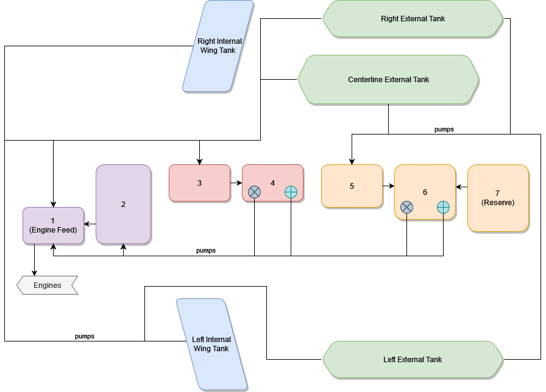
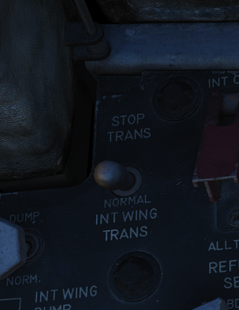
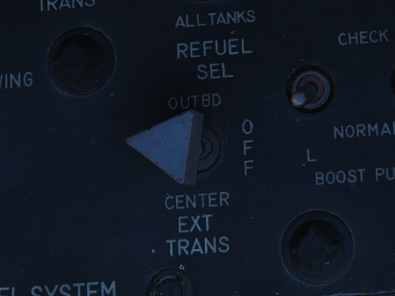
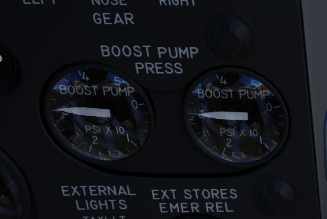
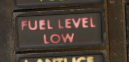
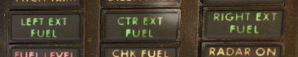
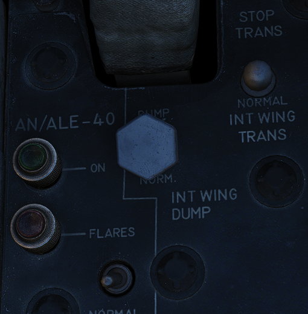

# Fuel System

The Phantom's fuel system is duplicated; that is, their pump and feed
arrangement is the same for both the left and right engines, and they share the
same set of fuel cells. Internal fuselage fuel between all 7 cells and the wing
tanks is just over 12,000 lbs of JP-4. With two external 315 gallon wing tanks,
that value increases to over 16,800 lbs. Adding the centerline 600 gallon tank
will bring the aircraft total fuel state to just under 20,800 lbs of fuel.

## Transfer Sequence

The F-4 carries two internal wing tanks, along with seven fuel cells down the
length of the fuselage, with cell 1 resting just behind the aft cockpit, and the
remaining cells numbered in order to the rear of the aircraft. Cell 1 is the
feed cell for the engines; cells 4 and 6 each carry a hydraulic and an electric
transfer pump to supply fuel to cells 1 and 2. The remaining fuselage cells
perform a gravity feed into cells 1, 4, or 6. Cell 3 feeds cell 4 and 5, cell 2
feeds cell 1 and cell 7 feeds cell 6. With this arrangement, center of gravity
balance is maintained along the centerline. Cell 7 is the last cell to initiate
transfer in the sequence, and does not begin until the total fuel in cells 1 and
2 fall below 1800 lbs.

Fuel transfer from the wing and external tanks is performed by bleed air
pressurization once airborne; they will not transfer until the aircraft is off
the ground. Internal wing tank fuel is transferred into fuselage cells 1 and 3,
whereas fuel from external tanks are balanced between cells 1, 3, and 5.

## Internal Wing Transfer Switch

Should it be necessary, a two position switch is available to turn off transfer
from the wing internal tanks. Found on the Fuel Control Panel, the Internal Wing
Transfer Switch can be toggled between NORMAL and STOP TRANS.

## External Transfer Switch

External tank transfer is controlled by the External Transfer Switch; found on
the Fuel Control Panel, the switch has three positions: CENTER, OFF, and OUTBD
(Outboard), with OUTBD referring to the wing external tanks.

It is not possible to transfer from the wing tanks and external tanks at the
same time. If both are selected, the external tanks will take priority.

## Fuel Boost System

Flow from Cell 1 to the engines is performed by a pair of boost pumps. The pumps
are installed at the bottom of the tank to provide fuel in the event of a
negative G excursion. The function of these pumps can be confirmed on the Fuel
Boost Pump Pressure Indicators found in the front cockpit. Engine idle pump flow
rate is 30 PSI, ±5 pounds. To confirm a ground check, a pair of Boost Pump Check
switches are found on the fuel control panel. Holding one of these switches in
the CHECK position will perform an engine shutdown, and provide feedback on the
respective Pressure Indicator.

## Fuel Quantity Indication System

## Fuel Level Low Warning Light

When the sensor in Cell 2 detects a fuel weight of less than 1650 ±200 lbs, the
FUEL LEVEL LOW warning will illuminate on the front cockpit telelight panel.
This illumination is independent of the Fuel Quantity Indication System, and can
be indicative of a transfer failure.

## External Tanks Fuel Lights

Any time an external fuel tank is detected to not be flowing fuel into the
fuselage, a respective light will illuminate on the telelight panel- L EXT FUEL,
CTR EXT FUEL, or R EXT FUEL. These lights will only illuminate for the
respective external transfer- that is, if OUTBD is selected, CTR EXT FUEL cannot
illuminate, and vice versa. Because transfer can occur intermittently due to
flow from the tanks exceeding engine fuel consumption, the warning lamp is not
immediately indicative of an empty external tank, and should be checked against
the quantity indication system. Further, the lamps will illuminate when the air
refuel switch is set to EXTEND, with the ALL TANKS setting selected.

When air to air refueling, or when refueling on the ground and the tanks have
reached a full condition, the External Tanks Full lamps, found under the canopy
bow, will light.

## Internal Wing Fuel Dump System

Fuel from the wings can be dumped directly, rather than requiring transfer into
the fuselage, using the Wing Fuel Dump Switch. This switch, when selected to
DUMP, will release fuel from the internal wing tanks at their dump lines at the
wing fold trailing edge. Flow rate is dependent on power setting and attitude,
higher engine RPM and positive pitch increases dump speed, whereas lower RPM and
a nose low condition reduces dump speed. In level flight at 85% RPM, the dump
flow rate is roughly 650 pounds per minute. Leading to the entire fuel being
dumped after roughly 15 minutes.
