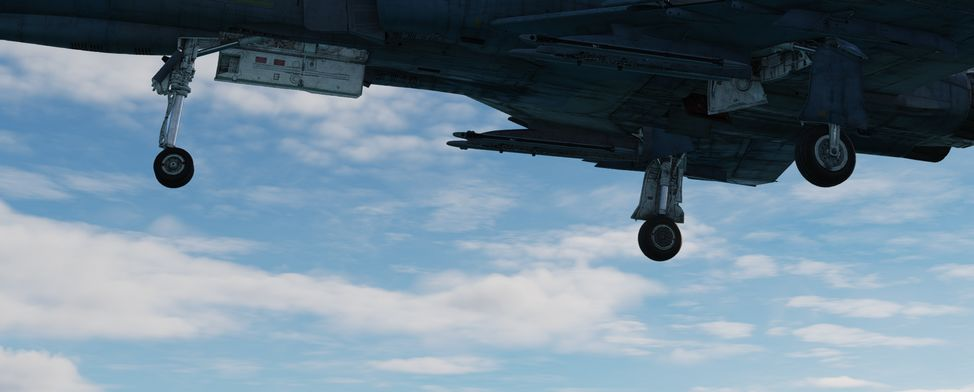
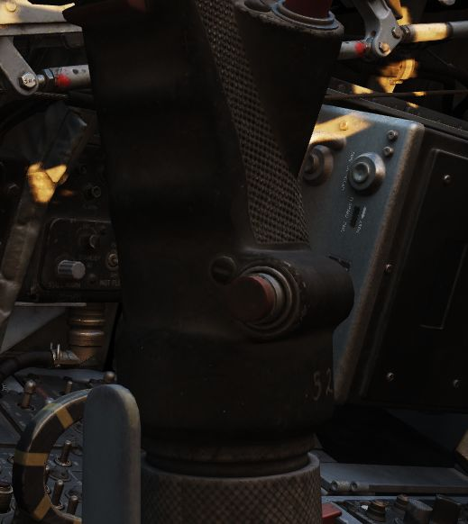
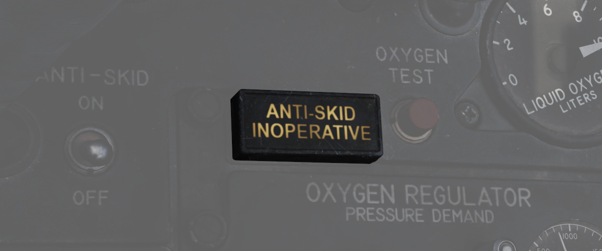
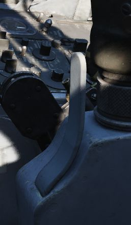

# Landing Gear System and Ground Handling Controls

The F-4 Phantom uses a conventional tricycle landing gear arrangement, driven by
the Utility hydraulic system. The Landing gear is electronically controlled and hydraulically
actuated by the utility hydraulic system. Accidential retraction of the landing gear when the
aircraft is on the ground is prevented by safety switches on the main gear. The gear is locked down
by internal finger latches which require hydraulic pressure to release. The automatic disable of the
nose gear steering and anti-skid system is realized by scissor switches located in the landing gear
bays. In the event Utility hydraulics are offline, an emergency extension system using compressed
air is available to lower the gear for landing.

## Landing Gear Control Handle

The Landing Gear Control Handle is found on the left instrument panel in the
front cockpit, with a red wheel-shaped knob for identification.

## Landing Gear Emergency Extension Handles

Emergency landing gear extension is driven by a pair of compressed air bottles
carrying sufficient charge for lowering the gear one time. The emergency extension
is commanded in the front cockpit is performed using the Gear Control Handle;
pulling the handle aft in any position releases the compressed air into the
landing gear hydraulic system, forcing the gear doors to open and the gear to
lower and lock. Extension can also be performed in an emergency from the back
seat using a handle on the left sub-panel marked EMERG LDG GEAR. Pulling this
handle performs the same action as pulling the front cockpit gear control handle
aft.

## Landing Gear Warning Lights

In the upper left corner of the front cockpit instrument panel is a WHEELS
warning lamp that illuminates when the aircraft is below 230 knots without the
landing gear lowered. Selecting the gears down or up when the WHEELS lamp is
illuminated will cause a warning lamp installed in the Landing Gear Control
handle to light up red.

## Landing Gear Position Indicators

Status indicators for the landing gear system are found in both cockpits on the
left sub-panel. The indicators are three windows, one for each gear station. The
position of the gear are shown in their respective windows with the word UP when
up and doors are closed, a barber pole (angled white and black bars) when the
gear and doors are in transition either closing or opening, and the illustration
of a wheel when the gears are down and locked.

## Nose Gear Steering

Nose Gear Steering is actuated using the referenced button on the control stick
in either cockpit. Holding the button down permits the crew member to steer the
aircraft using the rudder. Steering limit of the nose gear is 70 degrees from
centerline in both directions. Rudder steering becomes effective at approximately 70 knots. At this
speed Nose Gear Steering should be disengaged and not be used any further.

## Wheel Brakes

Differential steering is provided with weight on wheels using rudder pedal
deflection. Assistance in braking performance is provided by an included
Anti-Skid System, which engages with the aircraft over 30 knots. Braking
function is delayed by the Anti-Skid System on landing until the right main gear
has been in contact with the ground for 3 seconds, or the wheels reach 50 knots
of rotation.

## Anti-Skid Control Switch

Next to the oxygen quantity gauge in the front cockpit is the Anti-Skid Control
Switch, which is used to turn the system ON or OFF.

## Anti-Skid Inoperative Light

Found on the front cockpit left console, the ANTI-SKID INOPERATIVE light will
indicate when the Anti-Skid Switch is set to OFF, the Emergency Quick Release
Lever is pressed, or there is a system issue.

## Emergency Anti-Skid Quick Release Lever

Should the Anti-Skid system appear to malfunction during a rollout, the system
can be immediately disengaged by holding down the Quick Release Lever found on
the control sticks in either cockpit. This will illuminate ANTI-SKID INOPERATIVE
warning.

## Emergency Hydraulic Brake System

In the event of a Utility hydraulic system failure, emergency differential
braking is provided by pulling the Emergency Brake Handle on the lower left side
of the instrument panel in either cockpit. Doing so forces hydraulic pressure
from a reserve accumulator, and provides enough power for approximately 10 brake
applications.

## Arresting Hook System

The Phantom carries a retractable arresting hook for ground stopping in
emergency takeoff and landing situations that will reach the strip overrun.
Placing the Arresting Hook Handle in the front cockpit into the DOWN position
will lower the hook in approximately five seconds. Lowering the hook will
illuminate a red warning lamp in the Hook Handle, and illuminate the HOOK DOWN
warning on the telelight panel.

The system is not intended to be used for carrier operations.

## Drag Chute System

The F-4E has an available Drag Chute to reduce landing roll as necessary. The
chute can also be used for spin recovery. Deployment of the chute is performed
by rotating the handle found in the front cockpit. The chute is drawn from its
door with a smaller pilot chute. Once the chute has deployed and performed
sufficient braking action or the aircraft has recovered into a controllable
state, the chute is jettisoned by pressing the button and pulling the handle
back, then lowering it. This action releases the chute cables and allows it to
pull free. Do not use the Chute in excess of 200 Knots IAS while landing.
For spin recovery the Chute can be used by pushing the stick full forward, putting ailerons and
rudder in a neutral position and deploying the chute.

## Wing Fold System

The F-4E includes a wing fold system to assist in maintenance and ground
handling. Unlike prior models, the wing fold apparatus on the F-4E is un-powered,
and requires ground crew members to manually move the outboard panels with the
fold control activated to release the locking mechanism.
