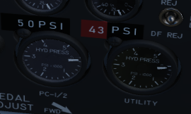

# Hydraulics

The hydraulic power system of the F-4E consists of three closed hydraulic
systems: Power Control System 1 (PC-1), Power Control System 2 (PC-2), and the
Utility System. Each aileron, spoiler, and stabilators have two hydraulic
actuators. The PC systems are the primary hydraulic delivery to the flight
control systems, with PC-1 powering the left side of the aircraft, and PC-2
powering the right; these actuate one of the two actuators on each flight
control surface. The Utility System drives the second actuator on the flight
control surfaces, acting as both a power assist and backup. Control is retained
in the event of a failure of one PC or the Utility System. One exclusion to this
is the stabilators- rather than using the Utility System as the secondary power,
an APU unit in the tail provides the additional and backup power for the
stabilators should PC system PSI to the stabilator actuators fall below 1000.

## Auxiliary Power Unit Reject Switch

## APU Light

In the event of handover to the stabilator APU, the APU light will illuminate on
the telelight panel. This does not activate the Master Caution.

## Hydraulic Pressure Indicators

On the pedestal panel in the front cockpit is a pair of PSI indicators, one for
the PC systems and the other for the Utility system. The PC system gauge has two
pointers, labeled PC-1 and PC-2. Nominal operating power for all three systems
is 3000 PSI ±250 PSI.

## Hydraulic Systems Indicator Lights

In the event of a pressure loss on PC-1, PC-2, or the Utility system below 1500
PSI, or a detected outright pump failure, CHK HYD GAGES will illuminate on the
telelight panel along with the Master Caution warning. In the event of a Utility
system failure on the right side, no apparent pressure loss will display to
match the CHK HYD GAGES light, whereas a left side failure will show a loss of
200 PSI or more on the Utility system pressure indicator. In the event system
pressure recovers back to above 1750 PSI, the CHK HYD GAGES light will turn off.

With a CHK HYD GAGES warning, the Master Caution can be cleared by selecting the
reset; however, be aware that if the CHK HYD GAGES light is on at this time, a
subsequent hydraulic system failure will not re-trigger the Master Caution
warning.

Also, the Master Caution and CHK HYD GAGES lights can illuminate momentarily on
landing gear lowering or during high maneuvering due to system load- check the
pressure indicators; should they return to nominal, disregard the warnings as
they will reset momentarily.
