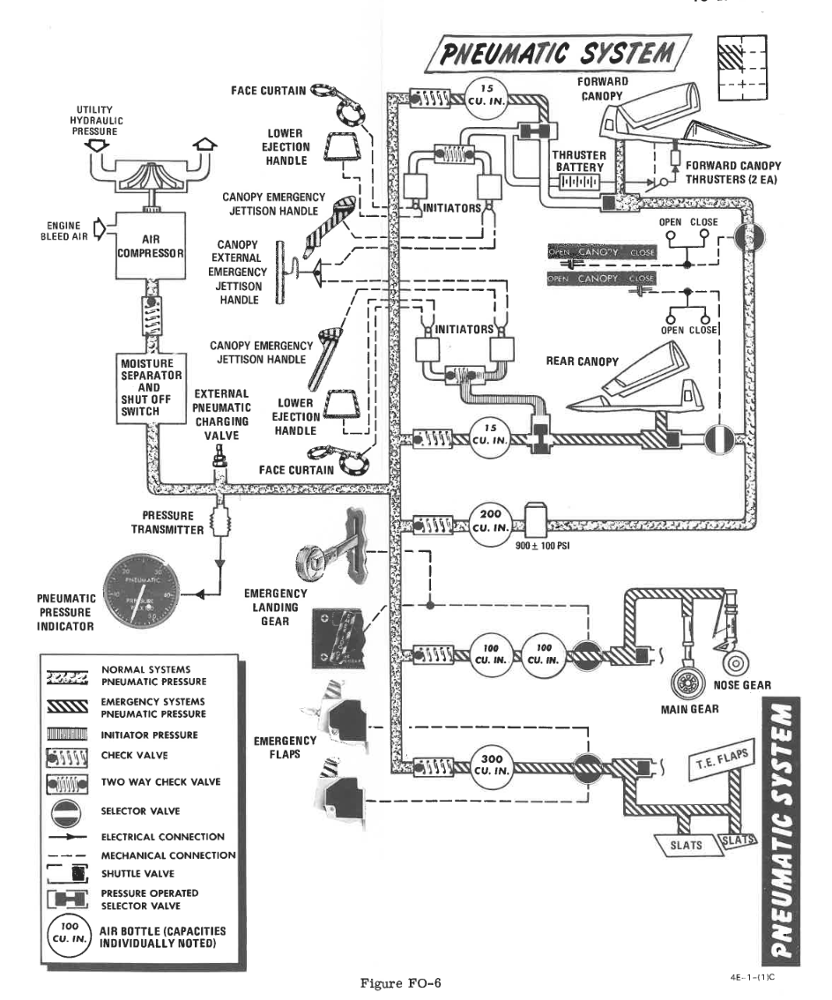

# Pneumatics

The pneumatic system provides power for the canopies, as well as emergency
operation for the landing gear and slats flaps systems. A Pneumatic Pressure
Indicator is found on the front cockpit pedestal panel to confirm function, and
indicates manifold pressure.

## Pneumatics diagram

