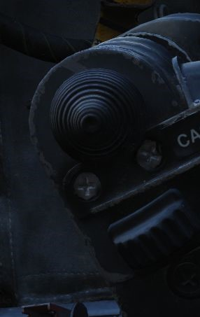

# Flight Control Surfaces and System

The flight controls include the slats seen in front of the wing in extended position, the flaps, the
rudder, the aileron-spoiler seen on top of the right wing in the picture and rearward stabilizers.

## Control Sticks

A control stick is provided in both cockpits, with near-uniform switchology
between the two. A Trim Control is found on both sticks to provide force
reduction and minor flight path correction in the pitch and roll axis. Weapons
are deliverable through both a Trigger
(for [air-to-air missiles](../../stores/air_to_air/overview.md) and the [gun](../../stores/guns.md))
and a Bomb Release Switch. Both sticks carry
a [Nose Wheel Steering button](gear_ground_handling.md#nose-gear-steering) that
doubles as a [radar](../radar.md) auto-acquisition control for the [radar](../radar.md) in visual
range combat, and sensor focus control for
video-directed [air to ground weapons](../../stores/air_to_ground/overview.md). An
[Emergency Quick Release lever](gear_ground_handling.md#emergency-anti-skid-quick-release-lever) on
each stick is available to immediately deactivate the anti-skid, ARI, autopilot, and stability
augmentation. Unique to the front cockpit control stick is
the [Air Refueling Release Button](../utility.md#air-refueling-release-button) - a dual-role
control that performs the boom disconnect function its name implies, as well as
a number of weapon selection functions.

Also, unique to the front cockpit stick is a force transducer, to allow the pilot
fine adjustment control of
the [AFCS](../../cockpit/pilot/left_console/center_section.md#afcs-control-panel) with the autopilot
functionality engaged. In the event the force applied to the stick exceeds
the [AFCS](../../cockpit/pilot/left_console/center_section.md#afcs-control-panel) breakout limit,
autopilot will be turned off.

## Aileron-Spoiler Control and Stabilator Control Feel and Trim Systems

The Aileron-Spoiler Control System and the Stabilator Control System both offer
trim following; the former through a screw jack actuator, the latter using a
servo directed by the [AFCS](../../cockpit/pilot/left_console/center_section.md#afcs-control-panel).
These functions cause the stick to position relative
to the current trim and autopilot position when the crew member in control goes
"hands off". It is therefore advisable to maneuver the stick to the same
position, or to gently move the stick to "breakout force" prior to disengaging
the autopilot system to reduce the chance for an abrupt return to pilot control.

To confirm current state of the stabilator trim, a Stabilator Trim Position
Indicator is provided on
the [front cockpit left vertical panel](../../cockpit/pilot/left_sub_panel.md#stabilator-trim-indicator)
.

## Rudder Control System

Yaw axis control is directed by the rudder pedals found in both cockpits. To
offset any relative skidding due to wind effect, stores imbalance, or minor
[engine](../engines_and_fuel_systems/engines.md) output deviation,
a [Rudder Trim Switch](../../cockpit/pilot/left_console/front_section.md#rudder-trim-switch) is
found on
the [engine control panel](../../cockpit/pilot/left_console/front_section.md#inboard-engine-control-panel)
in the front cockpit. On the ground, the pedals themselves can be pressed
independently for differential braking, and the rudder axis itself functions as
the nose wheel steering directional control when
the [Nose Wheel Steering button](gear_ground_handling.md#nose-gear-steering)
on either control stick is pressed.

## Aileron-Rudder Interconnect (ARI)

To assist in low speed turn coordination, the Phantom II includes an
Aileron-Rudder Interconnect. The system is engaged automatically with the [Slats
Flap Switch](../../cockpit/pilot/left_console/wall.md#slatsflaps-control-panel) in the Out and Down
position, and below the flap blowup speed of 230
knots. With the system engaged, the rudder can be driven up to 10 degrees by the
interconnect to alleviate pilot workload. The circuit breaker for the ARI is located right of the
Emergency stores release.

### Emergency ARI disconnect

In the event either seat in command requires the ARI deactivated, the system can be disconnected by
pulling
the [Emergency Quick Release lever](gear_ground_handling.md#emergency-anti-skid-quick-release-lever)
on their respective control stick. Releasing the switch will re-engage the ARI. Function of the ARI
can always be overridden through the rudder pedals.

## Stability Augmentation System

The F-4 offers a three axis Stability Augmentation system, with independent
Pitch, Roll, and Yaw channels. The system is to smooth out flight in normal
cruise regimes, rather than provide enhancement in maneuvering. The control
panel for the Stab Aug system is found in the front cockpit.

The Pitch channel provides a maximum control authority to the stability
augmentation of one half degree (0.5) above or below the current pitch trim
setting.

The Roll channel gives the stability augmentation 7.5 degrees of control of the
ailerons, and up to 11 degrees of deflection to the spoilers.

The Yaw channel permits augmentation up to 5 degrees left or right from the
current rudder trim position.

Because the stability augmentation system can misinterpret roll oscillation in
high AoA maneuvering and inadvertently invoke adverse roll, it is suggested to
disable the Roll channel prior to aerobatics or combat to alleviate this
possibility.

With the Roll stability augmentation system engaged, roll rate using the rear
control stick can be less than that in the front cockpit relative to the amount
of deflection; conversely, when returning control to the front cockpit, the rate
can jump due to said difference.

## Auotmatic Flight Control System (AFCS)

The automatic flight control system (AFCS) is an electro-hydraulic system designed to provide
stable, accurate and coordinated flight maneuvers without interferring with manual control. The
System utilizes the displacement gyro (for pitch and roll) additionally to the heading reference
signals to maintain the airplane in the desired attitude with maximum stability.

In the F-4E DSCG variant there are two modes of operation, AFCS and Altitude Hold. In the AFCS mode
of operation maintains any aircraft heading and/or attitude selected within the limits (± 70° pitch,
70° bank and 360° azimuth), providing the G-Limits (+ 4G or - 1G) are not being exceeded. During
AFCS mode, two accelerometers are utilized to ensure proper functioning of the AFCS system. One of
the accelerometers is a G-Limiting type to prevent excess G-loads from occuring as a result of AFCS
operation, the other accelerometer is a lateral accelerometer which is used to perform coordinated
maneuvers while in AFCS or stability augmentation mode.

## Slats Flap System

The Slats Flap system is manually selected for takeoff and landing, then
automatically controlled relative to AoA for best handling performance in all
other flight regimes. Control is through
a [three position switch](../../cockpit/pilot/left_console/wall.md#slatsflaps-control-panel) found
outboard of the left [throttle](../../cockpit/pilot/left_console/front_section.md#throttles)
handle in the front cockpit and driven by the aircraft hydraulic system.
The [three switch positions](../../cockpit/pilot/left_console/wall.md#slatsflaps-control-panel) are
Norm, Out, and Out and Down,
and the resulting command can be moderated based on whether or not the landing gear being deployed.

Norm is the standard in-flight position, locking the Flaps and automatically
programming the Slat deployment as a function of AoA.

Out deploys the Slats to their fully deployed position. Should the landing gear
be deployed, both the Slats and Flaps will deploy.

Out and Down fully deploys both the Slats and the Flaps. Should the landing gear
not be down, the Wheels Light on
the [telelight](../../cockpit/pilot/right_sub_panel.md#telelight-annunciator-panel) Panel will
illuminate and flash.

Both cockpits have
a [Slats Flap Indicator](../../cockpit/pilot/left_sub_panel.md#slatsflaps-indicators), which read In
and Out, along with a
barber-pole reading when the surfaces are in transition.

In the Norm position, Maneuvering Slat deployment is a function of AoA; above
11.5 units they will extend, then retract when the aircraft is reduced below
10.5 units. Maneuvering Slat operation includes a speed-induced blowback; slats
will retract due to air pressure between 568 and 602 knots.

To the rear of the Fuel Control Panel in the front cockpit is the Slat Override Switch. Guarded,
this switch has two positions: NORM and IN. Defaulted to NORM under the guard, switching to IN
forces the retraction of the slats, no matter the current aircraft AoA or state of the Slats Flap
Switch position; this action will trigger the SLATS IN warning on
the [telelight](../../cockpit/pilot/right_sub_panel.md#telelight-annunciator-panel) Panel and
illuminate the [Master Caution](../../cockpit/pilot/right_main_panel.md#master-caution-light).

The Slats Flaps system also has an Emergency system; handles are found on the
[Slats Flaps control panel](../../cockpit/pilot/left_console/wall.md#slatsflaps-control-panel) in
the front cockpit, and next to the rear cockpit
[throttle](../../cockpit/wso/left_console/front_section.md#throttles) pair. The emergency system
uses pneumatic pressure, and does not
require electrical power to force deployment. The emergency system can only
function once, and can be actuated at any airspeed; however, above 230 knots,
the Flaps will retract based on air pressure, and the normal Slat retraction
speeds also apply.

## Speed Brakes

Underneath the aircraft and close to the rear [Sparrow](../../stores/air_to_air/aim_7.md) recesses
are the [speed
brakes](../..), installed on the wings. The speed brakes are driven by the aircraft's
hydraulic system and actuated by
a [three position switch](../../cockpit/pilot/left_console/front_section.md#throttles) found on the
inboard [throttle](../../cockpit/pilot/left_console/front_section.md#throttles) in both cockpits.
Either switch will actuate the brakes. The positions
are Out, Stop, and In; the first and last positions are momentary (reverting to
Stop upon being released).

Brake actuation illuminates the Speed Brake Out Indicator Light found on the
[telelight Panel](../../cockpit/pilot/right_sub_panel.md#telelight-annunciator-panel). Brake
deployment and illumination of the Indicator does not
trigger the [Master Caution](../../cockpit/pilot/right_main_panel.md#master-caution-light).

## Angle of Attack System

To precisely monitor and control aircraft flight performance, the Angle of
Attack System (AoA) provides visual and audio confirmation of current
parameters. Included in the system are the Angle of Attack Indicators found in
both cockpits, the illuminated Angle of Attack Indexers, as well as the AoA
Aural Tone System.

### Indicators

The Angle of Attack Indicator dials register AoA values from 0 to 30 units, with
indications for weight-relative optimum altitude cruise (7.9 units) , approach
(19.2 units), and stall (30 units).

It is important to note that extension of the landing gear and thus the nose
gear door changes the airflow around the probe causing to indicate higher
angles by 1 unit. The approach airspeeds account for that. Therefore, performing
an approach with the gear retracted, will cause the indicators to show
approximately 1 unit low, and the aircraft will be roughly 5 knots fast for an
on-speed approach.

### Indexers

The AoA Indexers, found on the windshield frame of the front cockpit, and above
the instrument panel in the rear, display color coded and directional symbology
for the on-speed approach value of 19.2 units once the landing gear have been
lowered.

## Aural Tone System

The Aural Tone System provides audible feedback in maneuvering flight and during
landing configuration. Beginning above 15 units AoA with gear down, and 21 units
AoA with the gear up and slats in, a pulse will be heard by both crew-members.

The rate of the pulse can vary from 1.5 to 20 pulses per second, with increasing
frequency based on higher AoA values.

This tone can be lowered in volume below 20.3 units AoA gear down/25 units gear
up with controls in each cockpit; exceeding these values will cause the system
to override the volume limits and deliver the warning pulses at full volume.

The respective knobs are labelled STALL WARNING and can be found on the right
side in either cockpit. They must not to be confused with the AURAL TONE CONTROL
knobs, which control weapon related tones.

## Stall Warning Vibrator

The left front cockpit pedal includes a Stall Warning Vibrator, which is
activated over 22.3 units Angle of Attack. This physical (and in DCS audible)
indication is given to make the pilot aware of the potential of an impending
stall and provide enough time to reduce AoA and prevent the loss of control of
the aircraft. Reducing AoA below the threshold will deactivate the warning.
